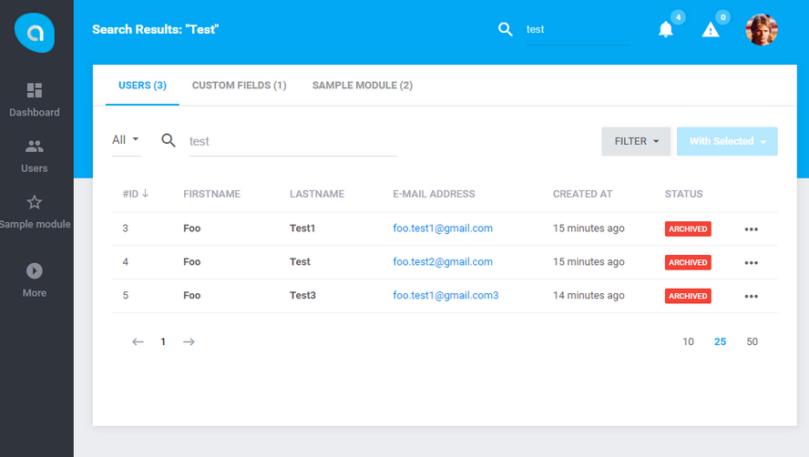
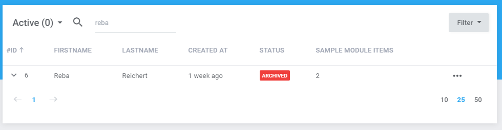
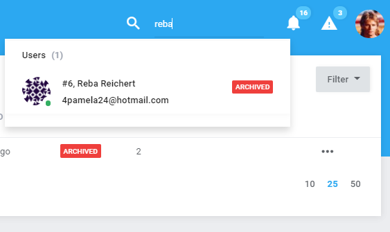

# Search  

[TOC]

## Introduction  

Search Module is a package for full-text search over Eloquent models based on [Datatables](http://www.docs.antaresproject.io/php-framework/services/datatables). 
Allows you to perform searches in a table by priorites and relations, decorations of responses as partialized [Twig](https://twig.sensiolabs.org/) views.



## Configuration

If you want to add your module to be visible within search results you have to open file located in:

```bash
resources/config/search.php
``` 

Default file content is:

```php
<?php

return [
    'datatables' => [
        'users'         => \Antares\Users\Http\Datatables\Users::class,
        'customfields'  => Antares\Customfields\Http\Datatables\Customfields::class,
        'sample_module' => \Antares\Modules\SampleModule\Http\Datatables\ModuleDatatable::class
    ]
];
```

File definition is a list of datatables classes located in separated modules. 
To add new search results, just add new row, as follows:

```php
'foo'           => \Antares\Modules\Foo\Http\Datatables\FooDatatable::class,
```

## Results

Results of quick search and global search results are response of datatable "search" action.  
It means if you fill search input within datatable view and press enter, the same results will be showed in quick and global search results.





## Format

If you want to format quick search results you have to add some lines in your datatable class.
First of all is adding class attribute, called "search":

```php
/**
 * Quick search settings
 *
 * @var String
 */
protected $search = [
    'view'     => 'antares/foundation::foo.partials._search_row',
    'category' => 'Foo'
];
```

Where `view` is a alias of path to partialized quick search, and category is the name of group and tab in results page.
Row view has access to Eloquent model instance which is response of search query. 
An example of partial view, can be presented as follows:

```twig
<div class="type--contact flex-block">
    <div class="avatar avatar--active avatar--xs">
        <div></div>            
    </div>
    <div class="flex-block__content">
        <span class="flex-block__title">#{{ id }}, {{ fullname|raw }}</span>
        <div class="flex-block__desc">{{ email|raw }}</div>
    </div>
    <div class="flex-block__badge">
        {{ status|raw }}
    </div>
</div>
``` 
Variables such as email, full name or status are Eloquent model attributes.

Remember, if you do not set "search" attribute in datatable class, default will be applied:

```php
/**
 * Default quick search settings
 *
 * @var String
 */
protected $search = [
    'view'     => 'antares/search::admin.partials._default_row',
    'category' => 'Foundation'
];
``` 

## Customizing result search

If you want to customize search results for global search, just overwrite `prepare` method in datatable class:

```php
/**
 * Prepare datatable instance before
 *
 * @param EloquentBuilder|Collection $query
 * @return \Antares\Datatables\Engines\BaseEngine
 */
public function prepare($query = null)
{

    $of = is_null($query) ? $this->getQuery() : $query;
    if (request()->header('search_protection') && request()->has('search')) {
        $keyword = input('search');
        $of->where('name', 'like', "%$keyword%")
                ->orWhere('group_name', 'like', "%$keyword%")
                ->orWhere('type_name', 'like', "%$keyword%")
                ->orWhere('type', 'like', "%$keyword%")
                ->orWhere('id', 'like', "%$keyword%");
    }
    return $datatables = $this->datatables->of($of, get_class($this));
}
```

As you can see while, global search is executed, the header `search_protection` is send from browser with `search` param as query.
Variable `$of` is an instance of Laravel's QueryBuilder which can be extended of custom query conditions. 
 


