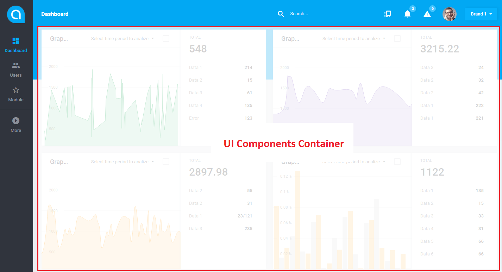
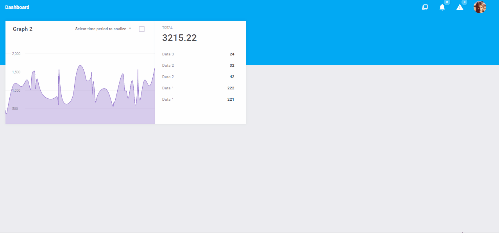

# UI Structure 

[TOC]

The biggest advantage of using Antares as a base of your application is powerful UI. Understading it's structure will help you to work super fast and deliver a consistent interface which is significant in any modern application. For most of the customers the interface stands for the quality of your solution because it is what they see and use on a daily basis. Antares will provide you a pattern to make your clients satisfied.

## The basics

By default, Antares provides User and Admin **Levels**. Except **Dashboard**, which is by default available on every level, modules can define their own [Views](../modules-development/ui-components.md). Dashboard is a View itself as well.
  
Every View includes:
1. **UI Components Container** - the area where all the [UI Components](../modules-development/ui-components.md#how-to-create-ui-component) (widgets) are loaded by the modules.  
2. **Template Base** - everything on the page except UI Components which includes:
   * [Menu](../modules-development/views.md#menus)  
   * [Breadcrumbs](../services/breadcrumbs.md)
   * [Actions of the section](../modules-development/views.md#breadcrumbs-menu)
   * Additional tools
      * Account icon with account menu
      * Search
      * [Notifications](../core-modules/notifications.md)
      * [Edit Widgets toggle](../services/ui-component.md#placing-the-widget-on-a-website)
      

*Everything except UI Components Container is Template Base to which you can easily hook up with your modules.*
        
The only exception of the above structure is **Login Page** which contains only the login form.

Some of the UI elements can be only visible for certain user level/group - it is controlled by modules and the [ACL module](../core-modules/acl.md).

## Template Layouts 

There are several **Template Layouts** that you can set up in the Antares per each Level (so can be different for admin and different for user). These Template Layouts have different composition of elements and by default there are following layouts:

* Small Side Menu
* Big Side Menu
* Top Menu Simple (suggested for end-customers)
* Top Menu Advanced (suggested for administrators/advanced users only)

**Please note:** Every Template Layout consists of the same structure so they always have UI Components Container and the Template Base with the same elements! Switching between layouts in the configuration will still render you the same UI structure, just different composition.

## UI Components Container

Every module defines what **UI Components** are visible on EVERY View. This means that one module can add/modify the UI Components on another module's View. This gives the developer full control on the displayed pages in the system depending on the modules installed in Antares.

There are two types of UI Components:

* [HTML](../modules-development/ui-components.md#how-to-create-ui-component) - using classic [TWIG](https://twig.sensiolabs.org/doc/2.x/) template engine, loaded by the Ajax request.
* Vue2 - using REST endpoint to load the data and automatically presenting the interface. 

Additionally, if defined by developer, each View can have **widgets edit option**. When enabled, user can use it to manually configure what UI components are visible or not and move/scale them depending on the component possibilities.

To speed up the development of your application, you should use **predefined UI Components** (documentation will be available soon), customize them or make your own.

Just like for the Views, each module [**can hook up into another module's widget**](../modules-development/ui-components.md#how-to-include-view-to-others) displayed on different View. You can add your own content or even interfere with the data returned by JSON to the vue component.

