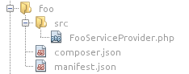
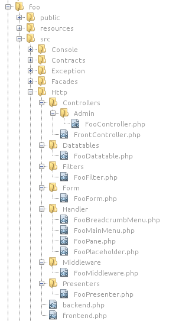
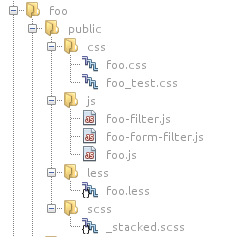
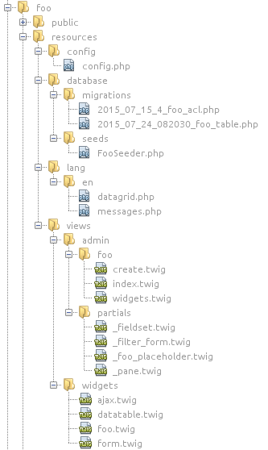
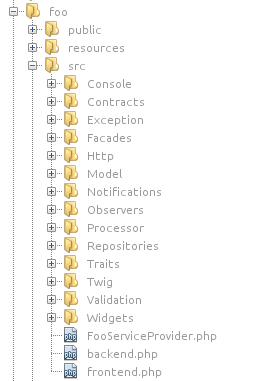
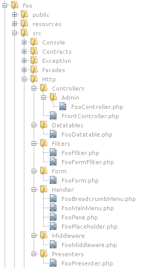

# Components & Modules  

[TOC]

## Structure  

### Minimal Structure
  
A component should consist of the minimal structure:


  
**composer.json** file's content:

```json
{
    "name": "antaresproject/component-foo",
    "description": "Antares Foo Component",
    "authors": [
        {
            "name": "Foo Bar"
        }
    ]
}
```

* name - determines the name - identifier of a component in a repository. The name must be unique within a repository group.

A description of the remaining variables can be found [here](https://getcomposer.org/doc/04-schema.md).
 
**manifest.json** file's content:

```json
{
    "name": "foo",
    "full_name": "Foo Component",
    "description": "Foo Component",
    "author": "Antares Developer",
    "url": "https://<server_name>.com/docs/foo",
    "version": "0.9.2",
    "provides": [
        "Antares\\Foo\\FooServiceProvider"
    ]
}
```

* name - determines a component's name abbreviation. It cannot contain special characters, spaces.
* full_name - full name of a component
* description - a component's operation description
* provides - a register of service providers used by a component.

Service provider's file structure:

```php
<?php

namespace Antares\Foo;

use Antares\Foundation\Support\Providers\ModuleServiceProvider;
use Illuminate\Routing\Router;

class FooServiceProvider extends ModuleServiceProvider
{
    public function boot(Router $router)
    {
        parent::boot($router);
    }
}
```

In the abovementioned example service provider must inherit from the class ModuleServiceProvider.

### Full Structure  

The full component's catalogue structure should be determined in a manner depicted below:

  
  
4 main subcatalogues may be distinguished: public, resources, src, tests.

### Public  

In this catalogue can be found all essential javascript, css, and img files used by a component. Preprocessors such less, sass, scss may be equally used for conversion [(click here for details)](https://github.com/kriswallsmith/assetic).

An example of the content:

  
  
### Resources  

The files that are used by a component, or to which it refers during its operation are located in this catalogue.

  
  
* config - the very name of this catalogue indicates its purpose. It stores files configuring a component
* database - contains the migration files for creating (and removing) the tables used by a component and filling them with data
 * migrations - strictly speaking, these files build an appropriate table scheme
 * seeds - class' files for filling the tables with the data
* lang - it consist of files with phrases' translation used by a component. The subcatalogue is always the language code.
* views - views' files used by a component. The subcatalogue is controller's name, while file's name is the name of the action in a controller.

### Src  

In this catalogue, component's business logic is placed.

  
  
Please notice that in this folder, catalogues' names start with a capital letter.

* Console - classes responsible for commands which are made accessible by a component. They are usually launched by means of: php artisan <name_of_the_component>:<name_of_the_command>,
* Contracts - interfaces used by a component,
* Exception - exception's classes',
* Facades - facades as a popular form of referring to a class,
* Http - stores incoming request's processing logic and data preparation for display,
* Model - contains models' classes (from the mapped tables) within the framework of Eloquent engine (Active Record),
* Notifications - contains the notification templates (e.g. email, sms) which the component will send to the users,
* Observers - observers' definitions applied to other classes (usually to models)
* Processor - processor's classes, which interpret and process incoming data,
* Repositories - repositories classes (combining several models into one),
* Traits - traits used by a component,
* Twig - extension classes for Twig view engine,
* Validation - forms' dedicated validator classes,
* Widgets - component's widget classes

Http catalogue (within src catalogue):

  
  
Description of the content:
* Controllers - component controllers' classes. It is worth noticing that for readability's sake, the controller available in the administrative panel has been placed in a subcatalogue,
* Datatables - tables' presenting classes within datatables,
* Filters - data filters used in a component,
* Form - component's forms classes,
* Handler - event class service thrown by other applications' components as well as by the framework itself. In this catalogue, equal classes are placed, responsible for breadcrumb, main menu, left beam and placeholder presentation,
* Middleware - middleware’s classes i.e. filters serving the events before sending a request to the action and after receiving the processed data,
* Presenters - presenters’ classes, i.e. the layer responsible for data return into a view and presentation in a browser

### Tests  

A catalogue containing component’s unit tests. Usually, the structure of such a catalogue is identical with src catalogue.

## Compatibility  

The project consists of packs - components which have their own repositories in git. Within the project's framework the following types of repositories can be distinguished in which the components of the whole system are stored:  

**project** - the repository contains official application's versions (branch master), which in turn determine components'' and vendors' versions which are a part of the whole system  

  
  
**core** - the repository contains main system component's source code which is used by the whole application and treated as main library. Branch master is always the most stable version, whereas minor branches can be core modification depending on target system's needs. Other branches such as master can be repository's source in the composer.json file determined within app repository group, e.g.:  
  
```json
"repositories": [
        {
            "type": "git",
            "url": "https://github.com/antaresproject/core.git"
        },
...
"require": {
        "antaresproject/core": "master" --> default branch name        
```

After the personalization:

```json
"repositories": [
        {
            "type": "git",
            "url": "https://github.com/antaresproject/core.git"
        },
...
"require": {
        "antaresproject/core": "0.9.2.1-dev", --> personalized branch for specific product having modifications which are not available in the official version
```
          
**components** - a repository group containing the components which can be a part of target product pack.
  
  
    
Similarly, as in the case of the core here is a possibility of configuring product's pack, pointing which components' branches must be taken into consideration during the project's creation
  
**modules repositories' group** containing the modules which similarly to components can become a part of target product
  
  
  
**antares-frontend** - a repository containing realization's frontend project. It consist of javascript and css files which are used by the application. Master version contains the most actual default version. Other versions can become dedicated solutions created for separate projects. During installation process, the files from this repository are copied to public catalogue.

In order to create a new component which will be compatible with master component's packs and core and frontend, you should:

1. Create a new project repository in the github
2. Add component's file to the repository
3. Add a configuration in the composer.json file. 
composer.json file's example:

```json
{
    "type": "project",
    "repositories": [
        {
            "type": "git",
            "url": "https://github.com/antaresproject/foo.git"
        }       
    ],
    "require": {
        "antaresproject/component-foo": "master",
        "mnsami/composer-custom-directory-installer": "1.1.*"       
    },
    "extra": {
        "installer-paths": {
            "./src/components/foo": ["antaresproject/component-foo"]           
        }
    },   
    "config": {
        "preferred-install": "dist",
        "secure-http": false
    },
    "prefer-stable": true,
    "minimum-stability": "dev"   
}
```

In the abovementioned example, the component named as 'foo' has been added from the [repository](https://github.com/antaresproject/foo) and project's branch master. Thus, if several developers work on  the 'foo' component and save its changes, the command

```bash
composer update
```

will always download the latest components version. The same procedure concerns 'core' and the remaining components and vendors which belong to application. Please remember about adding a vendor

```bash
mnsami/composer-custom-directory-installer
```

which will download to the catalogue:

```bash
./src/components/foo
```

the 'foo' component's source code. In the case when several developers work on one file, the command

```bash
composer update
```

will ask you about file's migration.

An example of the whole file defining project's settings is depicted below:

```json
{
    "name": "antaresproject/project",
    "type": "project",
    "prefer-stable": true,
    "minimum-stability": "dev",
    "authors": [{
            "name": "Antares Developer",
            "role": "developer"
        }
    ],
    "repositories": [
        {
            "type": "git",
            "url": "https://github.com/antaresproject/core.git"
        },
        {
            "type": "git",
            "url": "https://github.com/antaresproject/module.git"
        },
        {
            "type": "git",
            "url": "https://github.com/antaresproject/logger.git"
        },
        {
            "type": "git",
            "url": "https://github.com/antaresproject/updater.git"
        },
        {
            "type": "git",
            "url": "https://github.com/antaresproject/translations.git"
        },
        {
            "type": "git",
            "url": "https://github.com/antaresproject/widgets.git"
        },
        {
            "type": "git",
            "url": "https://github.com/antaresproject/tester.git"
        },
        {
            "type": "git",
            "url": "https://github.com/antaresproject/notifications.git"
        },
        {
            "type": "git",
            "url": "https://github.com/antaresproject/customfields.git"
        },
        {
            "type": "git",
            "url": "https://github.com/antaresproject/control.git"
        },
        {
            "type": "git",
            "url": "https://github.com/antaresproject/automation.git"
        },
        {
            "type": "git",
            "url": "https://github.com/antaresproject/search.git"
        },
        {
            "type": "git",
            "url": "https://github.com/antaresproject/api.git"
        },
        {
            "type": "git",
            "url": "https://github.com/antaresproject/ban_management.git"
        },
        {
            "type": "git",
            "url": "https://github.com/antaresproject/two_factor_auth.git"
        }
    ],
    "require": {
        "antaresproject/core": "0.9.2.x-dev",
        "antaresproject/component-module": "dev-master",
        "antaresproject/component-logger": "0.9.2.x-dev",
        "antaresproject/component-updater": "0.9.2.x-dev",
        "antaresproject/component-translations": "0.9.2.x-dev",
        "antaresproject/component-widgets": "0.9.2.x-dev",
        "antaresproject/component-tester": "0.9.2.x-dev",
        "antaresproject/component-notifications": "0.9.2.x-dev",
        "antaresproject/component-customfields": "0.9.2.x-dev",
        "antaresproject/component-control": "0.9.2.x-dev",
        "antaresproject/component-automation": "0.9.2.x-dev",
        "antaresproject/component-search": "0.9.2.x-dev",
        "antaresproject/component-api": "0.9.2.x-dev",
        "antaresproject/component-ban-management": "0.9.2.x-dev",
        "antaresproject/component-two-factor-auth": "dev-master",
        "laravel/framework": "5.2.*",
        "mnsami/composer-custom-directory-installer": "1.1.*",
        "laravie/html": "~5.2.1",
        "laravelcollective/html": "5.2.*",
        "barryvdh/laravel-ide-helper": "^2.0@dev",
        "barryvdh/laravel-debugbar": "^2.2@dev",
        "phpunit/phpunit": "5.0.*",
        "doctrine/dbal": "master",
        "tymon/jwt-auth": "1.0.*",
        "brainboxlabs/brain-socket": "^1.0",
        "kriswallsmith/assetic": "^1.3",
        "predis/predis": "v1.1.*",
        "barryvdh/laravel-cors": "v0.8.*",
        "twig/twig": "v1.30.0",                                 
        "rcrowe/twigbridge": "^0.9.0",
        "satooshi/php-coveralls": "~0.7"
    },
    "require-dev": {
        "symfony/security-core": "master",
        "fzaninotto/faker": "master",
        "mockery/mockery": "0.9.*",
        "davejamesmiller/laravel-breadcrumbs": "dev-master",
        "linfo/linfo": "dev-master"
    },
    "autoload": {
        "classmap": [
            "resources/database",
            "src/core",
            "src/components",
            "src/modules"
        ],
        "psr-4": {
            "App\\": "app/",
            "Installer\\": "app/Installer/src",
            "Antares\\Control\\": "src/components/control/src",
            "Antares\\Brands\\": "src/core/brands/src",
            "Antares\\Users\\": "src/components/users/src"
        }
    },
    "extra": {
        "branch-alias": {
            "0.9.2.x-dev": "0.9.0-dev"
        },
        "installer-paths": {
            "./src/core": ["antaresproject/core"],
            "./src/components/module": ["antaresproject/component-module"],
            "./src/components/logger": ["antaresproject/component-logger"],
            "./src/components/updater": ["antaresproject/component-updater"],
            "./src/components/translations": ["antaresproject/component-translations"],
            "./src/components/widgets": ["antaresproject/component-widgets"],
            "./src/components/tester": ["antaresproject/component-tester"],
            "./src/components/reports": ["antaresproject/component-reports"],
            "./src/components/notifications": ["antaresproject/component-notifications"],
            "./src/components/customfields": ["antaresproject/component-customfields"],
            "./src/components/control": ["antaresproject/component-control"],
            "./src/components/automation": ["antaresproject/component-automation"],
            "./src/components/search": ["antaresproject/component-search"],
            "./src/components/api": ["antaresproject/component-api"],
            "./src/components/ban_management": ["antaresproject/component-ban-management"],
            "./src/components/two_factor_auth": ["antaresproject/component-two-factor-auth"]            
        }
    },    
    "scripts": {
        "pre-update-cmd": [
            "Installer\\EnvironmentScripts::preUpdate"
        ],
        "pre-install-cmd": [
            "Installer\\EnvironmentScripts::preInstall"
        ],
        "post-install-cmd": [
            "Installer\\ComposerScripts::postUpdate",
            "php artisan clear-compiled",
            "php artisan ide-helper:generate",
            "php artisan key:generate"
        ],
        "post-update-cmd": [
            "php artisan clear-compiled",
            "php artisan ide-helper:generate",
            "php artisan key:generate"
        ],
        "post-create-project-cmd": [
            "php artisan key:generate"
        ]
    },
    "config": {
        "preferred-install": "dist",
        "secure-http": false
    }    
}
```

In the file composer.json which belongs to a project you can control the components which you want to be installed in your application. You can also control component's versions by specifying the branches, as it was described above.
