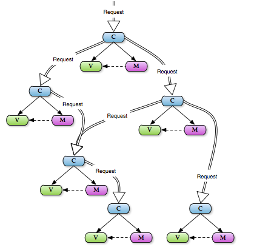
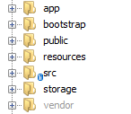
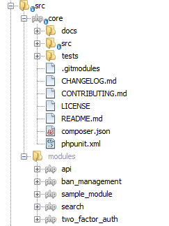
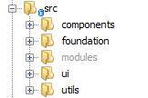

# Files Structure  

[TOC]

## Introduction  
 
The system has been designed on the basis of **HMVC** architectural pattern which stands for Hierarchical - Model - View - Controller. This type of architecture can be described with the use of the following graph:

  
  
The above mentioned graph shows:

* **M** - Model - a layer responsible for processing and delivering the data to View on the basis of data coming from the controller. The model usually is identified with the table in the database.
* **V** - View - a layer responsible for presentation of the interface, i.e. generation of html which will be displayed in the browser. The view may be conditioned, depending on data coming from the model or the Controller itself.
* **C** - Controller - the layer responsible for transforming (translating) requests coming from the browser into the View which will be directly displayed in the browser. 

The **Hierarchy** in this type of architecture relies on data exchange between individual layer groups. One layer may transfer the data to the next layer as long as the proper website's content is produced.  

## Filesystem Structure  

It is very important to keep your customizations of Antares on the same files structure as it is in the system. Antares **main files structure consists** of following directories:

  
  
* **app** - Application directory. More info is [here](https://laravel.com/docs/5.4/structure#the-root-app-directory).
* **bootstrap** - Files that bootstrap the framework and configure autoloading. This directory also includes a cache directory which contains framework generated files for performance optimization such as the route and services cache files.
* **resources** - Application views as well as raw, un-compiled assets such as LESS, SASS, or JavaScript. This directory also includes all of the language files.
* **src** - Source code of the Antares core and modules
* **storage** - Compiled [Twig](https://twig.sensiolabs.org/) templates, file based sessions, file caches, and other files generated by the Laravel framework and Antares. This directory is segregated into following subdirectories:

    * *app* - used to store any files generated by your application
    * *framework* - used to store framework generated files and caches
    * *logs* - your application's log files

* **public** - index.php file, which is the entry point for all requests to your application. Of course it includes public assets such as images, JavaScript and CSS.
* **vendor** - Composer dependencies.

### /src directory

This is the most important place in the Antares, which includes:
  
  
  
* **modules** - All additional modules that extend the basic Antares functionality. These modules are not required by the system so can be enabled/disabled/uninstalled without interfering with the default Antares functionality.
* **core** - The heart of the whole application.

### /src/core directory
 
It includes following subdirectories: 
 
   * **docs** - markdown documentation files and build reports generated by [Travis-ci](https://travis-ci.org/).    
   * **tests** - core php unit tests to verify code quality by code coverage    
   * **src** - Contains source code of Antares:
    
       
       
       * **components** - This directory contains the **Services** (see Services section in the documentation) of Antares Core, such as: acl, area manager, installer etc.  It includes following tools:
           
           * **html** - tools assisting in html design
           * **acl** - functions to control the users' access to resources (endpoints)
           * **area** - functions which enable separation into access levels (admin, user), depending on a group and the rules assigned to a single user
           * **auth** - supporting users' authorization and authentication
           * **composer** - pre and post installation scripts executed when application is installing by composer
           * **console** - supporting the commands in Laravel scheduler
           * **extension** - modules manager
           * **html** - helpers and tools for html design
           * **installer** - system installer
           * **kernel** - extended Laravel classes
           * **messages** - flash messages(short duration messages - to the next request) manager 
           * **model** - main data base business models used by the system
           * **notifier** - sending notifications to users
           * **publisher** - supports execution of module migration files            
       * **foundation** - all of required php classes which are used to boot the application. It has the base application config files with the information about default system notifications and settings (such as email templates and configuration, default system groups and roles). It connects together other core modules and services as elements to deliver one, connected, working package to use with external modules.       
       * **modules** - Here are the core modules, which which not interfere with foundation but are required by the Antares to work. It includes:             
           * [automation](../core_modules/automation.md) - is used to execute cyclic operation based on scheduler,           
           * [control](../core_modules/acl.md) - a lightweight role-based permissions module for Antares,           
           * [logger](../core_modules/logger.md) - responsible for gathering the logs coming from different parts of the system,         
           * [notifications](../core_modules/notifications.md) - used in order to execute the process of sending notifications to end users           
           * customfields - provides possibility to create system custom fields to extend default entity attributes           
           * tester - provides possibility to verify(test) configuration in various sections          
           * [translations](../core_modules/translations.md) - manage Antares translation files           
       * **ui** - various classes responsible for UI display and control. It includes:
            
           * base - including Template Base control, so breadcrumbs, menus, panes, placeholders, navigation features etc., which are used within main layout template.        
           * components - provides system UI Components which can be used by modules to display content in the UI Components Container.
                    
       * **utils** - various utilities and classes that are helpful and used by other elements of the application.  
