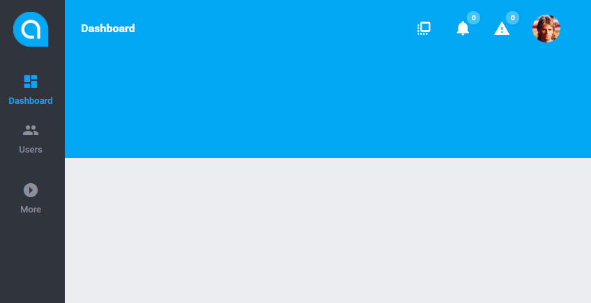

# UI Structure 

[TOC]

## The basics

Except Dashboard, which is pretty much always available, every module in the system can have it's own [Page Views](../modules_development/views_and_ui_components.md). Dashboard is a [Page View](../modules_development/views_and_ui_components.md) itself as well.
  
Every [Page View](../modules_development/views_and_ui_components.md) contains:

* **Template Base** - which includes:
  * [Menu](../antares_concepts/views.md#menus)  
  * [Breadcrumbs](../services/breadcrumbs.md)
  * [Actions of the section](../antares_concepts/views.md#breadcrumbs-menu)
  * Additional tools
    * Account icon with account menu
    * [Search](../modules/search.md)
    * [Notifications](../core_modules/notifications.md)
    * [Edit Widgets toggle](../services/widget.md#placing-the-widget-on-a-website)
        
* **[UI Components Container](../modules_development/views_and_ui_components.md)** - the area where all the [UI Compoents](../modules_development/views_and_ui_components.md#how-to-create-ui-component) (widgets) are loaded by the module.  

Some of the visible elements are not available or different for non-logged users. The only exception is login page which is currently containing only the login form.

## Template Layouts 

There are several template layouts that you can set up in the Antares per each [user level](../core_modules/control.md) (e.g. can be different for admin and different for user):

* Small Side Menu
* Big Side Menu
* Top Menu Simple (better for end-customers)
* Top Menu Advanced (rather for administrators/advanced users)

## UI Components Container

The module defines what [widgets](../services/widget.md) are visible in it's [page view](../modules_development/views_and_ui_components.md). What is more, one module can add/modify the [widgets](../services/widget.md) on other's module [page view](../modules_development/views_and_ui_components.md). This gives the developer full control on the displayed pages in the system depending on the modules installed in Antares.

There are two types of [UI Components](../modules_development/views_and_ui_components.md):

* [HTML](../modules_development/views_and_ui_components.md#how-to-create-ui-component) - using classic [TWIG](https://twig.sensiolabs.org/doc/2.x/) template engine, loaded by the Ajax request.
* Vue2 - loaded by [Webpack](../services/webpack.md)

Additionally, if enabled by developer, each view can have widgets edit option. User can use it to manually configure what UI components are visible or not and move/scale them depending on the component possibilities.

> **Please note:** You can use predefined [UI Components](../modules_development/views_and_ui_components.md) (documentation soon), customize them or make your own [UI Components](../modules_development/views_and_ui_components.md).

Just like for the page views, a module [can hook up into another module's widget](../modules_development/views_and_ui_components.md#how-to-include-view-to-others) displayed on different view. You can add your own content or even interfere with the data returned by JSON to the vue component.