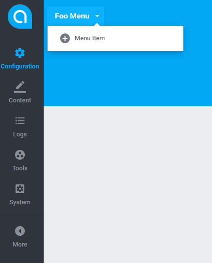

# Views  

[TOC]

## Menus  

### Main Menu  

#### Attributes  

A structure of the class responsible for main menu's generation can be depicted in the following manner:

```bash
Antares\Foo\Http\Handler\FooMainMenu
```

```php
<?php

namespace Antares\Foo\Http\Handler;

use Antares\Foundation\Support\MenuHandler;

class FooMainMenu extends MenuHandler
{

    /**
     * Configuration
     *
     * @var array
     */
    protected $menu = [
        'id'    => 'foo',
        'title' => 'Foo',
        'link'  => 'antares::foo/index',
        'icon'  => 'zmdi-format-color-text',
    ];

    /**
     * Position's designation
     * 
     * @return string
     */
    public function getPositionAttribute()
    {
        return '>:reports';
    }

    /**
     * Acl access verification
     * 
     * @return bool
     */
    public function authorize()
    {
        return app('antares.acl')->make('antares/foo')->can('index-action');
    }

}
```

Menu attribute consists of:

* id - menu's identificator, which should be unique within the whole application
* title - title of a position
* link - the url address where the menu's position will be directed after clicking
* icon - icon's css class

Menu's parameters are constituents of the **Fluent** object. Thanks to such a solution there is a possibility for free parameters' manipulation.

#### Position  

The **getPositionAttribute()** method enables menu positioning within already existing main menu. 
The following position's quantifiers can be distinguished:
  
'>:' - behind the element  
'<:' - before the element  
'^:' - inside the element (sub menu)  
  
##### Behind  

Position: 

```php
public function getPositionAttribute()
{
        return '>:reports';
}
```    
Menu's position will be placed behind the 'reports' element, just like on the screen below:

  
  
##### Before  

Position:
```php
public function getPositionAttribute()
{
        return '<:reports';
}
```

Menu's position will be placed before the 'reports' element, just like on the screen below:

  
  
##### Inside (Submenu)  

Position:
```php
public function getPositionAttribute()
{
        return '^:reports';
}
```    
The position will be placed inside the 'reports' element and is established as submenu:

  
  
##### Behind/ Before in Submenu  

Position:

```php
public function getPositionAttribute()
{
        return '>:system.sandboxes';
}
```    
The element will be placed behind the 'sandboxes' element, inside the 'system' menu:

  
  
##### Conditioning  

There is a possibility of conditioning the menu position, depending on the installed components:

```php
public function getPositionAttribute()
{
        return $this->handler->has('settings') && extension_active('automation') ? '>:settings.automation' : '>:dashboard';
}
```    
The code above verifies whether the 'settings' position is available and the component 'automation' is installed. If so, the position will be placed behind the 'automation' position, otherwise it will be placed in the main menu behind the 'dashboard' position.

The code used for downloading the list of available positions:

```php
var_dump(app('antares.platform.menu')->items());
```    
Another way is inside the **getPositionAttribute()** method:

```php
var_dump($this->handler->items());
```    

##### Access' Control   

The method:

```php
public function authorize()
{
        return app('antares.acl')->make('antares/foo')->can('index-action');
}
```    
verifies whether the logged in user has access to the specific resource. If not, the menu's position will not be displayed.

##### Translation of a Title  

The method:

```php
public function getTitleAttribute($value)
{
    return trans("antares/foo::messages.menu_" . $value);
}
```

will translate title's position according to the selected language.

#### Start  

To make the position visible, add menu's class to global configuration `/resources/config/menu.php`.
This file is a general configuration created for the needs of custom solutions. 
The content of the file:

```php
<?php
return [
    'antares.started: admin'                     => [
        \Antares\Foundation\Http\Handlers\DashboardMenu::class      => 1000,       
    ],
    'antares.ready: menu.after.general-settings' => [
        \Antares\foundation\src\Http\Handlers\SecurityMenu::class,        
    ],
    'antares.ready: menu.after.logger'           => [
        \Antares\Logger\Http\Handlers\System::class => 993
    ]
];
```

determines in which events in the system specific menu positions will be presented. The number being key's value is the priority - order of start.

### Breadcrumbs Menu  

#### Attributes  

Breadcrumb is a type of menu started during the 'composing' event. Syntactically, menu's class is very similar to the class from main menu. The differences rely on the form of start and attributes.

The code:

```php
    /**
     * Configuration
     *
     * @var array
     */
    protected $menu = [
        'id'    => 'foo-breadcrumb',
        'title' => 'Foo Menu',
        'link'  => 'antares::foo',
        'icon'  => null,
        'boot'  => [
            'group' => 'menu.top.foo',
            'on'    => 'antares/foo::admin.foo.index'
        ]
    ];
```

contains additional 'boot' attribute, defining start's parameters:

* group - name of the group that has the menu presented within. This attribute is essential due to the fact that positions coming from other components can pin to a group.
* on - name of a view identified with a menu means that during rendering of the view 'antares/foo::admin.foo.index' (composition) the menu must be started.

#### Submenu  

Adding a submenu within the breadcrumbs menu is associated with the 'handle' method, as in the example below:

```php
	
    /**
     * The method released during the rendering of a view, adding and building menu as breadcrumbs submenu
     * 
     * @return void
     */
    public function handle()
    {
        if (!$this->passesAuthorization()) {
            return;
        }
        $this->createMenu();
        if (!app('antares.acl')->make('antares/foo')->can('index-action')) {
            return;
        }
        $this->handler
                ->add('foo-add', '^:foo')
                ->title('Menu Item')
                ->icon('zmdi-plus-circle')
                ->link(handles('antares::foo/create'));
    }
```

The method not only verifies whether the user has acces to the position, but also responds to adding a position.

#### Start  

The start is done through the agency of the code:

```php
$this->attachMenu(FooBreadcrumbMenu::class);
```

placed in the 'boot' method of the component's service provider.

The efect of the created menu, is depicted by the picture below:

  


## Pane  

Pane is a type of a widget which can be placed in view's component. It enables for separation of view's section in order to separate the data section, separating one section from another, creating personalized menu for section etc.
An example of implementation is the following:

```php
<?php

namespace Antares\Foo\Http\Handler;

use Antares\Foundation\Http\Composers\LeftPane;

class FooPane extends LeftPane
{

    /**
     * Pane composition
     *
     * @return void
     */
    public function compose($name = null, $options = array())
    {
        $this->widget->make('pane.left')
                ->add('foo')
                ->content(view('antares/foo::admin.partials._pane'));
    }

}
```

The FooPane object contains the 'compose' method which is resumed during the 'composing' event. This means that widget's composition will be realized during rendering of the indicated view.
Indicating of the view:

```php
view()->composer(['antares/foo::admin.foo.index'], FooPane::class);
```

should be placed in service provider, in the 'boot' method and it is the start of the widget.

**Result**:

  
  
The menu can be ascribed to the pane object and the example is the following:

```php
        $menu = $this->widget->make('menu.brands.pane');
        $menu->add('foo-item')
                ->link('#')
                ->title('Foo item')
                ->icon('zmdi-settings');

        $menu->add('foo-item-submenu')
                ->link('#')
                ->title('Foo item with submenu')
                ->icon('zmdi-settings');

        $menu->add('foo-item-submenu-element', '^:foo-item-submenu')
                ->link('#')
                ->title('Foo Submenu item');

        $this->widget->make('pane.left')
                ->add('foo')
                ->content(view('antares/foundation::components.placeholder_left')->with('menu', $menu));
```

The effect:

  
  
Please remember that contents coming from other components and modules can be pinned to the pane objects.

## Placeholder  

As opposed to pane type widget, the placeholder's task is to present partial type view in any place at the system. As opposed to the pane object, the example:

```php
<?php

namespace Antares\Foo\Http\Handler;

class FooPlaceholder
{

    /**
     * Placeholder composition
     * 
     * @return void
     */
    public function handle()
    {
        app('antares.widget')
                ->make('placeholder.foo')
                ->add('foo')
                ->value(view('antares/foo::admin.partials._foo_placeholder'));
    }

}
```

consist of the `handle` method listening out for appearing of the right event and does not depend on the view which is being presented. The 'handle' method adds to the widget's object a new object of the 'placeholder' type and ascribes a name to it and value in the form of the view. If the event with an ascribed placeholder is picked out, the view will be rendered. Ascribing to an event is usually made in service provider:

```php
    protected $listen = [
            'antares.ready: admin' => [FooPlaceholder::class],
    ];
```

**The placeholder will be displayed in a place, where the helper twig will be placed:**

```html
    {{ placeholder('foo') }}
```

which will render the content declared by the 'handle' method. The effect:

  
  
Please remember that the contents coming from other components and modules may be pinned to the `placeholder` objects.
