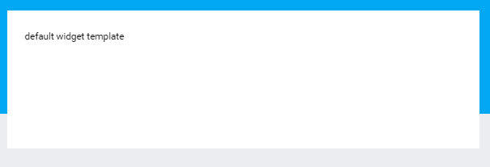
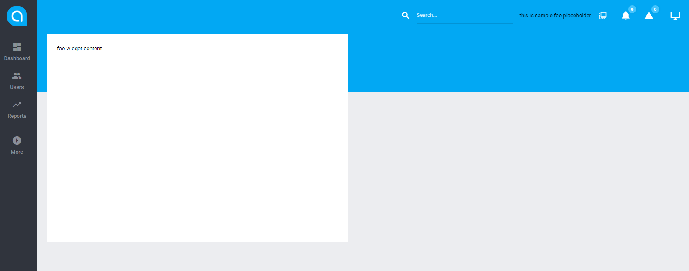
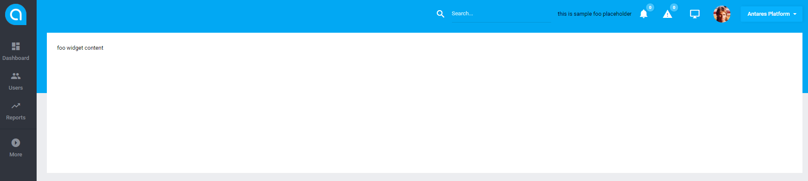
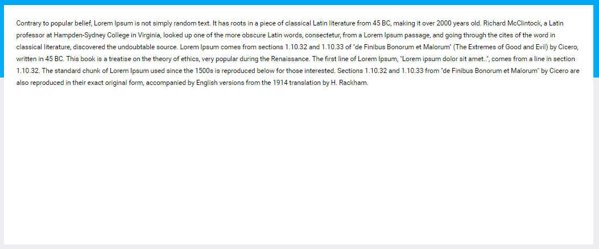

# Widget Templates  

[TOC]

## Widget Templates  

Widget Template is a structure creating decoration of existing widget instance. This means that, if there is a need for constructing a widget containing 'Datatables', one can use a set of predefined solutions known as widget templates. 
  
The following widget templates (that are currently supported) can be distinguished:  
  
* default  
* datatables  
* ajax  
  
### Default  

A template used for general destination content's publication:

```php
<?php
  
namespace Antares\Foo\Widgets;
  
use Antares\Widgets\Adapter\AbstractWidget;

class DefaultFooWidget extends AbstractWidget
 {

  /**
  * Name of the widget
  *
  * @var String
  */
  public $name = 'Default Foo Widget';
  
  /**
  * Render method is responsible for widget's content publication
  *
  * @return string
  */
  public function render()
  {
  return 'default widget template';
  }
}
```

And the result is:

  
  
Widget's file 'layout' content, located in 'src\components\widgets\resources\views\templates\default\index.twig':

```console
src\components\widgets\resources\views\templates\default\index.twig
```

```html


    <div class="card card--info card--padding24">
        
            <div class="card__header">
                <div class="card__header-left">
                    <span>
                        {{ name }}
                    </span>
                    {{ event('widgets:render.header-left.'~name)|raw }}
                </div>        
                <div class="card__header-right">
                    {{ event('widgets:render.header-right.'~name)|raw }}
                </div>
            </div>
        
        <div class="card__content">
            {{ content|raw }}
        </div>
    </div>

```

### Datatables  

Template is used for content's publication in the tabular form. An example of the structure:

```php
<?php
namespace Antares\Foo\Widgets;

use Antares\Widgets\Templates\DatatablesWidget as WidgetTemplate;
use Antares\Foo\Http\Datatables\FooDatatable;
use Illuminate\Support\Facades\Route;

class TableFooWidget extends WidgetTemplate
{

    /**
     * @var String
     */
    public $name = 'Foo Table Widget';

    /**
     * Routing's definition within the widget
     * 
     * @return \Symfony\Component\Routing\Router
     */
    public static function routes()
    {
        Route::post('foo-list', ['middleware' => 'web', function() {
                return app(FooDatatable::class)->ajax();
            }]);
    }

    /**
     * Widget's content publication
     * 
     * @return String | mixed
     */
    public function render()
    {
        $table = app(FooDatatable::class)->html('/foo-list');
        return view('antares/foo::widgets.datatable', ['dataTable' => $table]);
    }
}
```

And the result:

  
  
It is worth noticing that the pointed object '**TableFooWidget**' inherits from 'WidgetTemplate' that is '**Antares\Widgets\Templates\DatatablesWidget**'. The 'render' method will cause widget's data publication, that is the view containing 'Datatables' instance in this case. The file's structure which is responsible for widget's content rendering, is the following:

```html
{{ dataTable.scripts()|raw }}
{{ dataTable.tableDeferred()|raw }}
```

The 'Datatables' object is transferred to the view and in such a situation the 'scripts()' method is done which generates javascript responsible for correct datatables operation according to parameters. The 'tableDeferred()' method creates table's prototype, filled with data in initialization mode. Template uses 'datatables' layout by default. Structure of this layout is the following:

```html


    {{ content|raw }}

```

Thus, only the content is generated, which is widget's response. Setting of individual sections responsible for displaying the buttons such as 'Filter' or 'Mass actions' are done by Datatables' definition. More information about Datatables objects' construction can be found [here](https://inbssoftware.atlassian.net/wiki/display/AS/Datatables). 
Layout file's content located in 'src\components\widgets\resources\views\templates\datatables\index.twig':

```console
src\components\widgets\resources\views\templates\datatables\index.twig
```

```html


    <div class="card card--info card--padding24">
        
            <div class="card__header">
                <div class="card__header-left">
                    <span>
                        {{ name }}
                    </span>
                    {{ event('widgets:render.header-left.'~name)|raw }}
                </div>        
                <div class="card__header-right">
                    {{ event('widgets:render.header-right.'~name)|raw }}
                </div>
            </div>
        
        <div class="card__content">
            {{ content|raw }}
        </div>
    </div>

```

### Ajax  

Ajax widget template is a group of widgets in which, as the name suggests, content is loaded dynamically. This means that once the main container appears (its parameters are determined by widget's attributes) it will be downloaded by the ajax way.
Widget's example which uses a template:

```php
<?php

namespace Antares\Foo\Widgets;

use Antares\Widgets\Templates\AjaxWidget as WidgetTemplate;
use Illuminate\Support\Facades\Route;

class AjaxFooWidget extends WidgetTemplate
{

    /**
     * Name of the widget
     * 
     * @var String
     */
    public $name = 'Foo Ajax Widget';

    /**
     * widget attributes
     * 
     * @var array
     */
    protected $attributes = [
        'remote'   => 'foo-widget-content'
    ];

    /**
     * Routing definition
     * 
     * @return \Symfony\Component\Routing\Router
     */
    public static function routes()
    {
        return Route::get('/foo-widget-content', function() {
                    return view('antares/foo::widgets.ajax-sample-widget-content');
                });
    }

    /**
     * Widget's content publication, which will be downloaded by ajax
     * 
     * @return String | mixed
     */
    public function render()
    {
        return view('antares/foo::widgets.ajax')->render();
    }

}
```

Please notice widget's attributes. The **remote** attribute defines url address and its content will be downloaded. The class inherits from `Antares\Widgets\Templates\AjaxWidget` that is from template class of the ajax type. File's view in the 'render' method has the following syntax:

```console
antares/foo::widgets.ajax
```

```html
<div class="widget-content">
    <div class="alert alert--glow alert--info alert--lg alert--border mb20" >
        <i class="alert__icon zmdi zmdi-info"></i>
        <span>Loading widget content...</span>
        <i class="alert__close zmdi zmdi-close"></i>
    </div>
</div>
```

It will cause content's display before the loading of the ajax content:

  
  
View's file within the 'routes' method, is the content downloaded by ajax:

```console
antares/foo::widgets.ajax
```

```html
<p>
        Contrary to popular belief, Lorem Ipsum is not simply random text. It has roots in a piece of classical Latin literature from 45 BC, making it over 2000 years old. Richard McClintock, a Latin professor at Hampden-Sydney College in Virginia, looked up one of the more obscure Latin words, consectetur, from a Lorem Ipsum passage, and going through the cites of the word in classical literature, discovered the undoubtable source. Lorem Ipsum comes from sections 1.10.32 and 1.10.33 of "de Finibus Bonorum et Malorum" (The Extremes of Good and Evil) by Cicero, written in 45 BC. This book is a treatise on the theory of ethics, very popular during the Renaissance. The first line of Lorem Ipsum, "Lorem ipsum dolor sit amet..", comes from a line in section 1.10.32.
        The standard chunk of Lorem Ipsum used since the 1500s is reproduced below for those interested. Sections 1.10.32 and 1.10.33 from "de Finibus Bonorum et Malorum" by Cicero are also reproduced in their exact original form, accompanied by English versions from the 1914 translation by H. Rackham.
</p>
```

As a result, a widget will be created:

  
  
'layout' file's content, located in
'src\components\widgets\resources\views\templates\ajax\index.twig':

```html


    <div class="card card--info card--padding24">
        
            <div class="card__header">
                <div class="card__header-left">
                    <span>
                        {{ name }}
                    </span>
                    {{ event('widgets:render.header-left.'~name)|raw }}
                </div>        
                <div class="card__header-right">
                    {{ event('widgets:render.header-right.'~name)|raw }}
                </div>
            </div>
        
        <div class="card__content widget-content-{{widgetId}}">
            {{ content|raw }}
            <script type="text/javascript">
                {{ script|raw }}
            </script>
        </div>
    </div>

 ```   
