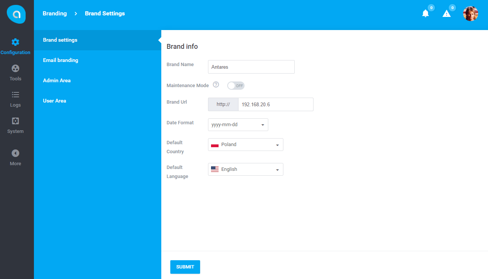
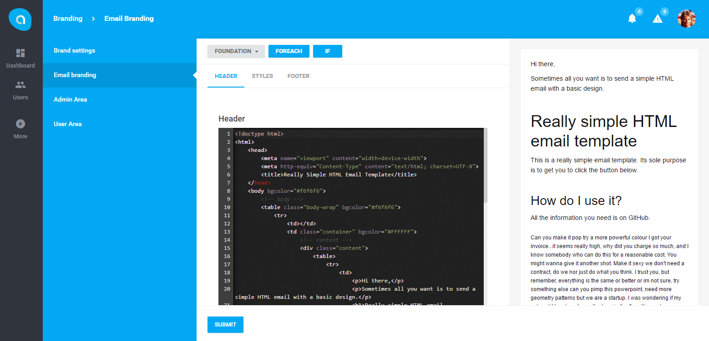
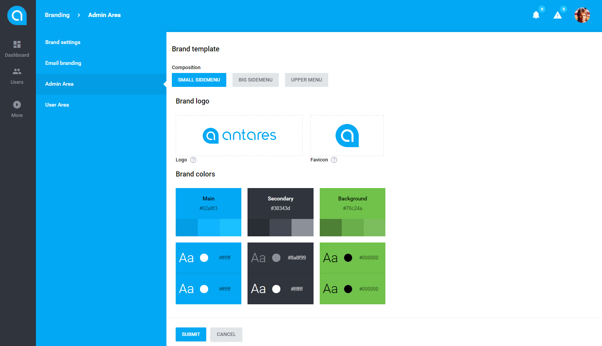

# Branding

[TOC]

## Introduction

The module provides the possibility to devide the application into brands. 

By default, one main brand which is the default brand at the same time is set during the system installation. 
Brands' functionalities provide the possibility to define own color settings for the whole application, 
default composition of e-mail templates (header, style, footer), URL, date and language settings. 
Dividing the application into areas is a superior function in relation to brands. 
Area is a level of the system's operation, which means that different groups of users may have different settings of the same brands. 
For instance, the users at the *redactors* level may have different color settings, 
footer and heading for outgoing e-mails, whereas the *administrators* level may have different settings of the same brand. 
Users' and UI components settings are related to the brand.
 
This means that a group of users e.g. *redactors* may have different resource access settings in one brand, 
in other brand these settings may be different. Thus, ui components settings (e.g. location) in one brand may be different in another.

## Brand configuration
  
Brand's configuration is available at `Branding` under `Configuration` section in the main menu.

   
The menu dedicated to the settings of a particular brand can be found on the left. 

Description of particular fields of the form:
1. Brand name - the name of the brand.
2. Maintenance mode - the synonym for stat.
3. Brand url - the URL related to the brand. When entering the URL, the application moves directly to the brand.
4. Date format - the date format recognized within the brand.
5. Default country - the default country which is used for the billing and conversion rate purposes.
6. Default language - the application's default language.

## Email branding

Email Branding provides the defining form of a new e-mail template. 
The template is used when sending an e-mail from the system, which is based on the [notifications](../core-modules/notifications.md) module:

  
Inline code editor is placed on the left. Each change is visible in the preview **on the right**. Changes are mirrored in the real mode. Above, the following tabs can be found:

1. Header - header is responsible for message heading
2. Styles - message css styles
3. Footer - message footer

The variables that can be attached directly to the content of the created template can be found at the top.

## Area branding

The menu on the left has the following positions:
1. Admin area
2. User area

These positions are areas (levels) of particular user groups. Each group enables color edition and the general application's design:

  
  
Description of particular fields of the form:

* Composition - the composition of the menu that determines location and size
* Brand logo - logotypes assigned to the application, Logo is the main logotype (presented at the login page and at the application's website for a wide menu), Favicon - application's icon:
* Brand colors - color assigned to the brand, it enables the color edition of particular application's sections

  
