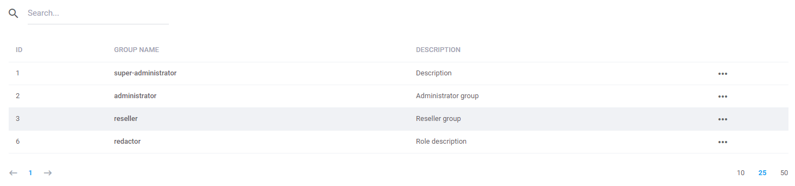
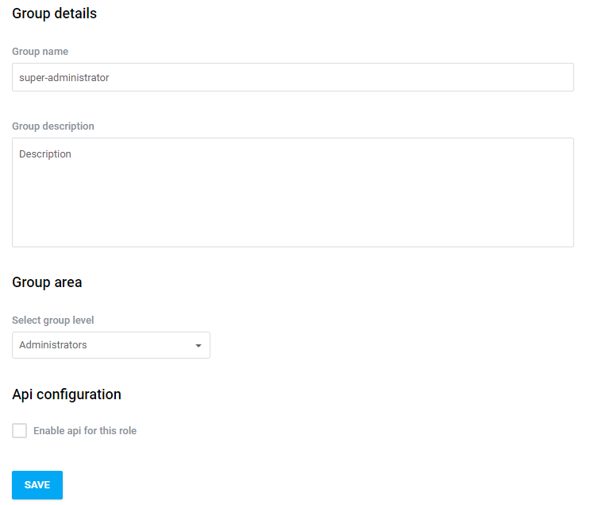
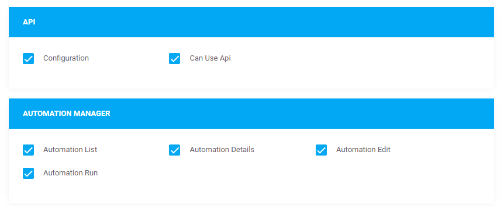

# Acl  

[TOC]

## Introduction

Acl is a lightweight role-based permissions module for Antares. 
It is designed to manage user access to resources located in different sections of the application. It sets up permissions based on module rules. It provides  NIST Level 2 Hierarchical Role Based Access Control (RBAC). It also provides an interface for administator to manage user roles (ACL configuration).   
 

## Groups  

Acl is a module for handling users' access permission to resources. The panel is available at the address below:

```bash
/{area}/acl/roles/index
```

e.g. /admin/acl/roles/index or when you choose the *Staff* position in the *Configuration* menu. 
It consists of the *Groups* and *Users* sections. 

*Groups* - groups of users (in other words - roles). 
To find more about groups go to the [Auth and ACL](../services/auth_and_acl.md) section. 

The list of available groups is the following:

  
  
In order to edit a group, click twice on a row and choose the *Edit* position in the context menu. Editing a group is based on the form:

  
  
Description of fields:

* Group name - name of a group
* Group description - description
* Group level - area (level) ascribed to a group
* Api - determining access through api

The remaining part of the form defines the group's availability for particular system sections divided into the components:

  
  
Checking/unchecking the checkboxes is equivalent to activating/deactivating the access to resource within the component.

## Users  

The `users` section available in the left menu includes a list of administrative users. The edition of the administrative user is identical with *My Account* form. In a list view, it is possible to add a new user similarly to the exmaple of the main menu 'Users' section. The difference lies in the fact that in this case you can choose the group where the user will belong.
