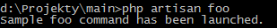
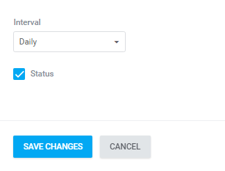
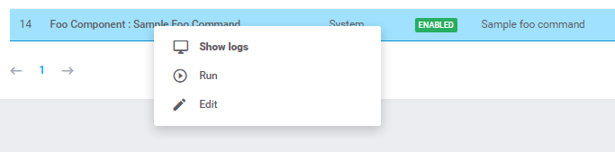

# Automation  

Automation is a module used to execute cyclic operations based on [laravel task scheduler](https://laravel.com/docs/5.4/scheduling). It serves as a replacement for setting up your own cron jobs to make it easier to manage. It provides an intuitive control  interface on the admin level. Automation can run tasks every few minutes, hourly, daily or weekly - depending how you set it up. Scheduled data is stored in the system database.

The operation is defined as a class which inherits from the `Antares\View\Console\Command` object, so it can be correctly recognized and interpreted in the system. A type of operation is usually a process running in the background (e.g. dispatch of e-mail notifications), or reports' generation which usually influence application's efficiency. The component as a whole is a cron's substitute in a server and it is based on activation of the command:

```bash
php artisan queue:start
```

Activation of the command causes launching all operations (jobs) from the *jobs* table. The process ascribed to the command is a demon and operates in the continuous mode monitoring the *jobs* table from an angle of new operations.
An example of a class fulfilling the task within *automation*:

```php
<?php
 
namespace Antares\Foo\Console;
 
use Antares\View\Console\Command;
 
class FooCommand extends Command
{
 
    /**
     * human readable command name
     *
     * @var String
     */
    protected $title = 'Sample Foo Command';
 
    /**
     * when command should be executed
     *
     * @var String
     */
    protected $launched = 'daily';
 
    /**
     * when command can be executed
     *
     * @var array
     */
    protected $availableLaunches = [
        'everyMinute',
        'everyFiveMinutes',
        'everyTenMinutes',
        'everyThirtyMinutes',
        'hourly',
        'daily'
    ];
 
    /**
     * The console command name.
     *
     * @var string
     */
    protected $name = 'foo';
 
    /**
     * The console command description.
     *
     * @var string
     */
    protected $description = 'Sample foo command';
 
    /**
     * whether command can be disabled
     *
     * @var boolean
     */
    protected $disablable = true;
 
    /**
     * Execute the console command.
     *
     * @return void
     */
    public function handle()
    {
        $this->line('Sample foo command has been launched.');
    }
}
```

To make the command visible in the *automation* space execute the following command:

```bash
php artisan automation:sync
```

which is responsible for all commands' instances synchronization in the system. This process is usually launched automatically when the system works within the confines of the *WatchDog* service. The command causes adding an instance to the *tbl_jobs* table which is responsible for preserving all system commands:

  
  
There is a possibility of launching only the command from the console's level. To this end, you have to inform the Laravel environment about such a command (the *boot* method) in the service provider:

```php
$this->commands(FooCommand::class);
```

Then, on the basis of the command's example indicated above, the launching is:

```bash
php artisan foo
```

And the result:

  
  
The table which is responsible for preserving the results of particular commands' operations is *tbl_job_results*, in the case of errors it is: *tbl_job_errors*. The table which is responsible for commands' categories is *tbl_jobs_category*. Categories are added automatically supposing that they were not defined earlier within the frameworks of the *automation:sync* process.

The *automation* command consists of the following parameters:

* title - determines the title of a command, it should be concise, comprehensible, and should determine the command's intended use
* launched - determines the default frequency of launching the command
* availableLaunches - determines the abilities of changing the launch frequency, it is available during editing the command within the automation's framework. It accepts the following default values:

```php
/**
 * when command can be executed
 *
 * @var array
 */
protected $availableLaunches = [
    'everyFiveMinutes',
    'everyTenMinutes',
    'everyThirtyMinutes',
    'hourly',
    'daily',
    'dailyAt'    => '13:00',
    'twiceDaily' => [1, 13],
    'weekly',
    'monthly',
    'quarterly',
    'yearly'
];

```

* description - description of the command
* disablable - whether the command can be deactivated at the GUI interface level by a user (default value: true)
* category - a category determining where the command belongs (default value: system), created solely for the purposes of grouping

Each of the command may overwrite the edition form, which allows full freedom when it comes to configuration of a command. By default the edition form appears in the following manner:

  
  
Overwriting the form is possible through overwriting the *form()* method - its definition can be found in the base class. The following options are available on particular line which is a command in automation:

  
  
'Show logs' is used to preview the results of commands operation, 'Run' activates the command at the interface level (adding to task execution queue), whereas 'edit' displays command's parameters edition form.
