# Logger  

[TOC]


## Introduction

Logger is a component responsible for gathering the logs coming from different parts of the system.
It provides activity logger for monitoring users and processes which application taking while work. It logs the activity priority level and class, the remote user identifier (if logged), its computer details and many more. 
In additional there is application's error logger and request logger to collect data about the state of the system.      

## Activity Logs  

They are system's users logs of activity. Depending on the role (group) of the logged in user not every log may be presented. For instance, a logged in user who belongs to the *resellers* group will not be able to see the activity logs of users who are ascribed to the *administrators* group. Nevertheless, the users who belong to the *administrators* group will have access to the *resellers'* logs because the former group is the superior one.

  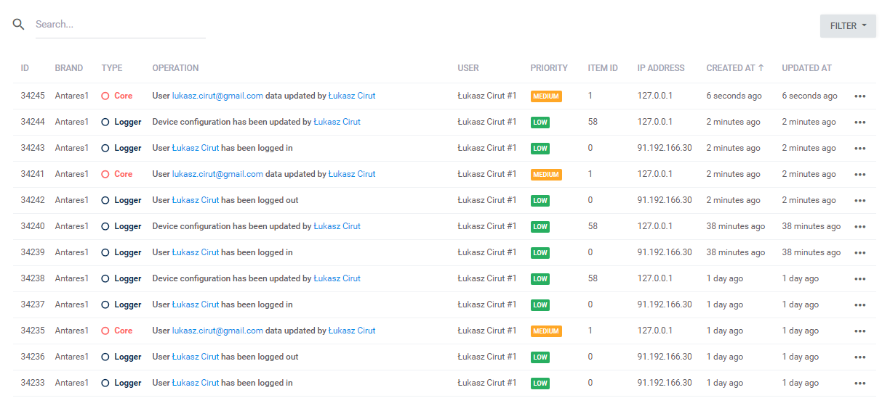
  
The details of each log are available once you click the right mouse button and choose the 'Show details' position within the framework of the table's row. It is also possible to go directly into details by clicking twice on a row:

  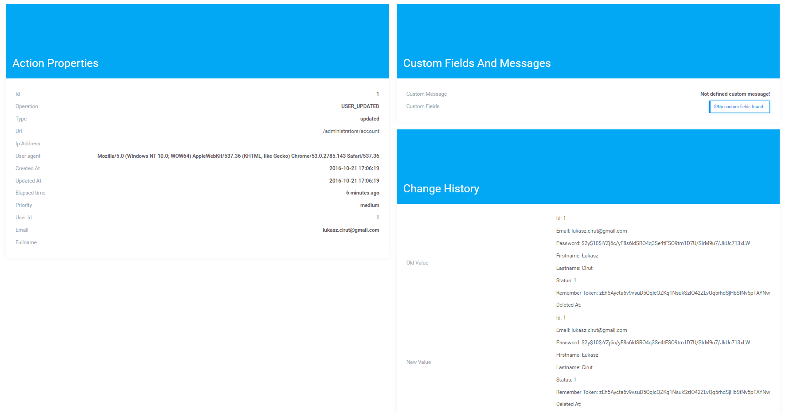
  
The '*Action Properties*' section is responsible for presenting the information connected with the taken action. The '*Custom Fields and Messages*' section contains information about dedicated fields ascribed to the model (models) - the one the action was taken for. '*Change history*' contains model's update history.

Each of the rows presented at the log list can be deleted. It is also possible to download the logs in the form of the csv file:

  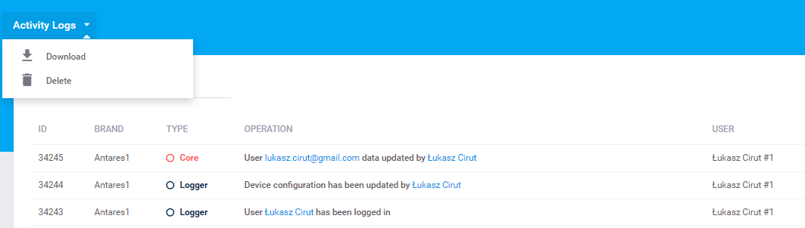
  
You can also delete the logs for a given date range:

  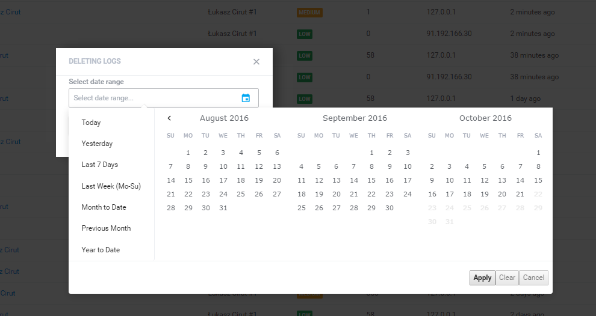
  
### Usage  

In order to relate activity log with an operation you have to indicate the Trait occurrence (`Antares\Logger\Traits\LogRecorder`) in the Eloquent model:

```php
<?php
 
namespace Antares\Foo\Model;
 
use Antares\Logger\Traits\LogRecorder;
use Antares\Model\Eloquent;
 
class FooRow extends Eloquent
{
 
    use LogRecorder;
...

```

Trait's task is to fill the log table during the actions executed at base models (in this case it is FooRow). Recognized actions:

* insert
* update
* delete


  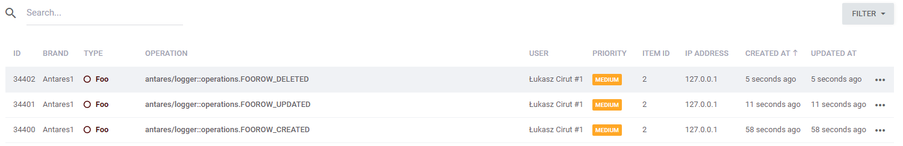
  
Additional configuration of activity logs takes into consideration the following parameters within the frameworks of the Eloquent model:

```php
//Disables the log record in this model.
protected $auditEnabled   = true;

// Disables the log record after 500 records.
protected $historyLimit   = 500;

// Fields you do NOT want to register.
protected $dontKeepLogOf  = ['created_at', 'updated_at', 'deleted_at'];

// Tell what actions you want to audit.
protected $auditableTypes = ['created', 'saved', 'deleted'];

```

* auditEnabled - determines whether a log should be activated or not for a given model (default value: true)
* historyLimit - history data limit, currently this value is not supported
* dontKeepLogOf - determines which columns should be ignored when saving the data
* auditableTypes - types of events which will be a basis for taking the action of saving


### Translations  

By default, the content of the executed action is subordinate to trial of translation on the basis of the language file found in the location:

```bash
src\components\logger\resources\lang\en\operations.php
```

After adding the translations:

```php
'FOOROW_CREATED'=> 'Foo item :owner_id has been created by :user',
'FOOROW_UPDATED'=> 'Foo item :owner_id has been updated by :user',
'FOOROW_DELETED'=> 'Foo item :owner_id has been deleted by :user',
```

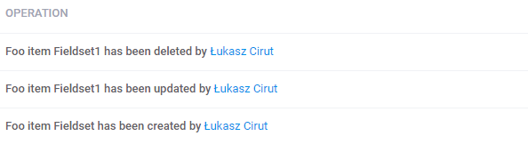
  
As you can notice, translations may use variables. Below, the list of predefined variables which are injected to the translated content:

* :owner_id - entity occurrence in the form of the string. If entity table contains a column named 'name', the value of this column is taken as first. Columns' order arrangement: name, value, email, version, domain, message, hostname, company_name, ip_address, id.
* :user_id - object's entity of the currently logged in user which executes the given action (also projected on string on the basis of the *firstname* and *lastname* columns).

What are the basis of the activity logs' functionality can be found [here](https://github.com/Regulus343/ActivityLog). The functionalities are also developed on the basis of system's guidelines.

## Request Logs  

Logs contain information about requests coming to the system and the types of these requests. The register can be found at the address /:area/logger/request (e.g. /administrators/logger/request). It is a list of files where the logs are saved (they are not saved in database as opposed to the activity logs).
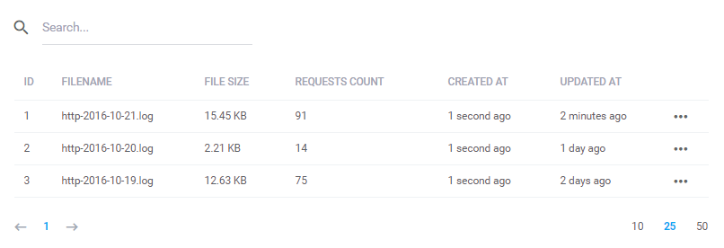
  
Request logs have been implemented for security and safety purposes. Request logs are gathered automatically and saved in files which are grouped for each day separately. Save location: */storage/logs*. Each line in the register is a mapping of physical file which is in the server. File's details are shown on the screen:
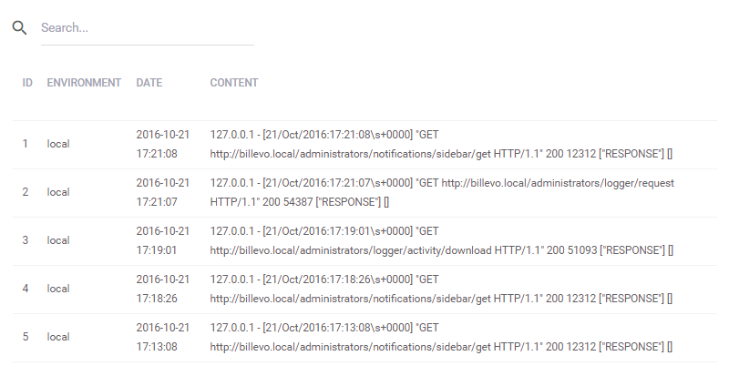
  
## Error Logs  

These are application's error logs in the form of files' register where the details of error occurrence are saved. They are divided into categories according to type and they are added automatically during application's operation:
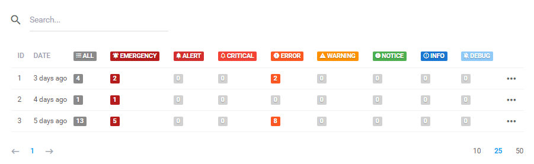
  
The code used to save manually error occurrence in a file:
```php
Log::warning('Unable to show user: '.$id);
```

or:
```php
try{
    //sample logic 
}catch(Exception $e){
    Log::error('Unable to show user: '.$id);
}
```

More information concerning the logs can be found [here](../services/logs.md).
Below, the details of a log (a file) which are available once the *View* position is chosen in the row's context menu or by clicking twice on the row:

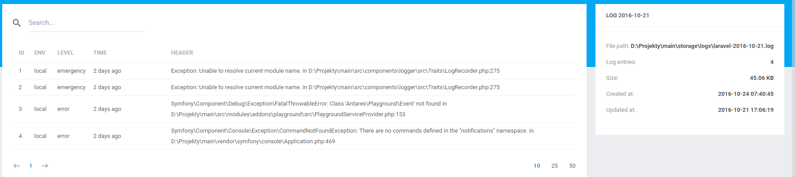
  
Each log may be removed or downloaded.

##Automation Logs  

Logs which are closely related to the [automation](automation.md) component are called automation logs. They are a register of scripts' and processes' operation results:
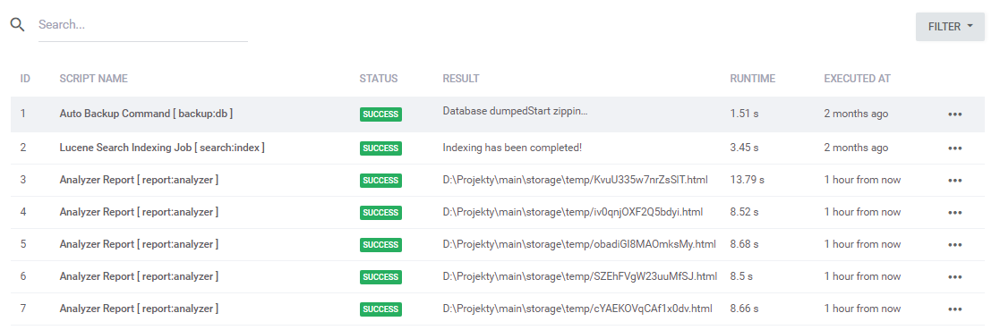
  
