# Notifications  

[TOC]

## Introduction  

Notifications module is responsible for configuration interface of notification templates and sending notifications to users in the system. It handles email and sms notifications, but also displays alerts (the bell icon) to the users. It allows administrator to set up their own text and supports multi-language.

## Type of notifications

### E-mail notifications

E-mail notifications as the very name suggests are sent in the form of e-mail to a user (users). The content of the message is determined by means of the notification template where variables from other modules can be pinned.

### Sms notifications
   
As you can see this is a kind of notifications which are sent as an sms to the user's (users') telephone number. Similarly to e-mail notifications, an sms operates variables from different modules.

### System notifications
  
System notifications is a kind of notifications send to the system which are frequently a result of some (usually fundamental) operation. Notifications of this type are available at the top of the website in the form of the icons below:


  
System notifications are divided into notifications and alerts. The general flow of notification's course in the system may be described by means of the following diagram:


  
All types of notifications operate multilingualism of translations for templates and they may (or may not) use the variables from different application's fragments.

## Migration Files 

Using the component is connected with filling the tables' structure, which usually occurs on the basis of migration files. These files are used in order to insert notification's content to the system which can be processed later at the GUI interface level. Exemplary migration file of a single notification (e-mail) may be the following:

```php
<?php
 
use Antares\Notifier\Seeder\NotificationSeeder;
 
class EmailFooNoificationSeeder extends NotificationSeeder
{
 
    /**
     * Sample email foo ntofication seeder
     *
     * @return void
     */
    public function run()
    {
        $this->down();
        $this->addNotification([
            'category' => 'default',
            'type'     => 'administrators',
            'severity' => 'high',
            'event'    => 'email.foo_notification',
            'contents' => [
                'en' => [
                    'title'   => 'Email notification from foo',
                    'content' => file_get_contents(__DIR__ . '/../../views/notification/emails/foo_notification.twig')
                ],
            ]
        ]);
    }
 
    /**
     * Deletes migration entries from DB
     *
     * @return void
     */
    public function down()
    {
        return $this->deleteNotificationByEventName('email.foo_notification');
    }
}
```

When analyzing the code above you can notice that the notification consists of:

- ***category*** - determines notification's category, it does not fulfill logical function, it is used only for grouping in the interface. If you want to display the list of available categories, you have to call the console command

```bash
php artisan notifications:category-list
```
    
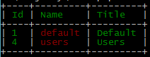
   
The default value is the *default* category.

- ***type - area***, in other words, that is user's work space. Several groups of users can be ascribed to one area. Area defines interface appearance and e-mail template. In order to display the list of available types (areas) you have to call the console command

```bash
php artisan notifications:types-list
```

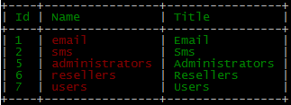

If the type is not defined, the notification will be added to all types with the exception of e-mail and sms types.

- ***severity*** - determines notification's priority. Depending on priority, system notification may be treated as an alert (high, highest), or as simple (medium). If you want to display the list of available priorities, you have to call the console command

```bash
php artisan notifications:severity-list
```
   
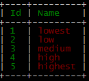
    
The default priority is `medium`.

The above-mentioned example is a migration file which imports e-mail notification. In the case of `sms notification` implementation may be the following:

```php
<?php
 
use Antares\Notifier\Seeder\NotificationSeeder;
 
class SmsFooNoificationSeeder extends NotificationSeeder
{
 
    /**
     * Sample sms foo ntofication seeder
     *
     * @return void
     */
    public function run()
    {
 
        $this->down();
        $this->addNotification([
            'event'    => 'sms.foo_notification',
            'contents' => [
                'en' => [
                    'title'   => 'Sms foo sample notification',
                    'content' => 'Hello from foo component'
                ],
            ]
        ]);
    }
 
    /**
     * Deletes migration entries from DB
     *
     * @return void
     */
    public function down()
    {
        return $this->deleteNotificationByEventName('sms.foo_notification');
    }
}
```

The lack of filling the category, priority or type is worth noticing. These parameters will be filled with default values. In order to add system notification, you have to import a file according to the code below:

```php
<?php
 
use Antares\Notifier\Seeder\NotificationSeeder;
use Illuminate\Support\Facades\DB;
 
class SystemFooNoificationSeeder extends NotificationSeeder
{
 
    /**
     * Adds data to tables
     *
     * @return void
     */
    public function run()
    {
 
        $this->down();
        $this->addNotification([
            'category' => 'default',
            'event'    => 'notification.foo_has_been_created',
            'contents' => [
                'en' => [
                    'title'   => 'Foo has been created',
                    'content' => 'Foo [[ model.name ]] has been created by [[ user.firstname ]] [[ user.lastname ]].'
                ],
            ]
        ]);
        $this->addNotification([
            'category' => 'default',
            'severity' => 'high',
            'event'    => 'notification.foo_has_not_been_created',
            'contents' => [
                'en' => [
                    'title'   => 'Foo has not been created',
                    'content' => 'Foo [[ model.name ]] has not created.'
                ],
            ]
        ]);
    }
 
    /**
     * Removes data from tables
     *
     * @return void
     */
    public function down()
    {
        return $this->deleteNotificationByEventName([
                    'notification.foo_has_been_created',
                    'notification.foo_has_not_been_created'
        ]);
    }
}

```

In all the aforementioned cases you deal with the `event` parameter. This parameter determines the name of the event which will call notification sending.

### Starting The Migration Files  

Starting the notification's migration files should occur along with module's activation/ installation in the system. To make the system recognize correctly the path and to start the migration the files must be placed in the `resources/database/seeds` catalogue. Do not forget about the `down()` method's operation which is started during module's deactivation/ uninstalling. When the migration file is started in this manner, the notification will be added to the `notifications templates` section (default path: `/administrators/notifications/index`):

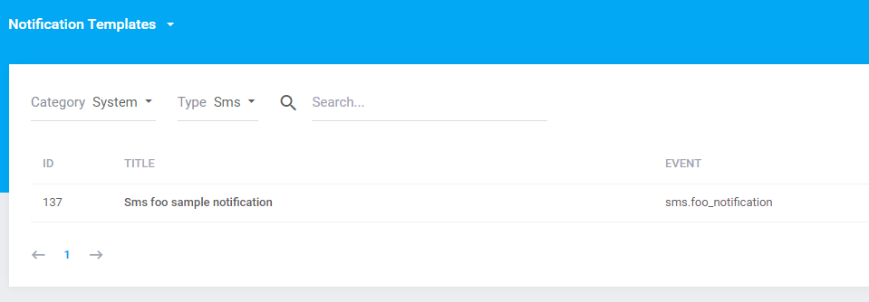
  
In case when the system is updated or when it is necessary to update only the notifications, it is good to move the migration files to the location `/resources/database/seeds` in the main application's structure.

## Starting The Notification  

### System Notifications  

Starting the notification occurs by means of launching the event related to notification in the place determined by the programmer. Consider the example of adding the system notification:

```php
/**
 * When stores form fields in database
 *
 * @return \Illuminate\Http\RedirectResponse
 */
public function store()
{
    $input      = Input::all();
    
    $attributes = [
        'user_id' => user()->id,
        'name'    => array_get($input, 'name'),
        'value'   => array_only($input, ['field_1', 'field_2'])
    ];
    
    $model      = new FooRow($attributes);
    
    $form       = $this->form($model);
    
    if (!$form->isValid()) {
        return redirect_with_errors(handles('antares::foo/index/create'), $form->getMessageBag());
    }
    
    if (!$model->save()) {
        notify('notification.foo_has_not_been_created', ['variables' => ['model' => $model]]);
        return redirect_with_message(handles('antares::foo/index'), trans('antares/foo::messages.save_error'), 'error');
    }
    
    notify('notification.foo_has_been_created', ['variables' => ['model' => $model, 'user' => user()]]);
    
    return redirect_with_message(handles('antares::foo/index'), trans('antares/foo::messages.save_success'), 'success');
}
```

In the case above, starting the notification happens when helper's function is called:

```php
notify('notification.foo_has_been_created', ['model' => $model, 'user' => user()]);
//notify('notification.foo_has_not_been_created', ['variables' => ['model' => $model]]);
```

As the first parameter the function takes the event's name, the second is a board containing variables prepared for the template's needs. The effect of notification's operation is the appearance of the notification:

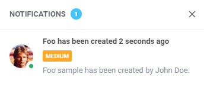
  
In the case of save data error (that is when the `foo_has_not_been_created` notification occurs):

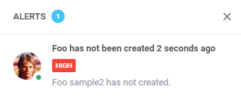
  
### E-mail Notifications  

In order to add e-mail notification appearance you have to start the function which calls the event:

```php
email_notification('email.foo_notification', [user()], ['model' => $model, 'user' => user()]);

```

The first method's argument is name of the event, the second is message recipients, the third are variables used in the template. Starting the notification causes adding the dispatch process to the queue of processes which will be executed. The dispatch of notifications is done by the `php artisan queue:start` process. The process is launched automatically along with the system's operation, but it is good to make sure whether the process has not been killed e.g. by restart of server.

System notification informing whether the dispatch succeeded or not is connected with e-mail notifications dispatch. An example:

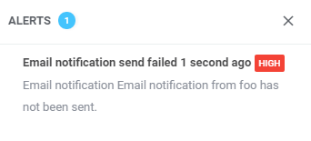
  
### Sms Notifications  

Adding the appearance of sms notification is executed by calling:

```php
sms_notification('email.foo_notification', [user()], ['model' => $model, 'user' => user()]);
```

Similarly to e-mail notifications, in situations when an error occurs, the system notification is being sent:

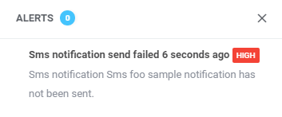
  
## Templates  

Templates are used to determine the content of sent notification. The number of languages ascribed to the application have impact on how much content may be edited. Notification's template edit is available in the menu when you click the right mouse button, or directly when you click twice on table's row.

## Variables  

Modules predict the functionality of adding variables to templates. Variables may be defined by other modules which makes the target template containing the information from different parts of the system. The code below depicts pinning a new variable to the template:

```php
listen('notifications:notification.variables', function(&$variables) {
    $variables['Foo'][] = [
        'name'        => 'foo_module_variable',
        'description' => 'foo module variable description',
        'value'       => 'this is value of foo variable'
    ];
});

```

The template's form is modified by the variables as shown below:

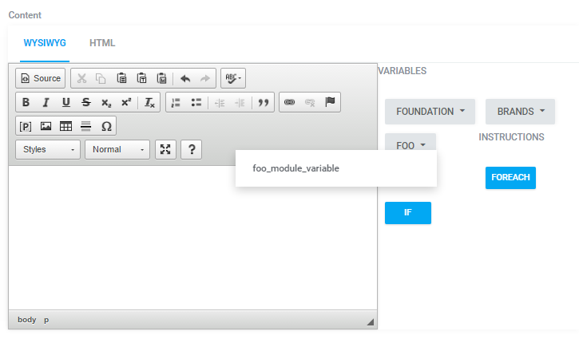
  
After filling the content by using the variable:

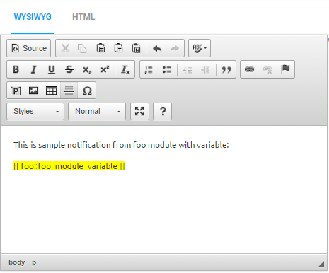
  
Preview of the message:

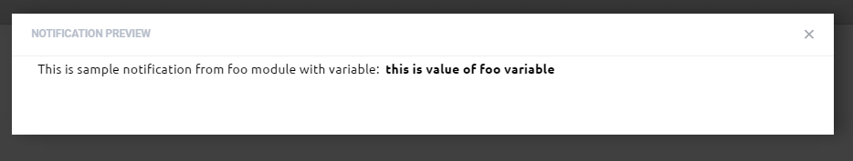
