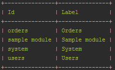
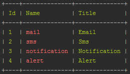
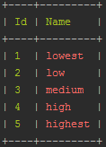

# Notifications  

[TOC]

## Introduction  

Notifications module is responsible for configuration interface of notification templates and sending notifications to users in the system. It handles email and sms notifications, but also displays alerts (the bell icon) to the users. It allows administrator to set up their own text and supports multi-language.

## Type of notifications

### E-mail notifications

E-mail notifications as the very name suggests are sent in the form of e-mail to a user (users). The content of the message is determined by means of the notification template where variables from other modules can be pinned.

### Sms notifications
   
As you can see this is a kind of notifications which are sent as an sms to the user's (users') telephone number. Similarly to e-mail notifications, an sms operates variables from different modules.

### System notifications
  
System notifications is a kind of notifications send to the system which are frequently a result of some (usually fundamental) operation. Notifications of this type are available at the top of the website in the form of the icons below:


  
System notifications are divided into notifications and alerts. The general flow of notification's course in the system may be described by means of the following diagram:


  
All types of notifications operate multilingualism of translations for templates and they may (or may not) use the variables from different application's fragments.

## Creating notification

A developer is able to create standalone notifications and templated notifications. The first ones are similar to the native notifications handles by the Laravel Framework. Because of there are no differences, in the documentation this use case is omitted.

The second ones give possibiility to configure how a notification should be provided as template and on which event should react. Let's create one of them.

1. Create directory named Notifications inside root of your module. It must be named exactly as described.
2. Create class:

```php
<?php

namespace Antares\Modules\SampleModule\Notifications;

use Antares\Modules\SampleModule\Events\ItemCreated;
use Antares\Modules\SampleModule\Models\Item;
use Antares\Notifications\AbstractNotification;
use Antares\Notifications\Contracts\NotificationEditable;
use Antares\Notifications\Collections\TemplatesCollection;
use Antares\Notifications\Model\Template;

class ItemCreatedNotification extends AbstractNotification implements NotificationEditable
{
 
    protected $item;
    
    public function __construct(Item $item) {
        $this->item = $item;
    }
    
    /**
     * Returns collection of defined templates.
     *
     * @return TemplatesCollection
     */
    public static function templates() : TemplatesCollection {
        return TemplatesCollection::make('Item Created', ItemCreated::class)
            ->define(static::mailMessage());
    }
    
    /**
     * Returns template for notification.
     *
     * @return Template
     */
    protected static function mailMessage() {
        $subject    = 'Item has been created';
        $view       = 'antares/sample_module::notifications.item_created';

        return (new Template(['mail'], $subject, $view))->setRecipients(['admin']);
    }
    
}

```

The class contains static ```templates()``` method which is responsible to return a collection of defined templates. It requires 2 parameters:

1. ```$title``` - Will be visible inside Notification Templates section.
2. ```$notifiableEvent``` - Class name of event. Based on this class the category will be assigned automatically but not all notifications need associated events so then there should be passed name which will be recognized as custom category name.

Next for that collection can be defined what content should be pass by type (mail, sms, notification or alert) so define ```Template``` object which has these parameters:

1. array of types - mail, sms, notification or alert
2. notification subject
3. Notification content as view path.

You should also add at least one recipient to template. The ```setRecipients(array)``` method accept an array of area recipients which for now are ```admin``` and ```client```.

Additionally you can customize the severity.

```php

(new Template(['mail'], $subject, $view))->setSeverity('high');

```

Important to known is that the ```templates()``` method is used for importing notification to database so not all notifications must implement it. If you want omit that method then remove ```NotificationEditable``` interface from class.


## Defining notifiable events.

In ```Service Provider``` of module create method ```booted()``` if not exists and inside you can define notifiable events.

```php
<?php

use Antares\Notifications\Helpers\NotificationsEventHelper;
use Antares\Modules\SampleModule\Events\ItemCreated;

public function booted() {
    $admin = function(ItemCreated $event) {
        return $event->user;
    });

    NotificationsEventHelper::make()
        ->event(ItemCreated::class, 'Sample Module', 'When item is created')
        ->addRecipient('admin', $admin)
        ->register();
}
```

#### event() definition

1. Class name of event. The same as used for notification.
2. Category of event. It is used for table with notifications and to organize events within notification form.
3. Friendly user label. It is optional and if omitted then the label will be get from class name.

#### addRecipient() definitions

Setup recipient who will fetch the notification. You are not limited to one recipient. Definition od parameters:

1. Area name used only for grouping recipients in data table. It does not control ACL or type of user.
2. Closure which has only one parameter - the event object. Recommended is not to use user auth() provider. Some notifications can be push by daemon running in background which does not handle session. Assign user to the event object instead.

For now there are only 2 areas for users - ```admin``` and ```client``` so you can use 2 helpers instead of ```addRecipient()```

1. ```addAdminRecipient(Closure)```
2. ```addClientRecipient(Closure)```

## Custom notifications for event

Sometimes may be required to send notification which does not match to defined event. For example dispatched ```InvoiceStatusChanged``` event has info about new status and depending of the new status value different notification will be send or will not. To handle that type os situations for the desired event you should attach a special object.

```php
<?php

use Antares\Notifications\Helpers\NotificationsEventHelper;
use Antares\Modules\SampleModule\Events\ItemCreated;

public function booted() {
    $admin = function(ItemCreated $event) {
        return $event->user;
    });

    NotificationsEventHelper::make()
        ->event(ItemCreated::class, 'Sample Module', 'When item is created')
        ->addRecipient('admin', $admin)
        ->setHandler(CustomNotificationHandler::class)
        ->register();
}
```

Instead of class name you can also define there a closure.

```php
NotificationsEventHelper::make()
    ->event(ItemCreated::class, 'Sample Module', 'When item is created')
    ->addRecipient('admin', $admin)
    ->setHandler(function() {
        return ...;
    })
    ->register();
```

The class used as handler should implement a ```handle()``` method which accept one parameter - a event object. So basically it is similar to Listeners objects for events.

```php
<?php

use Antares\Modules\SampleModule\Events\ItemCreated;

class CustomNotificationHandler
{

    public function handle(ItemCreated $event) {
        return ...;
    }

}
```

The returned value of the method should be instance of ```\Illuminate\Notifications\Notification```. Otherwise notification will be not sent.

## Defining variables

In ```Service Provider``` of module create method ```booted()``` if not exists and inside put code as below.

```php
<?php

use Antares\Notifications\Services\VariablesService;

public function booted() {
   /* @var $service VariablesService */
   $service     = app()->make(VariablesService::class);
   $variables   = $service->register('sample_module_name');
 
   // Define variables here
}
```

The put ```sample_module_name``` value is group of your variables. In general variables are organised to groups like foundation, shopping etc. Of course you can put your variables to already exists group if scope of variables semantically match to it but in the general there will be name of module for which variables belongs to. TIme to define variables.

```php
$variables->set('foo', 'The Foo', 'fooooo!');
// or
$variables->set('foo', 'The Foo', function() {
    return 'fooooo!';
});
```

Note that the second argument is a variable label used in notification template editor. Now you can use that variable for notifications using code like this:

```[[ sample_module_name::foo ]]```

The above variables declaration is used for simply values. But what if you want to use more complex object like Eloquent model? In this case using ```set()``` method is not enought so you have to use dedicated way for that.

```php

$default = function() {
    $faker = \Faker\Factory::create();
    
    return SampleModel([
        'name'  => $faker->text(20),
        'value' => $faker->randomNumber(),
    ]);
);

$variables->modelDefinition('sampleModel', SampleModel::class, $default)
    ->setAttributes([
        'name'  => 'Name',
        'value' => 'Value',
    ]);
```

Explanation of arguments:

1. Variable placeholder. The same as the first argument for ```set(...)``` method.
2. Class name to object. It is used to fetch real values for model.
3. Closure with default object. Because models usually are get from database, inside this closure should be returned model with sample values. Handy to show preview and send testable notifications with fake data.

The ```setAttributes(array)``` method declare variables with labels which belongs to object. Based on example there will be available these variables:

```
[[ sample_module_name::sampleModel.name ]]
[[ sample_module_name::sampleModel.value ]]
```

## How it works in background?

Every time an event is executing the ```NotificationsService``` is going to fetch that event and notification associated to it. Next the parameters from event object are pass to the notification object and send to the defined recipient(s) and channel (notification type).
So basically after properly set events for notification all of them will be automatically sent by dispatching desired event for example:

```php
$item = new Item(); // the object which should be passed to the notification
event(new ItemCreated($item)); // dispatching event with that object
```


## Artisan commands

```bash
php artisan notifications:import
```

Imports all notifications found in system which are placed inside ```Notifications``` directory.

```bash
php artisan notifications:import antaresproject/module-name
```

The same as above but only for typed module.

```bash
php artisan notifications:import --force
php artisan notifications:import antaresproject/module-name --force
```

The ```--force``` flag will restore to default values already exist templates and create other if not exists.

```bash
php artisan notifications:category-list
```
    

   
The default value is the *default* category.

- ***type - area***, in other words, that is user's work space. Several groups of users can be ascribed to one area. Area defines interface appearance and e-mail template. In order to display the list of available types (areas) you have to call the console command

```bash
php artisan notifications:types-list
```



If the type is not defined, the notification will be added to all types with the exception of e-mail and sms types.

- ***severity*** - determines notification's priority. Depending on priority, system notification may be treated as an alert (high, highest), or as simple (medium). If you want to display the list of available priorities, you have to call the console command

```bash
php artisan notifications:severity-list
```
   

    
The default priority is `medium`.

