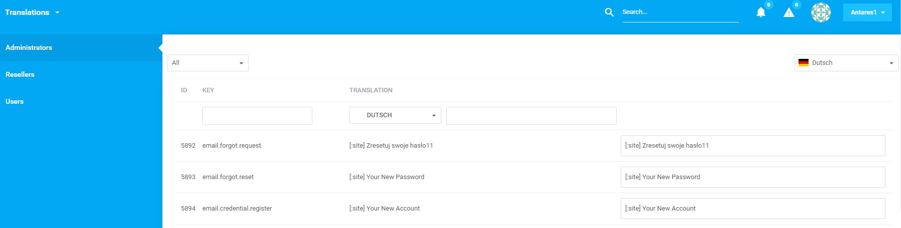
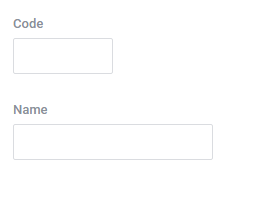
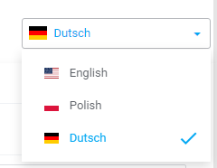

# Translations  

Translations is a package to manage Antares translation files. It doesn't replace the translation system, only automated import / export the php files to a database and make them editable through a web interface. 
It allows to manage app languages as CRUD with text comparsion feature.   

[TOC]

## Introduction  

The component is used to operate translations in the system. Access to the component occurs by means of the url: /{area}/translations/index/{area}/{lang} (e.g. /administrators/translations/index/administrators/en). The component facilitates translations' content change of particular system's phrases which depends on added languages. The translation list is the following:

The upper menu consists of positions which facilitate:

  
  
* adding new language
* import csv file with translations
* export of the translation file to the file
* translations' publishing

Below you can find a division into areas (levels) connected with groups of users to which they belong. This means that a translation concerning a single phrase may be different at the `administrators` level and different at the `users` level.

The table contains a register of particular phrases, the first column is the translated phrase, the second is a translation into a chosen language, the third is a field of translation's edit. Worth mentioning is that translations takes variables into consideration which are injected to phrase during system's operation. The menu above the table consists of the field of component choice (on the left), the currently chosen language can be found on the right. Fields which are in the table's heading are used for searching (in the first column). The second column contains the select which enables comparing the content with other language, the second field is used for searching. 

In order to add new language choose the 'Add new language' option in the upper menu:


  
Description of form's fields:

* Code - determines the language code (e.g. en, de)
* Name - name of the language (e.g. Polish, Dutch)

## Languages  

Adding a language causes synchronization of the former translations (adding) with the new added language. Once it is added, the field of choice is updated:


  
## Export  

The export of translations occurs by means of choosing an option in the menu on the website with the list. Export concerns currently chosen language and level. An exemplary line which is export's result:

```php
Segment;Locale;Key;Translation
foundation;de;"email.forgot.request";"[:site] Reset your password11"
```

* Segment - it is a name of component that the phrase concerns. Note that phrases may be duplicated for different components.
* Locale - language code
* Key - the key as a phrase which will be translated
* Translation - the translated content

## Import  

Similarly to export, translation's import is available by means of choosing the position in menu on the website with the list. The import file must be the csv file and format must be compatible with the export file format.

## Publication  

Publication facilitates providing translated phrases to the application. As long as translations are not published, the system is not using them. Publication's task is to download translations from database and saving them to files, depending on the component which they concern. The catalogue below is the saving location:

```php
\resources\lang\{area}\antares\
```

e.g. \resources\lang\administrators\antares

Full structure of access to the file with the translation is the following:

```php
\resources\lang\{area}\antares\{compoentn}\{lang}\{filename}
```

e.g. \resources\lang\administrators\antares\automation\de\messages.php

## Synchronization  

Synchronization of translations is responsible for correct recognition of translation files' paths in respective components and modules, and changes' register in database. Translations presented on the list are downloaded from database from the `tbl_translations` table. Synchronization happens automatically each time you enter the translations' list provided that the translations have not been published. Removal of the translation files from the catalogue `resources\lang\{area}\antares\` causes the necessity of repeated publication.
