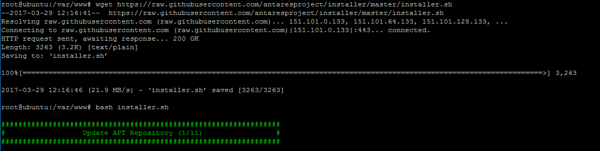
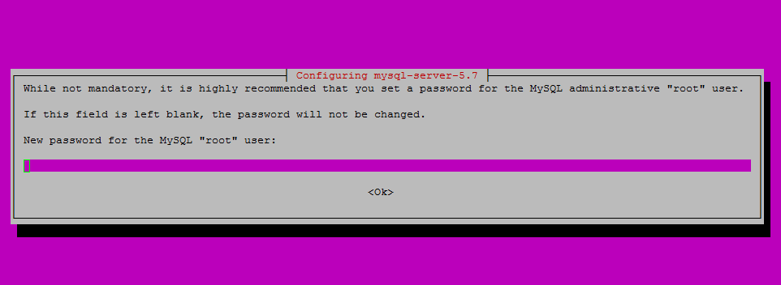
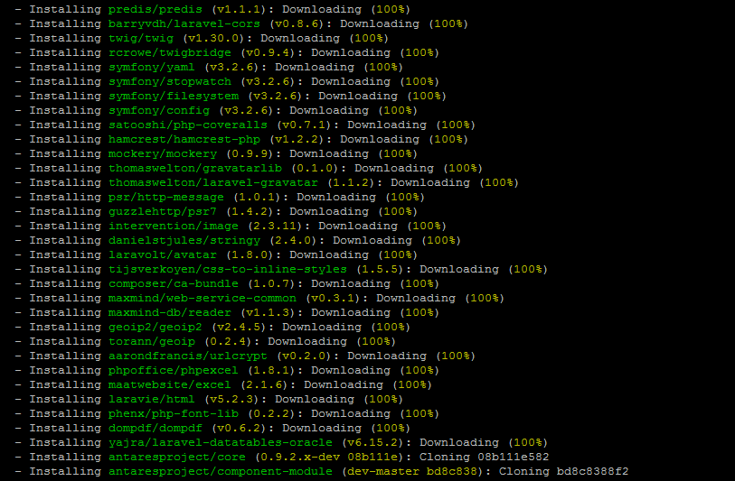
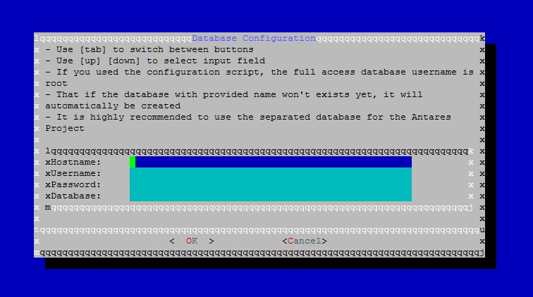
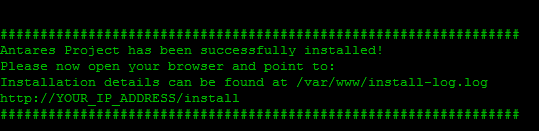

# Automatic Installation Guide

Automatic installation is the fastest way to install Antares on your server **in case that you have Ubuntu 14.04/16.06**. It is based on a bash script that you can find [here](https://raw.githubusercontent.com/antaresproject/installer/master/installer.sh).

> **Please note**: Automatic installer was mostly tested on a clean server system so it may not always work if you have your own customized environment. In case that you are not able to automatically install Antares successfully, please follow the [Manual Installation Guide](manual_installation_guide.md).*

Before the installation, it is recommended to make sure that all of the environment components have been installed and their versions are compatible with the [expected](requirements.md) ones.  


## Installation setup

Log in to your server via console as Super User or Root and create directory: `/var/www` if does not exist:
```bash
mkdir -p /var/www
```

Go to `/var/www` directory:
```bash
cd /var/www
```

Download the installer script:
```bash
wget https://raw.githubusercontent.com/antaresproject/installer/master/installer.sh
```


**Hint: ** The installer script needs to be in the `/var/www` server directory.

Once you're set, run the following command and wait for the magic:

```bash
sudo bash installer.sh
```

The installation begins:



## Installation process
During the installation, the automatic installer will require additional information to be provided - **please read them and answer carefully.**

First of all, you need to provide a root password for the mySQL database:


Then, all the system dependencies required for correct functioning of Antares will be installed. This process can take a few minutes and the time required to finish the installation process of the packages depends on your server's network speed.



Installer will request database connection configuration. However, if you haven't created the dataabse yet, the installer will do that automatically for you. For quick setup, you can use "*localhost*" as a hostname an root credentials as a user details.
  
    

When the installer is done, proceed to: `http://Your IP Address/install` to finish the installation via web-installer. You can find more details about web-installer in the [Manual Installation Guide](manual_installation_guide.md#web-based-installer) .



