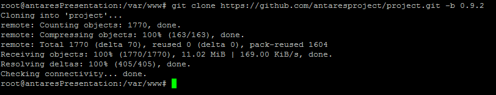
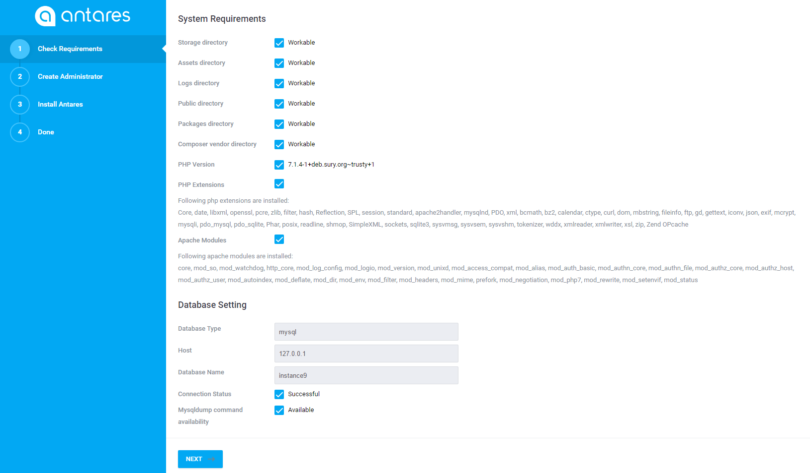
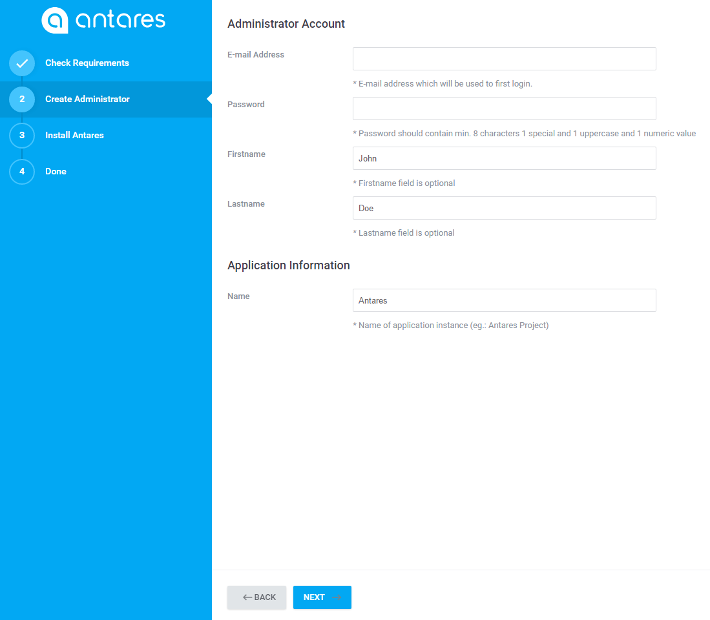
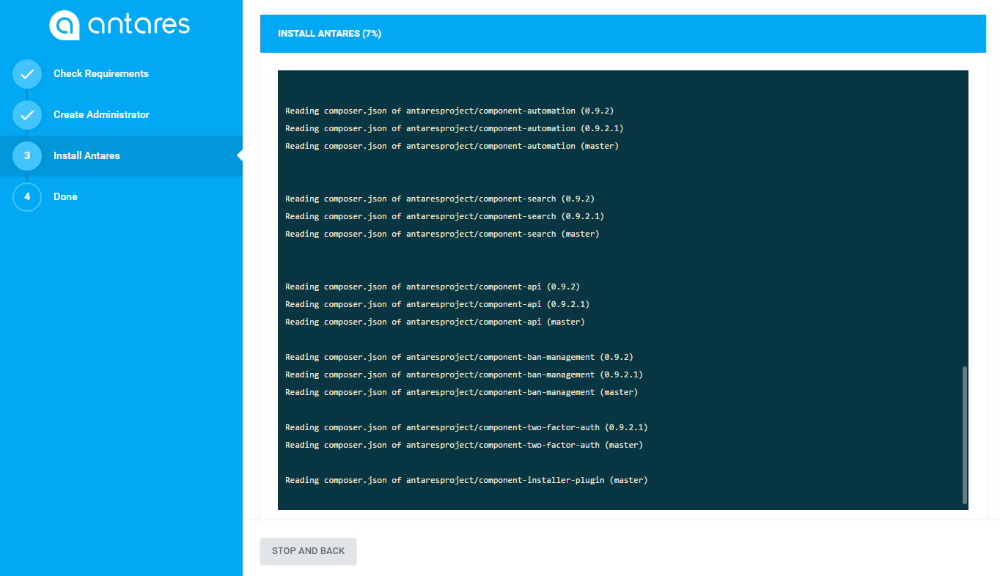
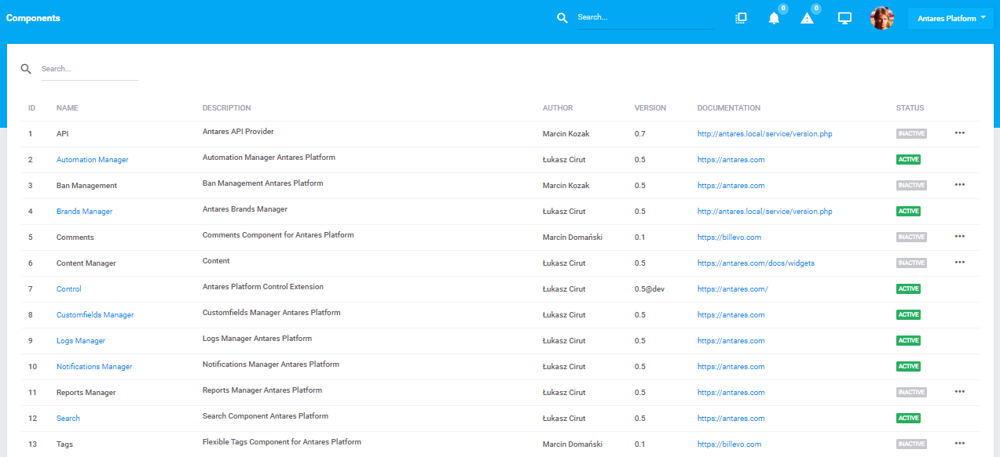

# Manual Installation Guide  

[TOC]

Manual installation is recommended when overall project requires interference with the specific server environment.
This way allows flexibility of configure server packages such as apache document root location, pre-installed apache extensions and server tools (eg.: [Varnish cache](https://varnish-cache.org/intro/index.html#intro)) and php extensions and libs (eg.: [ImageMagick](http://php.net/manual/en/book.imagick.php)) depends on project requirements.
It is worth to remember that server customization procedure can be also done after [Automatic Installation](installation_auto.md).    

Before the installation, it is worth to make sure that all environment's components have been installed in versions compatible with the [expected](requirements.md) ones.

***Please note**: Manual installation is the hardest and longest way to install Antares Project and gives full server customization as opposed to auto install.  The following manual is dedicated for **Ubuntu 14.04/16.06** or **CentOS 7.2.x**. In case that you are not able to use it, please follow [Automatic Installation Guide](installation_auto.md).*

## Preconfiguration  

### Libraries  

Here is the description of libraries installation which are a part of system's environment:

#### Apache 2.4.x

Apache 2.4.x or higher ([more info](requirements.md#####Apache 2.4.x))    
    

```bash
apt-get -y install apache2
```

The installation of dedicated modules is performed via a command:
```bash
a2enmod headers rewrite filter deflate alias mime env
```
After the modules' installation, it is necessary to restart:
    
```bash
service apache2 restart
```
   
Optionally, there might be a need for an update apache configuration file to read `.htaccess` file which is used by application. Edit `apache2.conf` file by command:
```bash
nano /etc/apache2/apache2.conf
```
and change following line:
```bash
AllowOverride None
```
to:
```bash
AllowOverride All
```

#### PHP 7.1.*   
PHP 7.1.* or higher ([more info](requirements.md#####PHP 7.1.x))
```bash
apt-get install software-properties-common
```
```bash
add-apt-repository ppa:ondrej/php
```
```bash
apt-get update
```
```bash
apt-get -y install php7.1 libapache2-mod-php7.1
```
Restart after the installation:
```bash
service apache2 restart
```
Installation of additional extensions:
```bash
apt-get -y install php7.1-bz2 php7.1-curl php7.1-fileinfo php7.1-mcrypt php7.1-gd php7.1-bcmath php7.1-xml php7.1-zip php7.1-pdo php7.1-dom php7.1-tokenizer php7.1-sqlite php7.1-gettext php7.1-mbstring php7.1-mysql
```
Searching for available extensions:
```bash
apt-cache search php7.1
```
It is necessary to remember about the restart after the installation:
```bash
service apache2 restart
```
#### Mysql 14.x
Mysql (MariaDB) 14.x or higher:
```bash
apt-get -y install mariadb-server mariadb-client
```

```bash
mysql_secure_installation
```

```bash
Enter current password for root (enter for none): <-- enter
Set root password? [Y/n] <-- y
New password: <-- provide a password for root user
Re-enter new password: <-- repeat password
Remove anonymous users? [Y/n] <-- y
Disallow root login remotely? [Y/n] <-- n
Reload privilege tables now? [Y/n] <-- y
```

In order to check installation's correctness, type the following command:
```bash
mysql -u root -p
```
Once logged in, you should achieve the following result:
 
  
  
Sometimes there may be a problem with connection to database via root user. It is recommended to create new database user, instead of root:

 1. Log into MYSQL as root:    
    <pre class="codehilite language-bash code-toolbar"><code class=" language-bash">mysql -u root -p</code></pre>
 2. Grant privileges to a new user, execute as follows:
    <pre class="codehilite language-bash code-toolbar"><code class=" language-bash">CREATE USER <span class="token string">'antares'</span>@<span class="token string">'localhost'</span> IDENTIFIED BY <span class="token string">'password'</span><span class="token punctuation">;</span>
    GRANT ALL PRIVILEGES ON *.* TO <span class="token string">'antares'</span>@<span class="token string">'localhost'</span><span class="token punctuation">;</span>
    FLUSH PRIVILEGES<span class="token punctuation">;</span></code></pre>
 3. Bind to all addresses:
    <pre class="codehilite language-bash code-toolbar"><code class=" language-bash"><span class="token function">nano</span> /etc/mysql/my.cnf</code></pre>
 4. Comment following line:
    <pre class="codehilite language-bash code-toolbar"><code class=" language-bash"><span class="token comment" spellcheck="true">#bind-address = 127.0.0.1</span></code></pre>
 5. Exit mysql and restart mysql:
    <pre class="codehilite language-bash code-toolbar"><code class="language-bash hljs"><span class="token keyword keyword-exit"><span class="hljs-built_in">exit</span></span>
    <span class="token function">service</span> mysql restart</code></pre>

Optionally, [phpMyAdmin](https://www.phpmyadmin.net/) can also be installed:
  
```bash
apt-get -y install phpmyadmin
```
  
```bash
Web server to configure automatically: <-- apache2
Configure database for phpmyadmin with dbconfig-common? <-- Yes
MySQL application password for phpmyadmin: <-- enter
```

After phpmyadmin installation, remove invalid php5 config files:
```bash
rm -rf /etc/apache2/mods-enabled/php5.conf /etc/apache2/mods-enabled/php5.load
service apache2 restart
```      
  
#### Composer 1.3.x
Composer 1.3.x or higher
```bash
curl -sS https://getcomposer.org/installer | php 
mv composer.phar /usr/local/bin/composer
```
#### Git 1.9.x
Git 1.9.x or higher:
```bash
apt-get install git
```    
  
### Environment Verification  
  
The aim of possession of all essential environment components correctness verification is the possibility of using a command in order to check the installed version.
  
#### Apache
```bash  
apache2 -v
```
  
The expected version:
  
```bash
Server version: Apache/2.4.25 (Ubuntu)
Server built:   2016-12-21T00:00:00
```  
#### Mysql  
```bash
mysql --version
```
      
The expected version (or higher):
  
```bash
mysql  Ver 14.14 Distrib 5.6.30
``` 

#### Php
  
```bash
php -v
```
  
The expected version (or higher):
  
```bash
PHP 7.1.3-2+deb.sury.org~trusty+1 (cli) (built: Mar 15 2017 09:53:03) ( NTS )
Copyright (c) 1997-2017 The PHP Group
Zend Engine v3.1.0, Copyright (c) 1998-2017 Zend Technologies
    with Zend OPcache v7.1.3-2+deb.sury.org~trusty+1, Copyright (c) 1999-2017, by Zend Technologies
```
  
#### Git
```bash  
git --version
```

The expected version (or higher):
  
```bash
git version 1.9.1
```
  
#### Composer
  
```bash
composer --version
```

The expected version (or higher):
  
```bash
Composer version 1.3.2
```

## Installation
  
1. Firstly, go to directory:  
    <pre class="codehilite language-bash code-toolbar"><code class=" language-bash"><span class="token function">cd</span> /var/www</code></pre>
    and clone repository:
    <pre class="codehilite language-bash code-toolbar"><code class=" language-bash">git clone https://github.com/antaresproject/project.git -b 0.9.2 html</code></pre>
    ***Please note**: Target clone directory should not exists. Using above sample check whether directory not contains*

    The above command will install the application in 0.9.2 version with git repository in html catalogue. 
    In this case, please remember about pointing the virtual machine at public project catalogue:

    <pre class="codehilite language-bash code-toolbar"><code class=" language-bash"><span class="token function">nano</span> /etc/apache2/sites-enabled/000-default.conf</code></pre>
    Change line:
    
    <pre class="codehilite language-bash code-toolbar"><code class=" language-bash">DocumentRoot /var/www/</code></pre>
    to:
    
    <pre class="codehilite language-bash code-toolbar"><code class=" language-bash">DocumentRoot /var/www/html/public</code></pre>
    
    Optionally you can configure permission settings for specified IPs. Add following line in `VirtualHost` section: 
    
    <pre class="codehilite language-bash code-toolbar"><code class=" language-bash"><span class="token operator">&lt;</span>Directory /var/www/html/public<span class="token operator">&gt;</span>
        Require all granted
        AllowOverride All
        Allow from 127.0.0.1
        Allow from ::1
    <span class="token operator">&lt;</span>/Directory<span class="token operator">&gt;</span></code></pre>
    
    More information about vhosts configuration you can find [here](https://httpd.apache.org/docs/2.4/vhosts/examples.html).

          
  
2. Go to html catalogue and launch the installation command:  
   
    <pre class="codehilite language-bash code-toolbar"><code class=" language-bash"><span class="token function">cd</span> /var/www/html</code></pre>
    <pre class="codehilite language-bash code-toolbar"><code class=" language-bash">composer <span class="token function">install</span></code></pre>

    

    The installation will download all the repositories belonging to the whole application based on interrelations specified in the composer.json file. It will additionally download the required assets (js, css). In the end of this procedure it will move such a frontend version to 'public' catalogue, which the application uses.  

3. In the application's catalogue change the catalogues' entitlements.
   <pre class="codehilite language-bash code-toolbar"><code class=" language-bash"><span class="token function">chmod</span> -R 777 storage public bootstrap</code></pre>    
   <pre class="codehilite language-bash code-toolbar"><code class=" language-bash"><span class="token function">chown</span> -R www-data:www-data /var/www/html</code></pre>

4. Create new database instance using following command:    
   <pre class="codehilite language-bash code-toolbar"><code class=" language-bash">mysql -u <span class="token operator">&lt;</span>enter mysql username here<span class="token operator">&gt;</span> -p <span class="token operator">&lt;</span>enter mysql password here<span class="token operator">&gt;</span></code></pre>   
   <pre class="codehilite language-bash code-toolbar"><code class="language-bash hljs">create database foo CHARACTER SET<span class="token operator">=</span>utf8 COLLATE<span class="token operator">=</span>utf8_general_ci</code></pre>
   `*Tip: You can create database using phpMyAdmin by going to http://<server_name>/phpmyadmin`
       
5.  Edit the file /var/www/html/.env:
    <pre class="codehilite language-bash code-toolbar"><code class=" language-bash"><span class="token function">nano</span> /var/www/html/.env</code></pre>
    and set access to database:
    <pre class="codehilite language-bash code-toolbar"><code class="language-bash hljs">DB_HOST<span class="token operator">=</span>127.0.0.1
    DB_DATABASE<span class="token operator">=</span>foo
    DB_USERNAME<span class="token operator">=</span><span class="token operator">&lt;</span>enter mysql username here<span class="token operator">&gt;</span>
    DB_PASSWORD<span class="token operator">=</span><span class="token operator">&lt;</span>enter mysql password here<span class="token operator">&gt;</span></code></pre>
  
6. Go to the `http://<server_name>/install` in order to start migration import to the base. In the first installation step, there is an environment set-up verification - if everything is correct please continue. If the application states that something has not been set properly, the continuation will not be possible.
   

 
7. In the next step, set up the application's instance name, username and password of the main administrator.
   

8. The final step in the installation is a definition of components and modules which will be a part of yours application's version. Once the components are chosen and the 'next' button is pressed, the application creates migration files and starts the Daemon that will watch over the execution of 'jobs' which the application will submit during the work (e.g. notifications, demanding computational procedures, etc.).    
   
  
  
9. In the next step the application will inform you about the end of installation, so move to the logging-in website. Log in using the created earlier account and move to the website /admin/extensions where you can install and uninstall the components and modules (right button).  
   
  
10. The application is ready to work.
