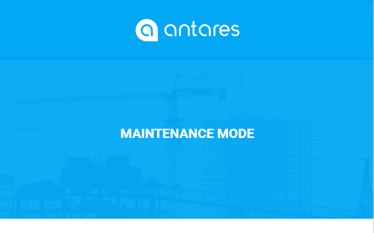

# Maintenance  

[TOC]

Following guide will help you to keep your application up to date. Using these utilities will also let you handle updates and changes in a proper flow without a risk of access to flawed functionality or debug data by the end-users.

## Maintenance Mode

To provide a proper flow of updating your Antares application on a production environment, it is possible to use **maintenance mode**. This mode makes it inaccessible for users, so you can easily update and test the solution without them seeing any errors/debug data. As an administrator, you can use "Log in as user" feature to enter the User Area.

In order to switch the application over the maintenance mode, type the following command:

```bash
php artisan down
```

As a result, during the attempt of entering the system, the following website will be shown:


  
In order to disable the maintenance mode, type the following command:

```bash
php artisan up
```

## Merging with the latest Antares release  

In order to keep the application up-to-date with the official Antares repository, type the following command:

```bash
composer update
```

Composer will update the source code with the latest versions of the modules and Antares core. Keep in mind that the command will download the code from the branch which is defined in the *composer.json* file, e.g.:

```json
{
    "repositories": [
        {
            "type": "git",
            "url": "https://github.com/antaresproject/sample_module.git"
        }
    ],
    "require": {
        "antaresproject/module-sample_module": "master"
    },   
}
```

In the above example the source code will be downloaded from the *sample_module* module of the *master* branch. 
To indicate other branch, indicate that name in the *require* section:

```json
{
    "repositories": [
        {
            "type": "git",
            "url": "https://github.com/antaresproject/sample_module.git"
        }
    ],
    "require": {
        "antaresproject/module-sample_module": "0.9.2-dev"
    }   
}
```

In the above example the *0.9.2-dev* branch of the *sample_module* module has been indicated.

Updates of your own modules and customization of Antares application should be executed on your own. 
When building your customization think about it as files belonging to the repository. Antares main repository structure should be treated as a pattern. 
Your project should have its own repository with defined configuration files' and `composer.json` file's settings following that pattern. For example, when building directory structures, it should stick to the default Antares directories:

- /app
- /public/packages/core
- /public/js
- /public/img
- /public/views


### Modules Update 

Each of the module used by your application may be updated individually due to the fact that it is a 
separate repository. 
This means that every module has its own directory named as *.git.* 
During committing and pushing the changes within a module the changes will be sent to the branch where the 
component comes from.

The *core* directory, which is the core of application and which is placed in the src 
directory in the main application's path, is subordinate to the similar procedures.
