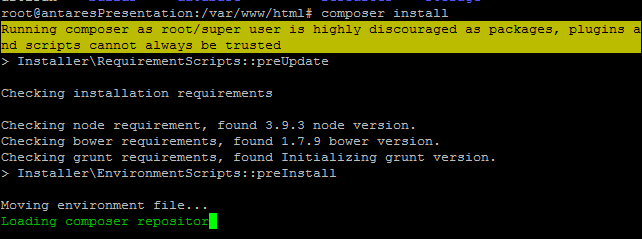
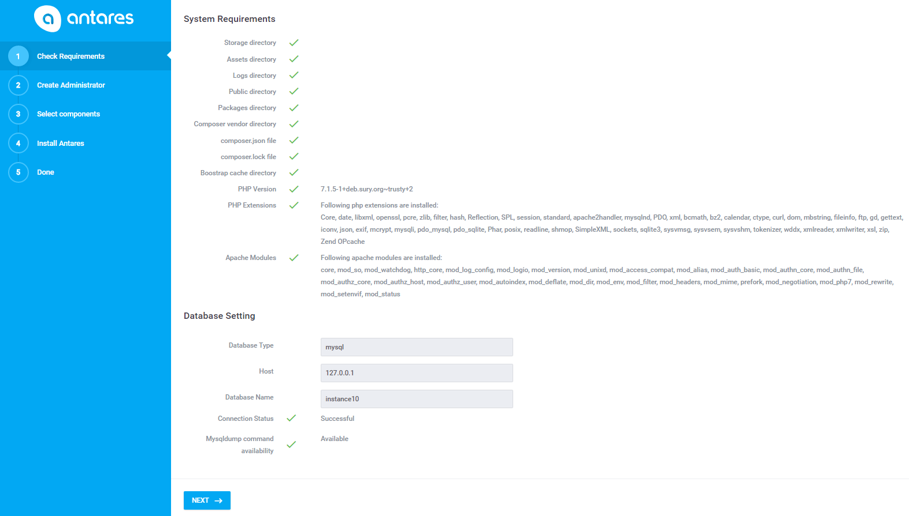
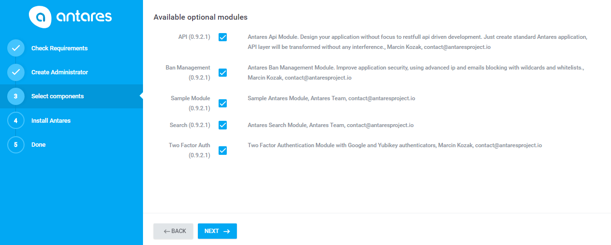

# Manual Installation Guide  

[TOC]

Manual installation is recommended for more advanced users that would like to set up Antares on their own,  specific server environment. It is also recommended to follow it when the automatic installer failed. It provides more flexibility of configuration of the server packages such as apache document root location, pre-installed apache extensions, PHP extensions and server tools.

Before the installation, it is worth to make sure that all environment's components have been installed in versions compatible with the [expected](requirements.md) ones. You will find the instructions [Automatic Installation Guide](automatic_installation_guide.md).

> **Please note**: Manual installation is the hardest and longest way to install Antares, but gives full server customization as opposed to the auto installation. In case that you are having problems or simply you're not experienced enough to set up your webserver on a Linux environment, please follow [Automatic Installation Guide](automatic_installation_guide.md).*

The following manual is dedicated for **Ubuntu 14.04/16.06**. 


## Server preconfiguration  

Before you proceed with the Antares installation, you need to start with libraries which are a part of the system environment.

Just in case, run apt-get update to get the newest versions of packages and their dependencies:
```bash
apt-get update
```

### Apache Installation

Install Apache 2.4.x or higher:    

```bash
apt-get -y install apache2
```

Install the required Apache modules:
```bash
a2enmod headers rewrite filter deflate alias mime env
```

After the modules are installed, it is necessary to restart Apache:
    
```bash
service apache2 restart
```
   
Optionally, there might be a need for an update apache configuration file to read `.htaccess` file which is used by application. Edit `apache2.conf` file by command:
```bash
nano /etc/apache2/apache2.conf
```
find following lines:
```bash
<Directory /var/www/>
        Options Indexes FollowSymLinks
        AllowOverride None
        Require all granted
</Directory>

```
and change AllowOverride to All :
```bash
AllowOverride All
```

### PHP 7 Installation 
Install PHP 7.1.* or higher:
```bash
apt-get install software-properties-common
```
```bash
add-apt-repository ppa:ondrej/php
```
```bash
apt-get update
```
```bash
apt-get -y install php7.1 libapache2-mod-php7.1
```

Install the required PHP extensions:
```bash
apt-get -y install php7.1-bz2 php7.1-curl php7.1-fileinfo php7.1-mcrypt php7.1-gd php7.1-bcmath php7.1-xml php7.1-zip php7.1-pdo php7.1-dom php7.1-tokenizer php7.1-sqlite php7.1-gettext php7.1-mbstring php7.1-mysql
```
Restart Apache after the installation:
```bash
service apache2 restart
```


### Mysql Installation
Install Mysql (MariaDB) 14.x or higher:
```bash
apt-get -y install mariadb-server mariadb-client
```

Run secure mySQL installation script:
```bash
mysql_secure_installation
```

You can follow these settings:
```bash
Enter current password for root (enter for none): <-- enter
Set root password? [Y/n] <-- y
New password: <-- provide a password for root user
Re-enter new password: <-- repeat password
Remove anonymous users? [Y/n] <-- y
Remove test database and access to it? [Y/n] <-- y
Disallow root login remotely? [Y/n] <-- n
Reload privilege tables now? [Y/n] <-- y
```

### Database User Configuration


Log into MYSQL as root:    

```bash
mysql -u root -p
```
Create a new user (**Do not forget to set up the password!**):

```bash
CREATE USER 'antares'@'localhost' IDENTIFIED BY 'password';
```

And grant him privileges to the database:

```bash
GRANT ALL PRIVILEGES ON *.* to 'antares'@'localhost' IDENTIFIED BY 'password' WITH GRANT OPTION;
```

Flush the privileges:

```bash
FLUSH PRIVILEGES;
```
  
### Composer Installation

Install composer 1.3.x or higher

```bash
curl -sS https://getcomposer.org/installer | php 
mv composer.phar /usr/local/bin/composer
```

### Git Installation
Install Git 1.9.x or higher:
```bash
apt-get install git
```    


## Antares Installation
  
### Git Clone
Firstly, go to directory:

```bash
cd /var/www
```  

and clone GIT repository:

```bash
git clone https://github.com/antaresproject/project.git -b 0.9.2 html
```

or just use the `create-project` command:

```bash
composer create-project antaresproject/project html 0.9.2.x-dev
```
    
> **Please note**: Target clone directory should not exist. Using the above command check whether directory does not exist.*

The above command will install the application in 0.9.2 version with git repository in html directory. 
In this case, please remember about pointing the virtual machine at public project directory:

```bash
nano /etc/apache2/sites-enabled/000-default.conf
```


Change line:

```bash
DocumentRoot /var/www/
```
    
to:
    
```bash
DocumentRoot /var/www/html/public
```    
    
Optionally you can configure permission settings for specified IPs. Add following line in `VirtualHost` section: 

```bash
<Directory /var/www/html/public>
   Require all granted
   AllowOverride All
   Allow from 127.0.0.1
   Allow from ::1
</Directory>   
```            

Once you apply the above settings, restart apache service:

```bash
service apache2 restart
```

More information about vhosts configuration you can find [here](https://httpd.apache.org/docs/2.4/vhosts/examples.html).


        

### Composer Install

Go to `/var/www/html` directory and launch the installation command:  

```bash
cd /var/www/html
```
If you have used `create-project` in previous installation step go to [Directory Permissions](manual_installation_guide.md#directory-permissions) section, 
otherwise run the following command:   

```bash
composer create-project
```

The reason for this solution is to correctly interpret the scripts specified in the `composer.json` file.      

The installation will download all the repositories used by Antares based on configuration specified in the composer.json file. It will additionally download all the required assets (js, css). In the end of this procedure it will move front-end elements to the 'public' directory, which the application uses.  




### Directory Permissions

Once the installation is over, you need to set up permissions to specific directories used by the application in the `/var/www/html`:

```bash
chmod -R 777 storage public bootstrap
```

```bash
cd /var/www/html
chown -R www-data:www-data storage public bootstrap src
```

```bash
mkdir -m 777 /var/www/html/cache
```
   

### Database Configuration

Create new database instance using following command:

```bash
mysql -u root -p 
```

```bash
create database foo CHARACTER SET=utf8 COLLATE=utf8_general_ci;
```    
> **Please note:** Database name "foo" is just an example, it is recommended to use your own database name.*

Type `exit` to leave the MySQL command line.


       
Once created, you need to set the database connection in the file `/var/www/html/.env`:

```bash
nano /var/www/html/.env
```

Change following lines:

```bash
DB_HOST=127.0.0.1
DB_DATABASE=foo
DB_USERNAME=<enter mysql username here>
DB_PASSWORD=<enter mysql password here>
```    
  
  
### Web-based Installer

Go to the `http://<server_IP>/install` in order to start migration import to the database. In the first installation step, there is an environment verification - if everything is correct please continue. If the application states that something has not been set properly, you will have to configure it before being able to proceed.

> **Please note:** If you have problems with the database connection, you can read about some extra troubleshooting below in the [MySQL Connection problems](#MySQL_Connection_problems) section.



 
In the next step, set up the application name, username and password of the main administrator.


> **Please note:** Do not forget to remember the password, it's the only way to log in to the application.

Next step is about choosing optional modules:



The final step in the installation is to choose the modules which will be included in your application. Once the components are chosen and the 'next' button is pressed, the application creates migration files and starts the daemon that will be handling [automation](../core_modules/automation.md).


  
  
In the next step the application will inform you about the end of the installation. 
  
**Congratulations!!! The Antares application is ready to work.**
