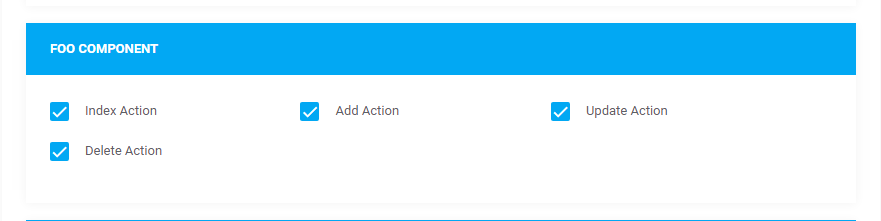
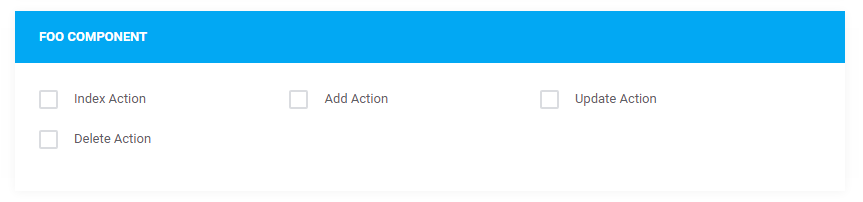
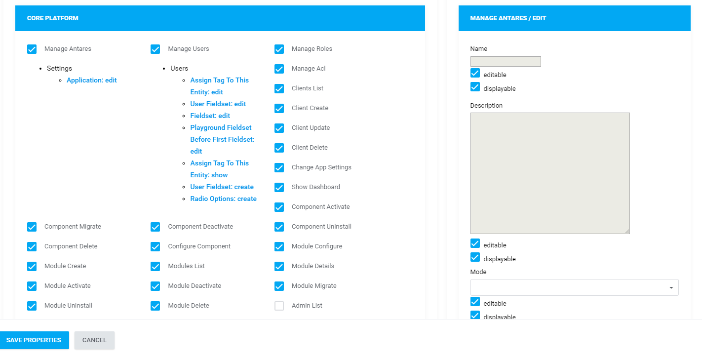

# ACL  

[TOC]

## Introduction

ACL - Access Control List, as the name suggests, is a layer responsible for decision-making concerning user's access to a resource (a website, a file, etc...).

> The path of acl.php file is `src/modules/<module_name>/` (e.g. `src/modules/sample_module/acl.php`).

## Setup inside component

If you want to make permissions which belongs to the component, you must create a new file called ```acl.php``` in the same directory where are ```providers.php``` and ```composer.json``` files. The file must have the content:

```php
<?php

use Antares\Acl\RoleActionList;
use Antares\Model\Role;
use Antares\Acl\Action;

$actions = [
    new Action('', 'Do Something'),
    new Action('', 'Do Another Thing'),
];

$adminActions = array_merge($actions, [
    new Action('', 'Manage That'),
]);

$permissions = new RoleActionList;
$permissions->add(Role::admin()->name, $adminActions);
$permissions->add(Role::member()->name, $actions);

return $permissions;
```

Important is that the file should returns the object of ```Antares\Acl\RoleActionList``` type. Only in that case permissions will be stored in the system.

#### How to use it

The ```Antares\Acl\RoleActionList``` has method ```add``` which allows to associate user roles with an actions list.  In the example above the admin role will be bonded with 3 type of actions. The each action object needs two arguments.
                                                                                                                      
First of them is the route name. For now it can be an empty string. This name will be used in the next release and will allow to automatically control access based on the route.

The second one is the human-friendly name of action. It may contain white spaces and capital letters but inside the system will be available in the sluggable format - where whitespaces are replaced by ```-``` dash character and all letters are lower cases.

The ACL will be stored after activating an component. Deactivating will flush them from the system. If you do not want to activated manually component to see changes of ACL, you can use the Artisan console to do that.

```bash
php artisan extension:acl:reload antaresproject/component-example
```

In this case for the given component name the ACL will be reloaded. Or just:

```bash
php artisan extension:acl:reload
```

to reload ACL for all activated components in the system.

Sometimes you may need to reload ACL for core (not components) by some reason. The command is similar just like last one.

```bash
php artisan foundation:acl:reload
```

It will remove permissions for all brands of administrator role and set up them again with default values. Just like after fresh installation of the whole system.


## Verification At The Controller's Level  

ACL's implementation occurs at the controller's level in the `setupMiddleware()` method. The rules determining whether a user can be admitted to the website (action) are located in this method. In the case of controllers the whole verification takes place at the Middleware stage (before entering the action). The following, predefined types of access can be distinguished:

All logged in users (regardless of the role) have access:


```php
/**
 * All logged in (authorized) users have access 
 **/
$this->middleware('antares.auth');
```

All the users who are not logged in have access:

```php
/**
 * All the users who are not logged in have access 
 **/
$this->middleware('antares.guest');
```

Only the logged in users who have the access to the *Show Dashboard* belonging to the core, have access:

```php
/** 
 * Only the logged in with access to the core and to the show dashboard 
 **/
$this->middleware('antares.can:show-dashboard');
```

Only the logged in users who have access to the *Index Action* belonging to the *Foo* component, have access:

```php
/** 
 * Only the logged in with access to the index-action within the foo component 
 **/
$this->middleware("antares.can:antares/foo::index-action");
```

There is also a possibility to determine which actions exactly the user may access:

```php
/** 
 * All the logged in users have access to the index action only 
 **/
$this->middleware('antares.auth',['only' => ['index']]);
```
```php  
/** 
 * All the logged in with access to the Index Action' within the foo component have access to the 'index' action in the controller 
 **/
$this->middleware("antares.can:antares/foo::index-action",['only' => ['index']]);
```

Keep in mind that the names of the accesses are the same as in the `acl()` method described in the [Service Provider](service_providers.md).

So an example of using the `setupMiddleware()` method in a controller, may be the following:

```php
public function setupMiddleware()
{
        $this->middleware('antares.auth');
        $this->middleware("antares.can:antares/foo::index-action", ['only' => ['index']]);
}
```

## Global Verification  

A helper has been prepared, used for the access verification at any application's place:

```php
can("antares/foo.index-action");
```

The abovementioned code is identical with:

```php
app('antares.acl')->make('antares/foo')->can('index-action')
```

## Verification At The View's Level  

Verification in a view uses specially prepared twig engine function, as an extension. An example of use:

```html
   
    <div>User has access to Index</div>

```

## Access Control At The Interface Level  

When using the url address /admin/control/roles/index one can notice a register of users' groups (roles). To edit a group and authorizations click the right mouse button on a line and choose the edit option. The edition contains the details of ascribed authorizations for a group. To change the authorizations of a role, check or uncheck the checkboxes placed next to the action's name:

  
Remember that for other user's group these settings may look different and for example the 'Redactor' group has no access to the component at all:

  
Keep in mind that the access settings are realized 'per brand' and for different brands the access settings may be different. this means that the access to a component may be active in one brand, but not active in the other. Access configuration for each of the brand is possible when switching to other brand only.

If the action is provided with forms, then there is a possibility of visibility configuration and edition of specific form's box depending on a brand, action and user's group:

   
