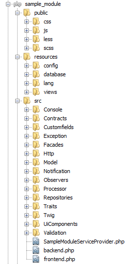
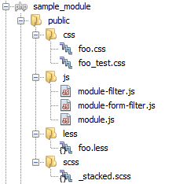
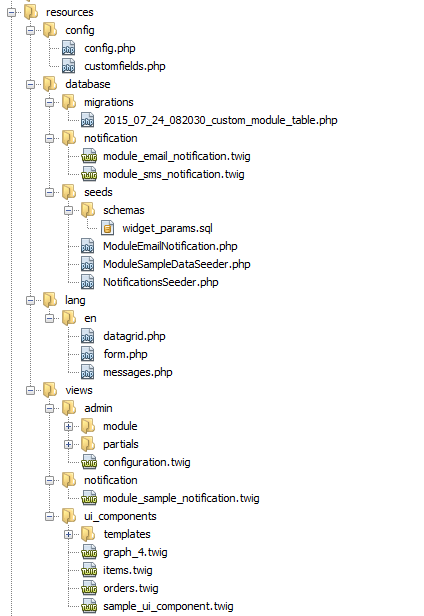
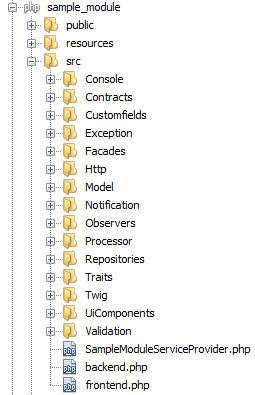
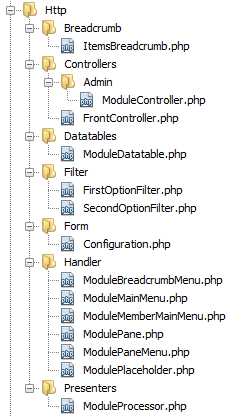
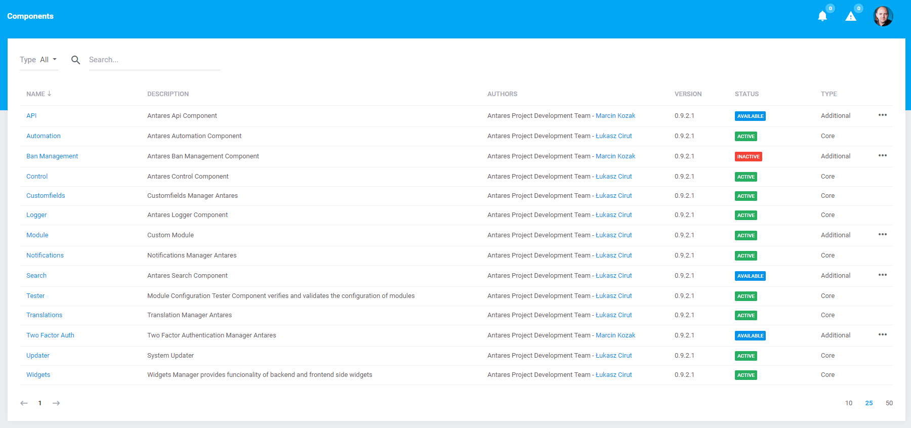
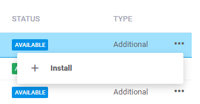
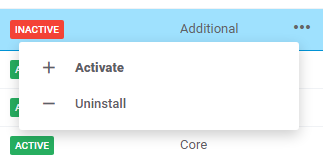
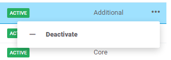
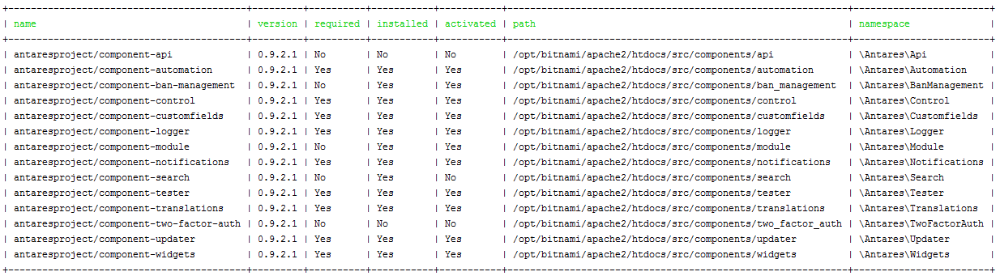

# Module Base

[TOC]

## Introduction

This article will help you to understand how modules in Antares are designed and what should include. If this is your first try with Antares, we highly recommend to follow the  [Sample Module Tutorial](../tutorials/sample_module.md) instead. Concept of Antares modular architecture is described in [Antares Concepts - Modules](../antares_concepts/components_&_modules.md) article.

## Minimal Structure
  
Every module must consist of the following files structure:


  
 
### composer.json schema

The ```composer.json``` file should include a following data (example):

```json
{
  "name": "antaresproject/module-example",
  "description": "Antares Example Module",
  "type": "antaresproject-module",
  "homepage": "http://your-module.website",
  "version": "0.9.2.1",
  "authors": [
    {
      "name": "Your Name",
      "email": "your@contactemail.io"
    }
  ],
  "require": {
    "antaresproject/component-installer-plugin": "*"
  },
  "autoload": {
    "psr-4": {
      "Antares\\Example\\": "src/"
    }
  },
  "extra": {
    "friendly-name": "Example Module"
  }
}
```

Required attributes:

* **name** - determines the name - identifier of a module in a repository. Just like the regular composer package, the name must be in `<vendor>/<package name>` format. The last part of name **must be prefixed** by ```module-``` word.
* **type** - a special type for composer package which determines how the module must be installed in the system. For moduels please use "antaresproject-module" type.
* **version** - the version of package.
* **authors** - an array of collaborators' names and emails. At least one author must be presented.
* **require** ```antaresproject/component-installer-plugin``` - required package which allows to install the package in a proper way.
* **autoload** - determines to which directory the namespace should be pointed.

Optional attributes:

* **homepage** - the HTTP address to your module homepage. It will be presented as a link in the Modules management page.
* **friendly-name** - must be placed in ```extra``` attribute. In the modules page, the name will be overridden by the given value.

A full description of the composer.json structure can be found [here](https://getcomposer.org/doc/04-schema.md).


### Service Providers

**providers.php** file's content:

```php
<?php

return [
    \Antares\Modules\Example\ExampleServiceProvider::class,
];

```

In this file must be an array with service providers which are required to run the module in the application. At least one service provider must be declared with a content as below:

Service provider's file structure:

```php
<?php

namespace Antares\Mdoules\Example;

use Antares\Foundation\Support\Providers\ModuleServiceProvider;
use Illuminate\Routing\Router;

class ExampleServiceProvider extends ModuleServiceProvider
{
    
}
```

In the above mentioned example service provider must inherit from the class `ModuleServiceProvider`.

## Module configuration form

### Simple configuration

You can provide a simple configuration of the module by creating a dedicated file named ```settings.php``` placed in the ```resources/config``` directory. The file looks like other configuration files, so it returns an array just like example below. Creating this file will result in automatically rendered configuration page on the Admin Leve, in the Modules Configuration page.

```php
<?php

return [
    'data' => [
        'email'  => '',
        'how_many' => 10,
    ],
    'rules' => [
        'email' => 'required|email',
        'how_many' => 'required|integer'
    ],
    'phrases' => [
        'email.required' => 'Oh no! You forgot give us your email :(',
    ],
];
```

* **data** - this array stores settings of the module. Must be provided in the ```key => value``` format, where a value is always a default one.
* **rules** - (optional) Laravel's way validation rules used by the form.
* **phrases** - (optional) Laravel's way validation phrases used as the messages for failed validation.

To access to the interested data, you can use IoC:

```php
<?php

use Antares\Extension\Manager;

class SomeClassExample {

    protected $manager;

    public function __construct(Manager $manager) {
        $this->manager = $manager;
    }
    
    public function getEmail() {
        return $this->manager->getSettings('antaresproject/module-example')->getValueByName('email');
    }
    
}
```

Or by using Facade:

```php
<?php

use Antares\Extension\Facade\Extension;

class SomeClassExample {
    
    public function getEmail($default = null) {
        return Extension::getSettings('antaresproject/module-example')->getValueByName('email', $default);
    }
    
}
```
 ### Dedicated configuration form

If the simple configuration fir is not enough, you can build your own settings page by using the [form builder](..services/form_builder.md). Inside the module src path create a ```SettingsForm.php``` file in ```config``` directory.

```php
<?php

namespace Antares\Modules\Example\Config;

use Antares\Contracts\Html\Form\Fieldset;
use Antares\Extension\Contracts\Config\SettingsContract;
use Antares\Extension\Contracts\Config\SettingsFormContract;

class SettingsForm implements SettingsFormContract {

    /**
     * Builds the content of the settings form.
     *
     * @param Fieldset $fieldset
     * @param SettingsContract $settings
     * @return mixed
     */
    public function build(Fieldset $fieldset, SettingsContract $settings) {
        $fieldset->control('input:text', 'email')
            ->value( $settings->getValueByName('email') )
            ->label('Your e-mail address');

        $fieldset->control('input:text', 'how_many')
            ->value( $settings->getValueByName('how_many') )
            ->label('How many times you would like to use it?');
    }

}
```

The class must implement the ```SettingsFormContract``` interface. Inside the ```build``` method your can build the form (within fieldset) using it in regular way. And it is done! The form will be created dynamically and it will handles validation based on your settings in your ```settings.php``` file. Access to the form will be available within the components page.

### Custom Forms

If you have already created form for the module and want to use it within the modules page instead of the automatically created configuration, you should open the ```settings.php``` file and add an extra key.

```php
<?php

return [
    'data' => [
        'email'  => '',
        'how_many' => 10,
    ],
    'custom_url' => 'url/to/your/page/where/is/form',
];
```

If the ```custom_url``` is presents and the value is not empty, your can safety remove ```rules```, ```phrases``` and ```SettingsForm``` file because they will be not used anymore. 
The value of that key must be URL to the page, where should be a form placed.


## Full module structure  

The full module directory structure including all the optional elements is following:


  
**Please note:** As you may see, the files structure is very similar to the main [Antares files structure](../concepts/core_&_files_structure.md). It is not a conincidence :).

### /public 

This directory contains all essential javascript, css, and img files used by a module. 
Preprocessors such less, sass, scss may be equally used with external vendor called [Assetic](https://github.com/kriswallsmith/assetic).

Typical public directory may contains files as follows:


  
### /resources

Additional files that are used by a module:


  
* **config** - files configuring a module.
* **database** - migration files for creating (and removing) the tables used by a module and filling them with data.
 * **migrations** - files which build the table scheme.
 * **seeds** - Class' files for filling the tables with the data (e.g. sample users)
* **lang** - files with phrases to be translated
* **views** - Views files used by a module. The subdirectory is controller's name, while file's name is the name of the action in a controller.

### /src

This directory includes the main module logic.

  
  
**Please note:** directories names start with a capital letter.

* **Console** - Classes responsible for commands which are accessible by a module. They are usually launched by means of:  
  `php artisan <name_of_the_component>:<name_of_the_command>`.            
* **Contracts** - Interfaces used by a module.
* **Exception** - Exception classes.
* **Facades** - Facades as a popular form of referring to a class.
* **Http** - Requests processing logic and data preparation for display.
* **Model** - Contains models classes (from the mapped tables) within the framework of [Eloquent](https://laravel.com/docs/5.4/eloquent) engine (Active Record).
* **Notifications** - Contains the [notification templates](../core_modules/notifications.md) (e.g. email, sms) which the module will send to the users.
* **Observers** - Observers definitions applied to other classes (usually to models).
* **Processor** - Processor classes, which interpret and process incoming data.
* **Repositories** - Repositories classes (combining several models into one).
* **Traits** - Traits used by a module.
* **Twig** - Extension classes for [Twig](https://twig.sensiolabs.org/) view engine. List of all available Twig extensions in Antares is [here](../services/twig.md).
* **Validation** - Forms dedicated validator classes.
* **UiComponents** - UI components classes.

#### Http directory

The Http directory contains controllers, middleware, [datatables](../services/datatables.md), [forms](../services/form_builder.md) and more. 
Almost all of the logic to handle requests entering to application is placed in this directory.


  

* **Controllers** - module controller classes. It is worth noticing that for readability sake, the controller of the admin level has been placed in a subdirectory.
* **Datatables** - tables presenting classes using [datatables](../services/datatables.md).
* **Filters** - data [filters](../services/filters.md) used in a module.
* **Form** - module [forms](../services/form_builder.md).
* **Handler** - event class service thrown by other applications modules as well as by the framework itself. In this directory, there are classes responsible for [breadcrumb](../services/breadcrumbs.md), [main menu](../modules_development/views_and_ui_components.md), [left beam]((../modules_development/views_and_ui_components.md)) and [placeholder]((../modules_development/views_and_ui_components.md)) presentation.
* **Middleware** - middleware classes i.e. filters serving the events before sending a request to the action and after receiving the processed data.
* **Presenters** - presenter classes, i.e. the layer responsible for data return into a view and presentation in a browser.

### Tests  

A directory containing module’s unit tests. Usually, the structure of such a directory is identical with src directory.

## Compatibility  

Every project created with Antares consists of modules which have their own Git repositoriest. Within the project's framework the following types of repositories can be distinguished in which the components of the whole system are stored:  

### Project
 
The repository contains official Antares versions (branch master), which in turn determine components and vendors versions which are a part of the whole system  


  
### Core 

The repository contains main system module source code which is used by the whole application and treated as main library. Branch master is always the most stable version, whereas minor branches can be core modification depending on target system needs. Other branches such as master can be repository source in the composer.json file determined within app repository group, e.g.:  
  
```json
"repositories": [
        {
            "type": "git",
            "url": "https://github.com/antaresproject/core.git"
        },
...
"require": {
        "antaresproject/core": "master" --> default branch name        
```

After the personalization:

```json
"repositories": [
        {
            "type": "git",
            "url": "https://github.com/antaresproject/core.git"
        },
...
"require": {
        "antaresproject/core": "0.9.2.1-dev", --> personalized branch for specific product having modifications which are not available in the official version
```
          
 
## Module management methods
 
This section describes possible methods that can be used by the module in the Modules Management page:
 
### User Interface
 
 
 
 Each of the module have a status:
 
 *  **available** - module is in the file system but is not installed nor activated.
 *  **inactive** - module is installed but not activated.
 *  **active** - module is activated.
 
#### Installation
 
 Only modules available in the file system can be installed. Installation means that all Composer requirements will be put and installed. Also migration and assets will be published.
 
 
 
#### Uninstallation
 
 Installed modules can be uninstalled. It is reverse method to the installation process so it will remove migrations and assets but the Composer dependencies will be kept in the system. 
 
 
 
#### Activation
 
 Only installed modules can be activated. Modules which have been not activated cannot be used by the system. In this operation the dedicated ACL will be stored.
 
 
 
#### Deactivation
 
 Only active modules can be deactivated. This operation will remove dedicated ACL of the module.
 
 
 
#### Configuration
 
 Some modules may have dedicated Configuration Form as explained above in Simple Configuration.
 In that case by clicking the **Configure** button you will be redirected to the page with form which can be created dynamically or not - in this case you will be redirected to the custom URL.
 
 
 
### Artisan commands

```bash
php artisan extension:list
```
Will output basic information about available modules in file system: 

  
***

```bash
php artisan extension:install <vendor>/<package> [--skip-composer]
```
 
Examples:
 
```bash
php artisan extension:install antaresproject/component-example
php artisan extension:install antaresproject/component-example --skip-composer
```
 
 The ```--skip-composer``` option will omit the composer `require` command.
 
***
 
```bash
php artisan extension:active <vendor>/<package> [--skip-composer]
```
 
Examples:
 
```bash
php artisan extension:active antaresproject/component-example
```
 
 ***
 
```bash
php artisan extension:deactive <vendor>/<package> [--skip-composer]
```
 
 Examples:
 
```bash
php artisan extension:deactive antaresproject/component-example
```
 
 ***
 
```bash
php artisan extension:uninstall <vendor>/<package> [--purge]
```
 
 Examples:
 
```bash
php artisan extension:uninstall antaresproject/component-example
php artisan extension:uninstall antaresproject/component-example --purge
```
 
The `--purge` option will run the composer `purge` command. It will remove files from the file system.
 
 ***
 
```bash
php artisan extension:acl:reload
php artisan extension:acl:reload <vendor>/<package>
```
 
Will reload ACL for all modules (the first command) or for the given one (the second one).
 
### Useful methods for modules
 
Using the `\Antares\Extension\Manager` object of the `\Antares\Extension\Facade\Extension` facade you can access to these methods:
 
* `getAvailableExtensions()` - Returns a collection of available in file system extensions.
* `isInstalled(string $name)` - Checks if the given extension is installed. **(\*)**
* `isActive(string $name)` - Checks if the given extension is active. **(\*)**
* `getExtensionPathByName(string $name)` - Returns the absolute absolute path to the extension directory. **(\*)**
* `getExtensionByVendorAndName(string $vendor, string $name)` - Returns the extension by the given vendor and package name, for example: antaresproject is the vendor part and module-example is the package name part.
* `getSettings(string $name)` - Returns the collection of settings for the given extension name. **(\*)**
* `hasSettingsForm(string $name)` - Checks if the given extension has dedicated settings for or associated custom URL to the custom configuration page. **(\*)**
 
**(\*)** - the name can be passed in two different ways:
 
* standard way - In vendor/package format name just like the Composer supports.
* backward way - To be compatible with previous releases of Antares, you can pass only last package name without vendor name and `component-` prefix. For example the `antaresproject/component-ban-management` name can be simplified by just `ban_management`. 
 The underscore will be replaced by the "-" char. This method can be used only for modules which belong to the `antaresproject` vendor.

