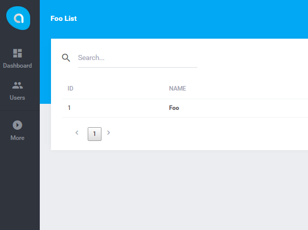
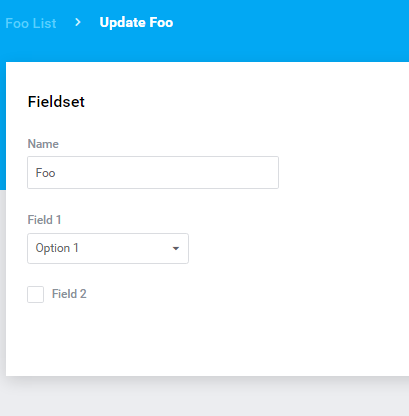

# Breadcrumbs  

## Introduction

Breadcrumbs are the website's elements and their task is to facilitate the user's navigation at the website. Thanks to the additional navigation in the form of breadcrumbs the user can see in which service's section he is located and without any problem he may return to the superior website's section.

## An example

A class defining a new breadcrumb is the following:

```php
<?php
     
    namespace Antares\Foo\Http\Breadcrumb;
     
    use Illuminate\Database\Eloquent\Model;
    use Antares\Breadcrumb\Navigation;
     
    class Breadcrumb extends Navigation
    {
     
        /**
         * on brands list
         */
        public function onFooList()
        {
            $this->breadcrumbs->register('foo', function($breadcrumbs) {
                $breadcrumbs->push(trans('antares/foo::messages.foo_list'), handles('antares::foo/index'));
            });
     
            $this->shareOnView('foo');
        }
     
        /**
         * on brand create or edit
         *
         * @param Model $model
         */
        public function onFooCreateOrEdit(Model $model)
        {
            $this->onFooList();
     
            $this->breadcrumbs->register('foo-action', function($breadcrumbs) use($model) {
                $name = $model->exists ? trans('antares/foo::messages.foo_update', ['name' => $model->name]) : trans('antares/foo::messages.foo_create');
                $breadcrumbs->parent('foo');
                $breadcrumbs->push($name);
            });
            $this->shareOnView('foo-action');
        }
    }
```    
    
This type of implementation needs to start in the class responsible for providing a view (e.g. in a processor, a presenter, or a controller). An example is the following:

```php
/**
 * Breadcrumb instance
 *
 * @var Breadcrumb
 */
protected $breadcrumb;
 
/**
 * Construct
 *
 * @param Breadcrumb $breadcrumb
 */
public function __construct(Breadcrumb $breadcrumb)
{
    $this->breadcrumb = $breadcrumb;
}
 
/**
 * Foo items list
 *
 * @param Collection $collection
 * @return \Illuminate\View\View
 */
public function index(Collection $collection)
{
    $this->breadcrumb->onFooList();
    return view('antares/foo::admin.foo.index', ['data' => $collection]);
}
```

The result:


  
For edition:


  
The breadcrumbs configuration is in the following file:

```php
resources\config\breadcrumbs.php
```

