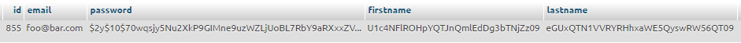
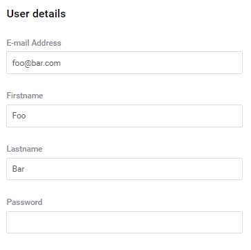
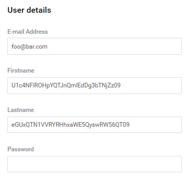

# Cryptor
  
[TOC]  

## Introduction

The platform provides a set of constructions enabling data coding which belong to databases' tables. Such a solution increases the application's security level. Only the tables' columns - with data type treated as a string - can be coded (especially the 'text' and 'varchar' types). 

> The default path of cryptor sources is `src/core/src/utils/security/`.

## Configuration

The configuration containing information about cryptors parameters is kept in a file in the following localization:

```php
core\foundation\resources\config\db_cryptor.php
```

The cryptor's configuration is the following:

```php
return
  [
      /**
       * whether cryptor is enabled or disabled
       */
       'enabled'      => true,
      /**
       * name of cast column to cryptor method
       */
       'cast_name'    => 'aes',
      /**
       * which type of columns can be casted
       */
       'column_types' => [
            'string'
       ],
      /**
       * cryptor configuration
       */
       'config'       => [
          'method'     => "AES-256-CBC",
          'secret_key' => 'This is my secret key',
          'secret_iv'  => 'This is my secret iv'
       ]
  ];
```

Note the 'config' section. The keys `secret_key` and `secret_iv` are the coding key and salt accordingly.

Activation of the tables' coding in a database causes saving of the coded strings in the columns' areas determined in a configuration. An example of a configuration:

```php
'cast'               => [
    'tbl_users' => [
        'firstname', 'lastname'
    ]
],
```

The example above contains the name of the table (the key) and a board of columns which will be coded. For example, adding of a new user will cause adding of the following registration in a table:


  
The areas `firstname` and `lastname` in the edition form are presented in the decoded form as below:


  
Deactivation of coding in turn will display:


  
When you work with the cryptor remember about determining the coding configuration in the main module's configuration file under the `cast` key.
