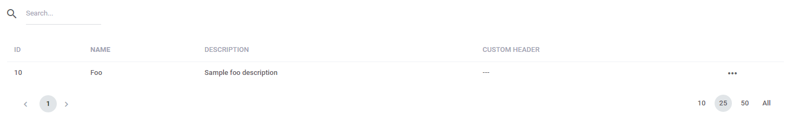
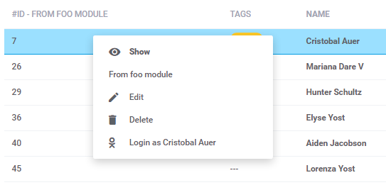
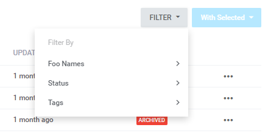
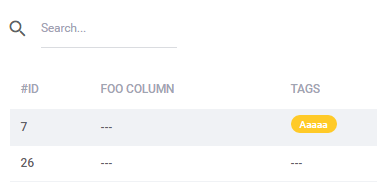
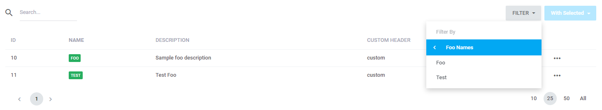
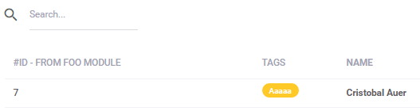
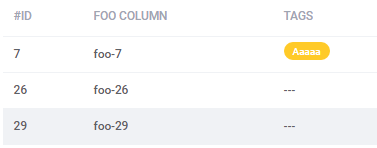

# Datatables  

[TOC]

## Introduction  

Datatables is a kind of structure facilitating data presentation in a tabular form process' automation (datagrid). A library with the same name is used within the system (click [here](https://datatables.net/) for details). The system also uses functionality of a [vendor](https://datatables.yajrabox.com/) which is an auxiliary library. An example of a solution is shown below (minimal implementation):

> The datatables classes should be placed in `src/modules/<module_name>/src/Http/Datatables/` (e.g. `src/modules/<sample_module>/src/Http/Datatables/SampleDatatable.php`). The path of datatable sources is `src/core/src/ui/components/datatables/`.

```php
<?php
     
    namespace Antares\Foo\Http\Datatables;
     
    use Antares\Foo\Http\Repositories\FooRepository;
    use Antares\Datatables\Services\DataTable;
     
    class FooDatatable extends DataTable
    {
     
        /**
         * A query which contributes to data generation in a table (dataprovider)
         *
         * @return \Illuminate\Database\Eloquent\Builder
         */
        public function query()
        {
            return app(FooRepository::class)->findAll(['id', 'name', 'description']);
        }
     
        /**
         * Parameters' settings of particular columns
         */
        public function ajax()
        {
            return $this->prepare()->addColumn('action', function() {
                        return '<i class="zmdi zmdi-more"></i>';
                    })->make(true);
        }
     
        /**
         * Instance's definition, columns' arrangement which will be a basis for table's prototype generation
         *
         * @return \Antares\Datatables\Html\Builder
         */
        public function html()
        {
            return $this->setName('Foo List')
                            ->addColumn(['data' => 'id', 'name' => 'id', 'title' => trans('antares/foo::datagrid.header.id')])
                            ->addColumn(['data' => 'name', 'name' => 'name', 'title' => trans('antares/foo::datagrid.header.name'), 'bolded' => true])
                            ->addColumn(['data' => 'description', 'name' => 'description', 'title' => trans('antares/foo::datagrid.header.description')])
                            ->addColumn(['data' => 'custom', 'name' => 'custom', 'title' => trans('antares/foo::datagrid.header.custom')])
                            ->addAction(['name' => 'edit', 'title' => '', 'class' => 'mass-actions dt-actions'])
                            ->setDeferedData();
        }
    }
```
    
This is a minimal class' version enabling data presentation in the tabular form. All the methods mentioned in the example are required and their description is included in the remaining part of the article. The example depicted above will cause data display in the following form:


  
##Dataproviders  

The `query` method is defined as a dataprovider because it is responsible for providing the data to the table. The most important types are:
* queries (on the basis of a query builder)
* collections (on the basis of the Collection object)

### Queries  

A query provides the data to the table on the basis of values gathered in the database. An example:

```php
public function query()
{
   return FooRow::select(['id', 'name', 'description'])->whereNotNull('id')->where('name', 'like', 'Foo');
}
```

The method will provide the outcome of the query including the data specified on the basis of the 'where' clause. The essential thing is that the method should return the correctly constructed object of the `\Illuminate\Database\Eloquent\Builder` type otherwise the data will not be published. To find more about building the queries visit the [Laravel website](https://laravel.com/docs/5.2/queries).

### Collections  

The collection delivers the data to the table in the form of the `Antares\Support\Collection` object. An example:

```php
public function query()
{
    return new Collection([
        ['id' => 1, 'name' => 'Foo name', 'description' => 'Foo description', 'custom' => 'custom value'],
        ['id' => 2, 'name' => 'Foo name 2', 'description' => 'Foo description 2']
    ]);
}
```

### Data Decoration In The Columns  

It is possible to execute an operation on data within a single column. Taking into consideration the example above the `ajax` method facilitates the data cell's building with the aid of the `editColumn` method. Here is an example:

```php
public function ajax()
{
    return $this->prepare()
                    ->editColumn('name', function($model) {
                        return '<span class="label-basic label-basic--success ui-selectee">' . $model->name . '</span>';
                    })
                    ->addColumn('action', function() {
                        return '<i class="zmdi zmdi-more"></i>';
                    })->make(true);
}
```

The `editColumn` method receives two arguments, the first one is the name of the column (coming from the `html()` method, the 'data' key's value when specifying the particular columns) and the second one is anonymous function determining the cell's value for a column. The effect:


  
It is also possible to use the method to decorate the value as a constituent of the datatable class:

```php
/**
 * Parameters' settings of particular columns
 */
public function ajax()
{
    return $this->prepare()
                    ->editColumn('name', $this->decorateColumn())
                    ->addColumn('action', function() {
                        return '<i class="zmdi zmdi-more"></i>';
                    })->make(true);
}
 
/**
 * Value's decoration for a column
 *
 * @param \Illuminate\Database\Eloquent\Model $model
 * @return String
 */
protected function decorateColumn()
{
    return function($model) {
        return '<span class="label-basic label-basic--success ui-selectee">' . $model->name . '</span>';
    };
}
```

## Row-Actions  

It is possible to determine the actions which can be executed in the table's row. Excitation occurs after clicking with the right mouse button on the row which will be edited. The whole operation focuses on adding a column named as `action` containing a collection of references which are available once you click with the right mouse button. Take a look at the following example of implementation:

```php
/**
 * Parameters' settings of particular columns
 */
public function ajax()
{
    return $this->prepare()
                    ->editColumn('name', $this->decorateColumn())
                    ->addColumn('action', function($row) {
                        return $this->rowActions($row);
                    })->make(true);
}
 
/**
 * Defining of actions which are available in the table's rows
 *
 * @param \Illuminate\Database\Eloquent\Model $row
 * @return String
 */
protected function rowActions($row)
{
    $this->tableActions = [];
    $html               = app('html');
    $link               = $html->link(handles("antares::foo/{$row->id}/edit"), trans('antares/foo::messages.edit'), [
        'data-icon' => 'edit',
    ]);
    $this->addTableAction('edit', $row, $link);
    return '<i class="zmdi zmdi-more"></i>'
            . '<div class="mass-actions-menu">'
            . '<section><ul>' . implode('', $this->tableActions->toArray()) . '</ul></section>'
            . '</div>';
}
```

The functionality focuses on the `rowActions`' method called within the anonymous function ascribed to the `action` column. Notice that the anonymous function has an argument in the form of topical `row` row which can be used during data presentation in the context menu. The `rowActions` method creates html in the form of bullet point list containing the references available in the row's context menu. The effect:


  
Quite frequently, there is a necessity of removing the data presented by the table. From time to time, it is connected with displaying a confirmation in the window form in order to verify whether a user is sure about data removal. In order to achieve this, the reference needs to be extended just like on the example below:

```php
protected function rowActions($row)
{
    $this->tableActions = [];
    $html               = app('html');
    $link               = $html->link(handles("antares::foo/{$row->id}/delete"), trans('antares/foo::messages.delete'), [
        'data-icon'        => 'delete',
        'class'            => "triggerable confirm",
        'data-title'       => trans('antares/foo::messages.are_you_sure'),
        'data-description' => trans('antares/foo::messages.delete_foo', ['name' => $row->name])
    ]);
    $this->addTableAction('edit', $row, $link);
    return '<i class="zmdi zmdi-more"></i>'
            . '<div class="mass-actions-menu">'
            . '<section><ul>' . implode('', $this->tableActions->toArray()) . '</ul></section>'
            . '</div>';
}
```

Notice that the change just depends on adding the css `triggerable confirm` class and window's title content and the announcement's content in the form of attribute data. The effect is depicted below:


  
## Acl

The currently logged in user cannot be authorized to every action executed in the rows.
What is shown in the example below:

```php
protected function rowActions($row)
{
    $this->tableActions = [];
    $html               = app('html');
    $canDelete          = can('antares/foo.delete-action');
 
    if ($canDelete) {
        $link = $html->link(handles("antares::foo/{$row->id}/delete"), trans('antares/foo::messages.delete'), [
            'data-icon'        => 'delete',
            'class'            => "triggerable confirm",
            'data-title'       => trans('antares/foo::messages.are_you_sure'),
            'data-description' => trans('antares/foo::messages.delete_foo', ['name' => $row->name])
        ]);
        $this->addTableAction('edit', $row, $link);
    }
 
    if (empty($this->tableActions)) {
        return '';
    }
 
    return '<i class="zmdi zmdi-more"></i>'
            . '<div class="mass-actions-menu">'
            . '<section><ul>' . implode('', $this->tableActions->toArray()) . '</ul></section>'
            . '</div>';
}
```

verifies whether the user has access to removing:

```php
$canDelete = can('antares/foo.delete-action');
```

Furthermore, it is also checked, whether any actions that the user may execute in a table are available at all:

```php
if (empty($this->tableActions)) {
        return '';
}
```

## Mass Actions  

Mass actions depend on executing one action on several rows at once. An example:

```php
public function html()
{
    $html = app('html');
    return $this->setName('Foo List')
                    ->addColumn(['data' => 'id', 'name' => 'id', 'title' => trans('antares/foo::datagrid.header.id')])
                    ->addColumn(['data' => 'name', 'name' => 'name', 'title' => trans('antares/foo::datagrid.header.name'), 'bolded' => true])
                    ->addColumn(['data' => 'description', 'name' => 'description', 'title' => trans('antares/foo::datagrid.header.description')])
                    ->addColumn(['data' => 'custom', 'name' => 'custom', 'title' => trans('antares/foo::datagrid.header.custom')])
                    ->addAction(['name' => 'edit', 'title' => '', 'class' => 'mass-actions dt-actions'])
                    ->addMassAction(
                            $html->link(handles('antares/foo::delete'), $html->raw('<i class="zmdi zmdi-delete"></i>' . trans('antares/foo::messages.delete')), [
                                'class'            => "triggerable confirm mass-action",
                                'data-title'       => trans('antares/foo::messages.are_you_sure'),
                                'data-description' => trans('antares/foo::messages.delete_mass_action')
                            ])
                    )
                    ->setDeferedData();
}
```

This is a definition of the `html` method, which is responsible for table's prototype preparation (including mass actions). Within the implementation the `addMassAction` method is placed which (in an argument) receives the reference to action where the identifiers (multiple ids) of the marked rows are send. It is good to notice the parameterization of the reference. The result of the code above:


  
You can notice that the `addMassAction` method adds a new button (dropdown) in the upper right corner of the table. If two rows at least are marked, the button becomes active.

## Sorting  

By default, the sorting is on in all the columns. In order to turn it off, determine the '**orderable**' attribute within the column's specification (within the 'html' method) as in the example:

```php
$this->setName('Foo List')
     ->addColumn(['data' => 'description', 'name' => 'description', 'title' => trans('antares/foo::datagrid.header.description'), 'orderable' => false]);
```

In a situation when table's data are downloaded from more complex data structure keeping the sorting correctly may be problematic. During the sorting an event named as `datatables.order.<column_name>` is thrown. An example:

```php
public function query()
{
    $query = FooRow::select(['id', 'name', 'description']);
    Event::listen('datatables.order.description', function($query, $direction) {
        $query->orderBy('description', $direction)->orderBy('name', 'desc');
    });
    return $query;
}
```

Event's parameters are: a handle to a query and direction of sorting. Within the anonymous function a dedicated sort order can be arranged.

## Searching  

By default, the data located in all the columns are subordinate to searching. In order to change that, determine the `searchable` attribute into `false` in the column's specification of the `html` method as in the example:

```php
return $this->setName('Foo List')
            ->addColumn(['data' => 'description', 'name' => 'description', 'title' => trans('antares/foo::datagrid.header.description'), 'searchable' => false]);
```
            
In order to determine your own question which will facilitate the correct searching use the `filterColumn` method in the `ajax()` method:

```php
public function ajax()
{
    return $this->prepare()
                    ->filterColumn('description', function($query, $keyword) {
                        $keywordLower = mb_strtolower($keyword);
                        $keywordUpper = mb_strtoupper($keyword);
                        return $query->where('description', 'like', "%$keywordLower%")->orWhere('description', 'like', "%$keywordUpper%");
                    })
                    ->editColumn('name', $this->decorateColumn())
                    ->editColumn('custom', function() {
                        return 'custom';
                    })
                    ->addColumn('action', function($row) {
                        return $this->rowActions($row);
                    })->make(true);
}
```

The `filterColumn` method as the first argument receives the name of the filtered column, whereas the second argument is the anonymous function containing the topical query and the key word subordinate to searching. The effect:


  
## Defered  

Determining a table as `defered` equals to direct data delivery. A table without the `defered` parameter will provide the data by 'ajax' (firstly, an empty table will be displayed and the data will be downloaded to the table by 'ajax'). Such a solution is important when complex user's interface occurs when the time of awaiting for the website's presentation must be minimized and the data delivery can be costly from the processing point of view (e.g complex queries to database). To download the data by ajax remove the `setDeferedData` position in the `html` method, so:

```php
public function html()
{
    $html = app('html');
    return $this->setName('Foo List')
                    ->addColumn(['data' => 'id', 'name' => 'id', 'title' => trans('antares/foo::datagrid.header.id')])
                    ->addColumn(['data' => 'name', 'name' => 'name', 'title' => trans('antares/foo::datagrid.header.name'), 'bolded' => true])
                    ->addColumn(['data' => 'description', 'name' => 'description', 'title' => trans('antares/foo::datagrid.header.description')])
                    ->addColumn(['data' => 'custom', 'name' => 'custom', 'title' => trans('antares/foo::datagrid.header.custom'), 'searchable' => false])
                    ->addAction(['name' => 'edit', 'title' => '', 'class' => 'mass-actions dt-actions'])
                    ->addMassAction(
                            $html->link(handles('antares/foo::delete'), $html->raw('<i class="zmdi zmdi-delete"></i>' . trans('antares/foo::messages.delete')), [
                                'class'            => "triggerable confirm mass-action",
                                'data-title'       => trans('antares/foo::messages.are_you_sure'),
                                'data-description' => trans('antares/foo::messages.delete_mass_action')
                            ])
    );
}
```

## Filters  

Filters are used for (as the very name suggests) additional data filtering in the tables. In order to add a filter to datatables' instance you need to complete the `filters` attribute in the Datatables class, so:

```php
/**
 * Filters used by Datatables
 *
 * @var array
 */
protected $filters = [
    FooFilter::class
];
```

The definition shown above gives the following result:


  
Filters are in fact a wide ranging subject. To find more about them and how they are defined click [here](filters.md).

## Paging  

Here the configuration focuses on determining the number of rows per page only. It is possible thanks to determining the `perPage` attribute:

```php
/**
 * The attribute determining the number of rows per page
 *
 * @var mixed
 */
public $perPage = 25;
```

## View  

Datatables object's data presentation is possible when using the `tableDefered` and `scripts` methods as in the example below:

```html

   
    {{ dataTable.scripts()|raw }}   
    {{ dataTable.tableDeferred()|raw }}   

```

## Events  

### Column's Content 

The change of column's content: `datatables:<route_name>:column.id`, and an example is the following:

```php
Event::listen('datatables:admin/users/index:column.id', function(&$attributes) {
   if (isset($attributes['title'])) {
        $attributes['title'] = $attributes['title'] . ' - from foo module';
    }
});
```

The effect:


  
### Row-Actions  

Pinning in row-actions, before the action: `datatables:<route_name>:before.action.<action_name>`, after the action: `datatables:<route_name>:after.action.<action_name>` and the example:

```php
Event::listen('datatables:admin/users/index:before.action.edit', function($actions, $row) {
     $actions->push(app('html')->link(handles("antares::users/{$row->id}/foo"), 'From foo module'));
});
```

And the effect:


  
### Adding A New Filter  

Pinning a new filter to the topical Datatables' instance, before: `datatables:filters.<route_name>.<filter_name>.before`, after: `datatables:filters.<route_name>.<filter_name>.after` and the example:

```php
Event::listen('datatables:filters.admin/users/index.userstatusfilter.before', function($filter) {
    $filter->add(FooFilter::class);
});
```

The effect:


  
### Adding A New Column  

Pinning a new column to the existing Datatables' instance, before: `datatables:<route_name>:before.<column_name>`, after: `datatables:<route_name>:after.<column_name>`, an example:

```php
use Antares\Datatables\Html\Builder;
use Yajra\Datatables\Html\Column;
 
 
Event::listen('datatables:admin/users/index:after.id', function($datatables) {
    if ($datatables instanceof Builder) {
        $datatables->collection->push(new Column([
            'data'  => 'foo',
            'name'  => 'foo',
            'title' => 'Foo column'
        ]));
    }
});
```

The effect:


  
###Change Of The Cell's Value  

Pinning of the value to the Datatables' instance existing cell: `datatables.value.<route_name>`, an example:

```php
Event::listen('datatables.value.admin/users/index', function($datatables) {
    $datatables->editColumn('foo', function($row) {
        return 'foo-' . $row->id;
    });
});
```

The effect:


  
