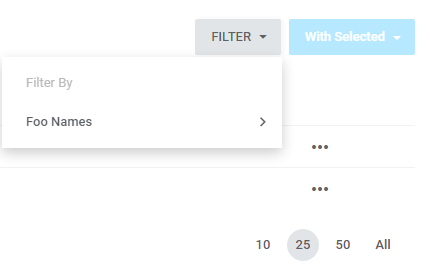
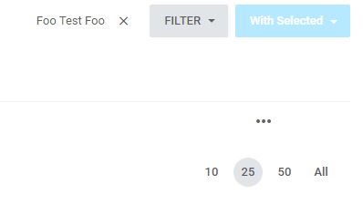
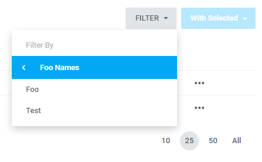
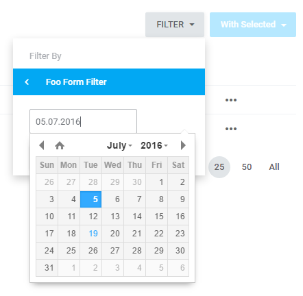

# Filters  

[TOC]

## Introduction  

Filters are used to delimit the query results which are data providers within the Datatables' operation. More about datatables can be found [here](datatables.md). 

## Class structure

Structure of class responsible for filter's operation is the following:

```php
<?php
     
    namespace Antares\Foo\Http\Filters;
     
    use Yajra\Datatables\Contracts\DataTableScopeContract;
    use Antares\Datatables\Filter\AbstractFilter;
    use Antares\Support\Collection;
    use Illuminate\Support\Fluent;
    use Antares\Foo\Model\FooRow;
    use Foundation;
     
    class FooFilter extends AbstractFilter implements DataTableScopeContract
    {
     
        /**
         * The name of the filter
         *
         * @var String
         */
        protected $name = 'Foo Names';
     
        /**
         * A unique name of the column - the key which will be saved in session
         *
         * @var String
         */
        protected $column = 'foo';
     
        /**
         * Pattern of data display in a filter
         *
         * @var String
         */
        protected $pattern = '%value';
     
        /**
         * Data provider (the data which will be included by the filter)
         *
         * @return Collection
         */
        protected function dataProvider()
        {
            $foos         = Foundation::make(FooRow::class)->get();
            $dataProvider = new Collection();
            foreach ($foos as $foo) {
                $dataProvider->push(new Fluent([
                    'name' => $foo->name,
                    'icon' => 'zmdi-accounts'
                ]));
            }
            return $dataProvider;
        }
     
        /**
         * Displays the filter's content
         *
         * @return String
         */
        public function render()
        {
            publish('foo', ['js/foo-filter.js']);
            return view('datatables-helpers::partials._filter_list', [
                'dataProvider' => $this->dataProvider(),
                'title'        => $this->column,
                'name'         => $this->name]);
        }
     
        /**
         * Filters the data on the basis of the data saved in session
         *
         * @param mixed $builder
         */
        public function apply($builder)
        {
            $params = $this->getParams();
            if (is_null($params) or $builder instanceof EloquentCollection) {
                return false;
            }
            if (!empty($values = array_get($params, $this->column . '.values'))) {
                $builder->whereIn('name', $values);
            }
        }
     
    }
```
    
As shown above, the filter must inherit from abstract base class `Antares\Datatables\Filter\AbstractFilter`. It must also implement the interface `Yajra\Datatables\Contracts\DataTableScopeContract` which is used by the Datatables object.

### Attributes  

* **name** - name of the filter which can be treated as a title as well. It is used to present the filter on the filters' list (dropdown) as below:
  
  
* **column** - an attribute being the name of the key where the filters data in session are located. It is crucial that the name of the column was unique due to the possibility of repetition's existence.
* **pattern** - an attribute determining the title's pattern after the filter's choice. An example:
  ```php
  protected $pattern = 'Foo %value Foo';
  ```
  It will cause filter's data display in the following format:

  
  
### Methods  

* **dataProvider** - a method which is used by the `render` method. In the case mentioned above it is a data provider for the list's needs which is displayed in the filter's dropdown as below:

  
  
* **render** - a method responsible for filter's presentation in a list. It may use the assets' publication which participate in interface service. **You need to remember that filters placed in the application are only a pattern and they cannot be used in the dedicated applications. Each filter should possess its own implementation of scripts responsible for interface service.** Implementation of the `render` method is simple and it is responsible for delivering a view which is presented with the filter. 
* **apply** - a method responsible for filtering logic. In this method narrowing the query is serviced. An argument of this method usually is builder's instance (`\Illuminate\Database\Eloquent\Builder`) sql delivered with the Laravel's environment. The `getParams()` method provides the data included in session. In the aforementioned case the code shown below is responsible for downloading the data ascribed to the filter:
  ```php
  if (!empty($values = array_get($params, $this->column . '.values'))) {
     $builder->whereIn('name', $values);
  }
  ```
  Remember that using the `whereIn` method in the foregoing example occurs on object's instance of the `Illuminate\Database\Eloquent\Builder` type which is responsible for creating a query to database. In a case when dataProvider is determined as a collection (`Illuminate\Database\Eloquent\Collection` or `Illuminate\Support\Collection`) the use of the `whereIn` method will give no result. In the case of the collection apply the methods described in the [documentation](https://laravel.com/docs/5.1/collections).

### Forms  

In the filters (beyond the list) forms narrowing the query results can be defined. Here is an example:

```php
<?php
     
    namespace Antares\Foo\Http\Filters;
     
    use Yajra\Datatables\Contracts\DataTableScopeContract;
    use Antares\Datatables\Filter\AbstractFilter;
    use Antares\Html\Form\FormBuilder;
    use Antares\Html\Form\Fieldset;
    use Antares\Html\Form\Grid;
     
    class FooFormFilter extends AbstractFilter implements DataTableScopeContract
    {
     
        /**
         * The name of the filter
         *
         * @var String
         */
        protected $name = 'Foo Form Filter';
     
        /**
         * A unique name of the column - the key which will be saved in session
         *
         * @var String
         */
        protected $column = 'foo_form';
     
        /**
         * Pattern of data display in a filter
         *
         * @var String
         */
        protected $pattern = 'Registered at %created_at_range';
     
        /**
         * Displays the filter's content
         *
         * @return String
         */
        public function render()
        {
            publish('foo', ['js/foo-form-filter.js']);
            $form = $this->form();
            return view('datatables-helpers::partials._filter_form')->with(['form' => $form]);
        }
     
        /**
         * Filters the data on the basis of the data saved in session
         *
         * @param mixed $builder
         */
        public function apply($builder)
        {
            $params = $this->getParams();
            if (is_null($params) or $builder instanceof EloquentCollection) {
                return false;
            }
            if (!empty($values = array_get($params, $this->column . '.values'))) {
                $collection = current($values);
                foreach ($collection as $item) {
                    if ($item['name'] !== 'created_at_range') {
                        continue;
                    }
                    $builder->where('created_at_range', $item['value']);
                }
            }
        }
     
        /**
         * Definition of form inside the filter
         *
         * @return \Antares\Html\Form\Builder
         */
        protected function form()
        {
            $grid = app(Grid::class);
            $grid->name('foo_filter_created_date');
            $grid->simple('#');
            $grid->layout('antares/foo::admin.partials._filter_form');
     
            $grid->fieldset(function (Fieldset $fieldset) {
     
                $value = !empty($this->data) ? $this->data->where('name', 'created_at_range')->pluck('value')->first() : null;
     
                $fieldset->control('input:text', 'created_at_range')
                        ->attributes(['placeholder' => "from date...", 'required' => 'required', 'data-datepicker' => true])
                        ->value($value);
     
                $fieldset->control('button', 'button')
                        ->attributes(['type' => 'submit', 'class' => 'btn btn--submit btn--md btn--primary mdl-button mdl-jsb mdl-re'])
                        ->value(trans('Set'));
            });
            return new FormBuilder($grid);
        }
    }
```

In the case above the `form` method is responsible for providing the form's object which will be displayed within the framework of the filter. More information concerning the work with forms can be found [here](form_builder.md). Note the name of value in the `pattern` attribute that is `%created_at_range` which is the same as the name of the box in the form. The layout's file used by the form has the following syntax:

<pre><code>antares/foo::admin.partials._filter_form</code></pre>

```html
{{ Form.open(form)|raw }}
    
        <fieldset name="inputs">               
            
                <div class="form-block">
                    {{ control.getField(row, control, [])|raw }}
                </div>
            
        </fieldset>
    
           
        
            {{ button.getField(row, button, [])|raw }}
         
    
{{ Form.close()|raw }}
```

The example above gives the following effect:


  
Once the filter is chosen, the effect is as shown below:


  
In the case of filters which use the forms, what is very important is the query that is the `apply` method. The code:

```php
if (!empty($values = array_get($params, $this->column . '.values'))) {
    $collection = current($values);
    foreach ($collection as $item) {
        if ($item['name'] !== 'created_at_range') {
            continue;
        }
        $builder->where('created_at_range', $item['value']);
    }
}
```

through the agency of a loop scans the collection of form's boxes saved in session and in a case when the key is found which is identical with the described one in the form's box, the results of a query are narrowed down.
