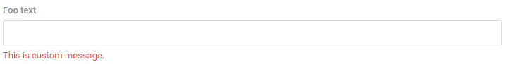
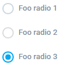
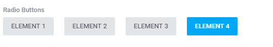
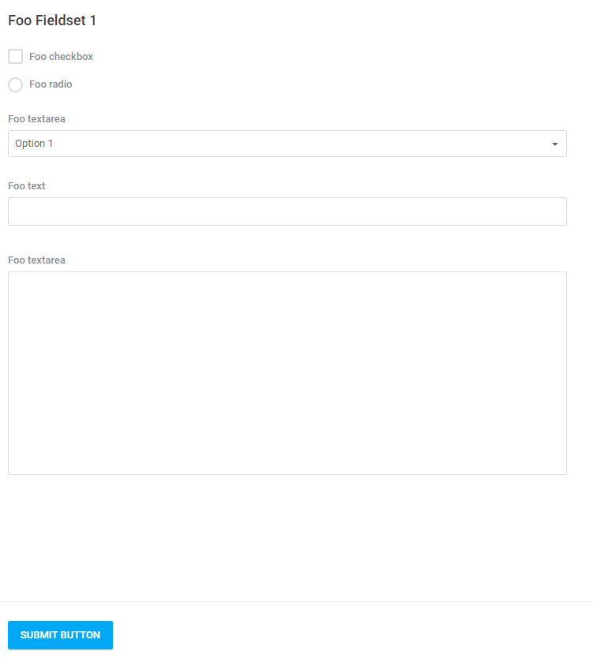
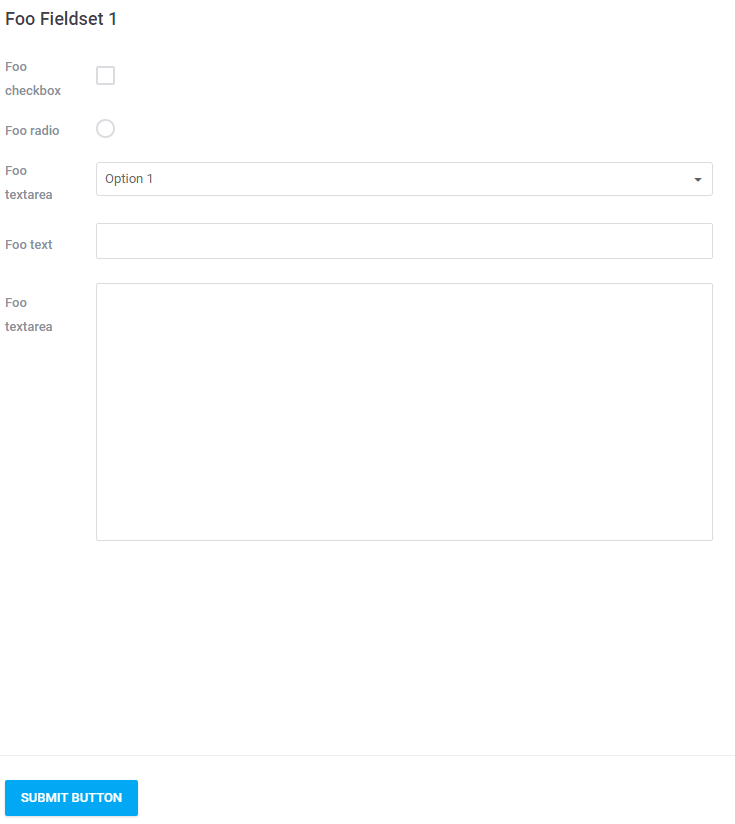
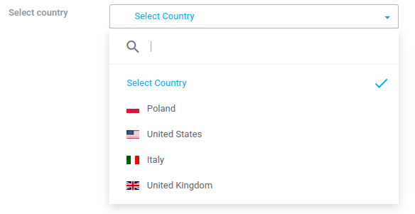
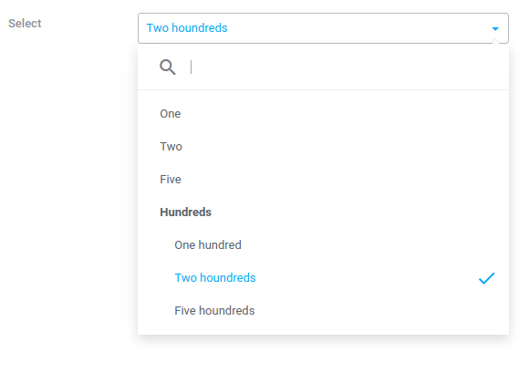

# Form Builder  

[TOC]

## Introduction  

The application supports the use of tools in building flexible forms. The object responsible for their presentation is **form builder** determined in the space `Antares/Html/Form` in the core system's package. As opposed to standard solutions which are rendered available by the Laravel the form builder enables the pinning of fieldsets, controls, as well as static contents through other components, and separation from view's layer. Functionally, the form builder is similar to the solution made available by the [Symfony 2 framework](http://symfony.com/doc/current/book/forms.html). Below an example of basic form is presented:

> Form classes should be placed in `src/modules/<module_name>/src/Http/Forms/` (e.g. `src/modules/<sample_module>/src/Http/Forms/SampleForm.php`).

```php
/**
 * Generating new form's object
 *
 * @return \Antares\Html\Form\FormBuilder
 */
protected function form()
{
    return app('antares.form')->of('awesome-foo-form', function(FormGrid $form) {
                $form->name('My Awesome Foo Form');
                $form->simple('#', ['method' => 'POST']);
                $form->fieldset('Fieldset one', function (Fieldset $fieldset) {
 
                    $fieldset->legend('Foo Fieldset 1');
 
                    $fieldset->control('input:checkbox', 'checkbox')
                            ->label('Foo checkbox');
 
                    $fieldset->control('input:radio', 'radio')
                            ->label('Foo radio');
 
                    $fieldset->control('select', 'select')
                            ->label('Foo textarea')
                            ->options([0 => 'Option 1', 1 => 'Option 2']);
 
                    $fieldset->control('input:text', 'text')
                            ->label('Foo text');
 
                    $fieldset->control('textarea', 'textarea')
                            ->label('Foo textarea');
 
                    $fieldset->control('button', 'button')
                            ->attributes(['type' => 'submit', 'class' => 'btn btn-primary'])
                            ->value('Submit button');
                });
            });
}
```


In the preceding example a form comprising several most important controls is being built. Such a form declaration enables 'pinning' to the form by other components. The components have the right to add, edit, and remove all form's elements: from fieldsets, through layouts and validation rules. The `of` method - used in the example - takes a (unique) name of statement which can be used by other components as the first parameter. The second argument is anonymous function which is responsible for the actual form's production. It is essential to determine the name of the form with the use of the `name` method within the anonymous function.

The implementation above will create the following form:


  
## Form's Attributes  

The following types of attributes which determine the form's initial parameters can be distinguished:

### Url And Parameters  

#### Simple  

```php
$form->simple('#', ['method' => 'POST']);
```

The method in attributes has url address where data from the form and attributes (e.g. method) will be send.

#### Complex  

```php
$form->resourced($url, Model $model, array $attributes = []);
```

The method takes the url address as the first parameter. Model is an instance of the object whose data will be used to fill the form. The type of model must be connected with the Eloquent database object (`\Illuminate\Database\Eloquent\Model`).

The final parameter is optional. It can be used to transfer the form's method - if it is not delivered by hand, it will be determined automatically. Other attributes are for instance css class of tag `<form>`

#### Connected With A Presenter  

```php
$form->setup(Presenter $listener, $url, $model, array $attributes = []);
or
$form->resource(Presenter $listener, $url, $model, array $attributes = []);
```

The presenters may have their own methods determining the form's url by using `handles()` and `setupForm()` which interferes in grid which in turn may be perceived as form's building material.

### Layout  

The following method:

```php
$form->layout('antares/foundation::components.form');
```

enables determining of the view which will be used to display the form. If it is not given, the following one will be used by default: `antares/html::form.horizontal`.

## Fieldsets  

Each system's form consists of fieldsets. The fieldsets are used to put in order (group) the controls belonging to the form.

```php
$form->fieldset('Fieldset one', function (Fieldset $fieldset) {
                         
});
```

The first argument of the `fieldset` method is the conventional name of the fieldset. There is also a possibility to replace the tag `<legend></legend>` with the value of this argument. Implementation lacking the first attribute as a name is also correct:

```php
$form->fieldset(function (Fieldset $fieldset) {
                         
});
```

The second argument is the anonymous function and within this function it is established which controls will belong to the fieldset. The form may also comprise any number of fieldsets. Here is an example:

```php
$form->fieldset('Fieldset 1', function (Fieldset $fieldset) {
    $fieldset->legend('Fieldset legend 1');
 
    $fieldset->layout('antares/foo::admin.partials._fieldset');
 
    $fieldset->control('input:text', 'foo_text1')
            ->label('Foo textarea 2');
});
 
$form->fieldset('Fieldset two', function (Fieldset $fieldset) {
    $fieldset->legend('Fieldset legend 2');
    $fieldset->control('input:text', 'foo_text2')
            ->label('Foo textarea 1');
});
```

The basic parameters of the fieldset are:

#### Fieldset Legend  

A legend is visible above the fieldset in a view and determines the name of the controls' group:

```php
$fieldset->legend('Fieldset legend 1');
```

#### Fieldset Layout  

Layout determines fieldset's dedicated view:

```php
$fieldset->layout('antares/foo::admin.partials._fieldset');
```

Therefore, the implementation above will cause the display of the following form:


  
## Controls  

The controls constitute form's areas (e.g. the *textarea* box). All the controls are invoked by means of the `control` method. The `control` method takes two attributes:

#### Structure  

```php
$fieldset->control('select', 'name');
```
The first one is type. The second one is name. Therefore, the code above will create:

```html
<select name="name"></select>
```

#### Attributes  

Control's attributes are determined by means of the `attributes` method:

```php
$fieldset->control('select', 'name')->attributes(['class' => 'foo-select']);
```
Which in turn will create:

```html
<select name="name" class="foo-select"></select>
```

#### Value
  
The `value` method is used to grant value to the control that is filling the `value` attribute in html. An example:

```php
$fieldset->control('input:text', 'text_field')->value('test');  
```

The html effect:
```html
<input type="text" name="text_field" value="text" />
```

#### Label  
The `label` method is used to determine the name of the label belonging to area's structure:
```php
$fieldset->control('select', 'select')->options([0 => 'Option 1', 1 => 'Option 2'])->attributes(['class' => 'foo-select'])->label('Foo select'); 
```

It will create code's segment on the basis of defined by default control's view:

```html
<div class="col-16 mb2">
  <label for="select" class="form-block__name">Foo select</label>   
</div>
<div class="col-16">
  <div class="input-field input-field--desc">
       <select class="foo-select" data-selectar="1" id="select" name="select"><option value="0">Option 1</option><option value="1">Option 2</option></select>
       <div class="col-16"></div>
  </div>
</div>
<span id="select_error" class="error col-13 col-mb-11"></span>
```

#### Wrapper  

The `wrapper` method is used to wrap the control's structure in additional html tag (div). An example: 

```php
$fieldset->control('select', 'select')
->options([0 => 'Option 1', 1 => 'Option 2'])
->attributes(['class' => 'foo-select'])
->label('Foo select')
->wrapper(['class' => 'w100']);
```

It will wrap as below:

```html
<div class="w100">
    <div class="col-16 mb2">
        <label for="select" class="form-block__name">Foo select</label>   
    </div>
    <div class="col-16">
        <div class="input-field input-field--desc">
            <select class="foo-select" data-selectar="1" id="select" name="select"><option value="0">Option 1</option><option value="1">Option 2</option></select>
            <div class="col-16"></div>
        </div>
    </div>
    <span id="select_error" class="error col-13 col-mb-11"></span>
</div>
```

Keep in mind that css wxx classes (e.g. w100, w200) are used to control the width of the control's structure.

### Types Of Controls  

#### Select  

Parameters:

Options - contains a list of values ascribed to a control. It may contain a board as in the example below:

```php
$fieldset->control('select', 'select')->options(['option 1','option 2'])
```
It may contain the anonymous function and its task is to set the value (e.g. downloading the value from base):

```php
$fieldset->control('select', 'select')
       ->options(function() {
             return [0 => 'Option 1', 1 => 'Option 2'];
        })
       ->label('Foo Select')
       ->wrapper(['class' => 'w200']);                                    
```

The effect is shown below:


  
#### Textfield  

Textfield of the input:text type:

```php
$fieldset->control('input:text', 'foo_text')->label('Foo text')->attributes(['class' => 'foo-text'])->wrapper(['class' => 'w200']);
```
The effect:


  
#### Textarea  

Textfield of the textarea type:

```php
$fieldset->control('textarea', 'foo_textarea')
       ->label('Foo textarea')
       ->attributes(['class' => 'foo-text', 'rows' => 3, 'cols' => 10])
       ->wrapper(['class' => 'w900']);
```

The effect:


  
#### Checkbox  

A control of the checkbox type, input:checkbox:

```php
$fieldset->control('checkbox', 'foo_checkbox')
       ->label('Foo checkbox')
       ->attributes(['class' => 'foo-checkbox'])
       ->value(1);                                
```

The effect:



Optionally it is possible to select the control:

```php
$fieldset->control('checkbox', 'foo_checkbox')
       ->label('Foo checkbox')
       ->attributes(['class' => 'foo-checkbox'])
       ->value(1)
       ->checked();                                
```

Multi checkboxes are characteristic for this type of areas:

```php
$fieldset->control('checkbox', 'foo_checkbox[]')
       ->label('Option 1')
       ->value(1)  
       ->attributes(['class' => 'foo-checkbox']);
 
$fieldset->control('checkbox', 'foo_checkbox[]')
       ->label('Option 2')
       ->value(2)
       ->attributes(['class' => 'foo-checkbox']);                               
```

The effect:


  
#### Radio  

Areas of the radio type, input:radio:

```php
$fieldset->control('checkbox', 'foo_checkbox')
       ->label('Foo checkbox')
       ->value(1)
       ->attributes(['class' => 'foo-checkbox']);                                
```

The effect:


Selection is done similarly as in the case of checkbox:

```php
$fieldset->control('checkbox', 'foo_checkbox')
         ->label('Foo checkbox')
         ->attributes(['class' => 'foo-checkbox'])
         ->value(1)
         ->checked();                                
```

The multi version:

```php
$fieldset->control('radio', 'foo_radio[]')
       ->label('Foo radio 1')
       ->attributes(['class' => 'foo-radio'])
       ->value(1);
 
$fieldset->control('radio', 'foo_radio[]')
       ->label('Foo radio 2')
       ->attributes(['class' => 'foo-radio'])
       ->value(2);
 
$fieldset->control('radio', 'foo_radio[]')
       ->label('Foo radio 3')
       ->attributes(['class' => 'foo-radio'])
       ->value(3)
       ->checked();         
```

The effect:


  
Specific type of a radio control is a form containing buttons instead of options. Definition of this type of control is described below:

```php
$fieldset->control('radio_btns', 'name')
       ->label('Radio Buttons')
       ->options(['0' => 'Element 1', '1' => 'Element 2', '2' => 'Element 3', '3' => 'Element 4'])
       ->value('1');         
```

The result will be the following:


  
#### Tabular Inputs  

It is possible to group the controls on the basis of the control's 'name' attribute. Here is an example:

```php
$fieldset->control('input:text', 'text[foo][]')
         ->label('Foo text 1')
         ->attributes(['class' => 'foo-radio']);
 
$fieldset->control('input:text', 'text[foo][]')
         ->label('Foo text 2')
         ->attributes(['class' => 'foo-radio']);
       
$fieldset->control('checkbox', 'checkbox[foo][]')
         ->label('Foo checkbox 1')
         ->attributes(['class' => 'foo-radio'])
         ->value(1);
 
$fieldset->control('checkbox', 'checkbox[foo][]')
         ->label('Foo checkbox 2')
         ->attributes(['class' => 'foo-radio'])
         ->value(2);                                
```

The effect:


  
The form will send data divided in a tabular manner, an example:

```php
[text] => Array
        (
            [foo] => Array(
                    [0] => just test
                    [1] =>
                )
 
        )
[checkbox] => Array
        (
            [foo] => Array
                (
                    [0] => 1
                )
 
        )        
```

#### Dropzone  

Dropzone is an area used to add files. It uses the well-known javascript library named as [dropzone](http://www.dropzonejs.com). The use:

```php
$attributes = [
    "container"       => "dropzoneLogo",
    "paramName"       => "logo",
    'thumbnailWidth'  => 220,
    'thumbnailHeight' => 121,
    "url"             => handles("antares::foo/upload"),
    'destination'     => public_path('img/logos'),
    'rules'           => [
        "acceptedFiles" => ['jpg', 'png', 'jpeg'],
        "maxFilesize"   => 9.76,
        "minFilesize"   => 0.0009,
]];
 
$fieldset->control('dropzone', $attributes['container'])
        ->attributes($attributes)
        ->label('Logo')
        ->value(public_path('img/logos/foo.png'));        
```

Attributes are the reflection of the parameters described in the [dropzone documentation](http://www.dropzonejs.com/#configuration). Furthermore, the 'container' attribute determines id diva used by the dropzone. It is important because of the possibility of having many dropzone instances on a single website. By default, the control's structure uses the view's file from the location: antares/foundation::widgets.forms.dropzone. If there is a necessity of defining another dropzone container appearance, it is possible to determine your own view by adding the 'view' attribute. In addition to this, it would be possible to determine the behavior if the file's upload had succeeded, so:

```php
$attributes = [
    "container"       => "dropzoneLogo",
    "paramName"       => "logo",
    'thumbnailWidth'  => 220,
    'thumbnailHeight' => 121,
    "url"             => handles("antares::foo/upload"),
    'destination'     => public_path('img/logos'),
    'rules'           => [
        "acceptedFiles" => ['jpg', 'png', 'jpeg'],
        "maxFilesize"   => 9.76,
        "minFilesize"   => 0.0009,
    ],
    'view'=>'antares/foo::partials._dropzone',
    'onSuccess'       => '$('.main-sidebar .main-sidebar__logo').css('background-image','url(/img/logos/'+response.path+')');',
];
 
$fieldset->control('dropzone', $attributes['container'])
        ->attributes($attributes)
        ->label('Logo');        
```

The implementation above gives the following result:


  
After the upload:


  
#### Remote Select  

Remote Select is used to build the controls of the select type with independently obtained values (ajax). An example of implementation:

```php
$fieldset->control('remote_select', 'select_name')
         ->label('Remote Select')
         ->options([
            ['0' => 'please select option...']
         ])
         ->attributes([
            'fieldname'     => 'fullname',
            'id'            => 'select-infinity',
            'options'       => ['placeholder' => 'Search for a foo ...'],
            'pluginOptions' => [
                'allowClear'              => true,
                'minimumInputLength'      => 1,
                'minimumResultsForSearch' => 'Infinity',
                'ajax'                    => [
                    'url'      => handles('antares/foo::elements'),
                    'dataType' => 'json',
                    'delay'    => 250,
                    'cache'    => true
                ],
            ],
]);
```

The `fieldname` attribute determines the name of the search field. If it is not determined, the name parameter is used by default that is `select_name` in the case above. The remaining parameters of use are in accord with the parameters which are used by the '**select2**' javascript library. The description of parameters can be found in the [link](https://select2.github.io/examples.html#data-ajax). The effect of the code shown in the last example:


  
#### Ckeditor  

Ckeditor is a complex editor of the '**wysiwyg**' type. Use the code below:

```php
$fieldset->control('ckeditor', 'content')
         ->label('Foo content')
         ->attributes(['id' => 'foo-content']);        
```

To generate the following textfield:


  
The parameters of this control are identical with parameters of the textarea field.

#### Customfields  

It is possible to create fully dedicated structure inside a form. The code:

```php
$fieldset->control('placeholder', 'custom_field')
         ->field(function() {
            return '<div class="col-group">'
                    . '<div class="col-16">' . '<input type="text" name="foo_customfield" />' . '</div>'
                    . '<div class="col-16">' . app('html')->link(handles("#"), 'Custom Field') . '</div>'
                    . '</div>';
         });        
```

will create:


  
##Form Layouts  

Forms may use views in order to define a dedicated view. Currently, two types of views which are operated by forms are available:

* vertical
* horizontal

Vertical is the default one.

The difference between the vertical view and the horizontal one lies in the block's structure layout. The block usually consist of label field, a control, and auxiliary fields in the form of container with  errors and fields of the inline - help type. An example of such a structure may be textfield's block input:text:

```html
<div class="col-dt-2 col-3 col-mb-5 {{ control.getLabelWrapper('class') }}">
    {{ Form.label(control.name, control.label,{'class':'form-block__name'})|raw }}   
</div>
<div class="col-dt-14 col-13 col-mb-11 {{ control.getWrapper('class') }}">
    <div class="input-field {{ (control.inlineHelp|length>1 or control.help|length>1) ? 'input-field--desc' : ''  }}">       
        {{ control.getField(row, control, [])|raw }}
        
                        
        
    </div>
    <span id="{{ control.id }}_error" class="error col-13 col-mb-11">
        {{ errors.first(control.name, format)|raw }}
    </span>
</div>
```

In order to set appropriate view's scheme you need to transmit short name of the view by means of the `layout` method to the form builder object.
For the horizontal view:

```php
$form->layout('horizontal');
```

For the vertical view:

```php
$form->layout('vertical');
```

Your own form's layout in turn is passing a path to the view's file:

```php
$form->layout('antares/foo::partials.form.my_foo_form_layout');
```

Fields' layout for the horizontal view is the following, an example:


  
The vertical view:


  
##Validation  

Information concerning validation can be found [here](validation.md).

## An alternative to the Controls - Control Types

Instead of `control()` method you can use `addType()`. This method takes one parameter: object which extends class `Antares\Form\Controls\AbstractType`.

#### Structure

```php
$fieldset->addType(new TextType('text_input'));
```

The code above will create:

```html
<input type='text' name='text_input'></select>
```

#### Attributes

Control Type's attributes can be set using method `setAttributes()` or `setAttribute()`.

Both codes:
```php
$control = (new TextType('text_input'))->setAttributes(['class' => 'some-class']);
```
```php
$control = (new TextType('text_input'))->setAttribute('class', 'some-class');
```
will give the same result:

```html
<input type='text' name='text_input' class='some-class'/>
```

You can also use method `addAttribute()` to add to exisitng attribute new value, especially useful for `class` attribute:

```php
$control = new TextType('text_input');
$control->addAttribute('class', 'class1');
$control->addAttribute('class', 'class2');
```

will generate:
```html
<input type='text' name='text_input' class='class1 class2'/>
```

Some of Control Types has dedicated methods for most used attributes, for example `setRows` for textarea input type, `setMinValue()` and `setMaxValue()` for number input or `setMultiple()` for select type.

#### Label

Each Control Type has it own label, event if was not set - it will be generated automatically based on Control Type name.

Using `setLabel()` method you can simply pass the string or object that extends `Antares\Form\Labels\AbstractLabel` class.
In the second case you can add attibutes for label, e.g. `class` or `id`.

Passing only string to `setLabel()` method:
```php
$fieldset->addType((new RangeType('range'))
    ->setLabel('Range slider')
);
```
In this case will be used default Label class: `Antares\Form\Labels\Label`.

As was said, you can pass the Label object instead:
```php
$fieldset->addType((new RangeType('range'))
    ->setLabel((new Label('Range slider'))
        ->setAttribute('class', 'label-class')
));
```

#### Decorators
Each Control Type has it own Decorator, which is basically responsible for rendering Control Type.
Decorators have been designed to allow render each Control Type separately.

You can use method `setDecorator()` to set decorator. This method takes one parameter: string with decorator class namespace or just decorator object itself.

By defauly each Control Type uses `Antares\Form\Decorators\HorizontalDecorator`.

Methods `setLabelWrapper()` and `setInputWrapper()` allows you to wrap the control's and label's structure in additional html tag.  

### Types Of Controls  

#### ALTDateType / DateType

Control with Date Picker:

```php
$fieldset->addType(new ALTDateType('date');
```

#### ALTDatetimeType / DatetimeType

Control with Date-Time Picker:

```php
$fieldset->addType(new ALTDatetimeType('date');
```

#### ALTTimeType / TimeType

Control with Time Picker:

```php
$fieldset->addType(new ALTTimeType('date');
```

#### CheckboxType / MulticheckboxType

A Control Type for the checkbox input.

```php
$fieldset->addType((new CheckboxType('checkbox')
    ->setCheckedValue(10)
    ->setUncheckedValue(0)
    ->setUseHiddenElement(true)
);
```

You can define checkbox checked value (`setCheckedValue()`) and unchecked (`setUncheckedValue()`).
Method `setUseHiddenElement()` was created to be able to define the value that will appear in the request when the form is sent and checkbox is not checked (this will be value set by `setUncheckedValue()` method, by default it is 0).

If you want create Multicheckbox use the `MulticheckboxType`. For this Control Type you can define array of options:
```php
$fieldset->addType((new MultiCheckboxType('multicheckbox'))
    ->setValueOptions([
        1 => 'One',
        2 => 'Two',
        5 => 'Five',
    ])
);
```

The effect is shown below:


#### CKEditorType

CKEditor is a complex editor of the '**WYSIWYG**' type. Use the code below:

```php
$fieldset->addType(new CKEditorType('richtext');
```

#### CountryType

Use this control to render `select` input with all countries defined in system.

```php
$fieldset->addType((new CountryType('country'))
    ->setLabel('Select Country')
);
```

The effect is shown below:


#### DataRangeType

Control with Date Picker which allows you to pick range of time.

```php
$fieldset->addType((new DataRangeType('data_range'))
    ->setLabel('Choose Dates')
);
```

#### DropzoneType

Code below will render the dropzone area where you can Drag & Drop files and upload them.

```php
$fieldset->addType((new DropzoneType('files'))
    ->setLabel('Upload Files')
);
```

The effect is shown below:


#### EmailType

A Control Type for the HTML5 `email` input.

```php
$fieldset->addType((new EmailType('email'))
    ->setLabel('Email Address')
);
```

#### FileType

A Control Type for the `file` input.

```php
$fieldset->addType((new FileType('file'))
    ->setLabel('Upload File')
);
```

#### HiddenType

A Control Type for the `hidden` input.

```php
$fieldset->addType(new HiddenType('id');
```
Please note that this control is using `Antares\Form\Decorators\HiddenDecorator` instead of default `HorizontalDecorator` to avoid rendering Label.

#### LanguageType

Code below will render the `select` input with languages available in system.

```php
$fieldset->addType((new LanguageType('language'))
    ->setLabel('Choose language')
);
```

#### NumberType

A Control Type for the HTML5 `number` input.

```php
$fieldset->addType((new NumberType('number'))
    ->setLabel('Some value')
    ->setMinValue(1)
    ->setMaxValue(10)
    ->setStep(1)
);
```
For this control there are available dedicated methods `setMinValue()`, `setMaxValue()` and `setStep()`. But still you can use `setAttributes()` method to set this attributes.

#### PasswordType

A Control Type for the `password` input.

```php
$fieldset->addType((new PasswordType('password'))
    ->setLabel('Type your password')
);
```

#### RadioType

A Control Type for the `radio` input.

```php
$fieldset->addType((new RadioType('radio'))
    ->setValueOptions([
        1 => 'One',
        2 => 'Two',
        5 => 'Five',
    ])
);
```

Similarly to the `MultiCheckboxType` you can use `setValueOptions` method to set possible values.
If you want to check some value by default use `setValue()` method.

The effect is shown below:


#### RangeType

A Control Type for the HTML5 `range` input.

```php
$fieldset->addType((new RangeType('range'))
    ->setLabel('Select range')
);
```

#### SearchType

A Control Type for the HTML5 `search` input.

```php
$fieldset->addType((new SearchType('search_phrase'))
    ->setLabel('Type antything to search...')
);
```

#### SelectType

A Control Type for the `select` input.

```php
$fieldset->addType((new SelectType('select'))
    ->setValueOptions([
        1 => 'One',
        2 => 'Two',
        5 => 'Five',
    ])
    ->useSelect2(true)
    ->setSearch(true)
    ->setMultiple(false)
    ->setLabel('Select')
    ->setEmptyValue('Choose some option')
    ->setValue(5)
);
```

This Control Type has a few useful methods:
* Method `useSelect2()` turns on/off select2 for the `select`.
* Method `setSearch()` truns on/off search feature in select2.
* Method `setEmptyValue()` allows you to define an empty value (option without value). This will be the default value of select if there is no any other selected option.
* Method `setMultiple()` means that user will be able to choose more than one option. Please note that there is no need to add `[]` in control name.

Similarly to the `MultiCheckboxType` you can use `setValueOptions` method to set possible values.

The effect is shown below:


In case you want use `OptGroups` in your select:



you should pass to the `setValueOptions()` array which looks like this:

```php
[
    1 => 'One',
    2 => 'Two',
    5 => 'Five',
    'Hundreds' => [
        100 => 'One hundred',
        200 => 'Two houndreds',
        500 => 'Five houndreds'
    ],
]
```

#### TextareaType

A Control Type for the `textarea` input.

```php
$fieldset->addType((new TextareaType('textarea'))
    ->setLabel('Description')
    ->setRows(10)
);
```

You can use `setRows()` method to set number of rows.

#### TextType

A Control Type for the `text` input.

```php
$fieldset->addType((new TextType('text_input'))
    ->setLabel('Title')
);
```

#### TimezoneType

Code below will render the `select` input with all timezone identifiers.

```php
$fieldset->addType((new TimezoneType('timezone'))
    ->useSelect2(true)
    ->setSearch(true)
    ->setLabel('Set your timezone')
);
```

In this example select2 with search feature is used to show more user friendly results.

#### UrlType

A Control Type for the HTML5 `url` input.

```php
$fieldset->addType((new UrlType('url'))
    ->setLabel('URL')
);
```

#### Buttons

There is three types of buttons you can add to the form:
* button
* submit
* reset

Code below shows how to do that:

```php
$fieldset->addType((new ButtonType('submit'))
    ->setValue('I will submit this form')
    ->setLabel('Simply click me')
    ->addClass('btn btn--md btn--primary')
    ->setButtonType(ButtonType::BUTTON_SUBMIT)
);
```

Method `setButtonType()` allows you to set what type of button you want to get. As said before you can use: `button`, `submit` or `reset` button. Pass one of these values to the method simply as string or use `ButtonType` class constants.

The effect is shown below:
