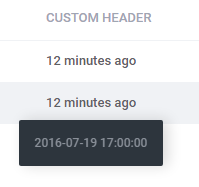

# Formatters  

[TOC]

## Introduction  

Formatters are tools facilitating data presentation. Their task is focused on formatting that is data processing in order to achieve the shape in accord with project's requirements. An example of a formatter can be data formatter (e.g. to the shape YYYY-MM-DD) or a formatter determining monetary value (e.g. periods instead of commas, the number of decimal places, leading zeros, etc.). The application renders available the following list of formatters:

* ### format_x_days  

    Enables data conversion to a more readable format by changing the value of date on a format which presents the amount of time which has passed until now. Take a look at the example:
    
    ```php 
    format_x_days('2016-07-19 17:00:00')
    ```
    
    This in turn will display:
    
    
      
    When you place the mouse cursor on a value you will be able to see the full date in a tooltip. The first argument of the method is date in any correct format, the second one is a flag (true/ false) denoting whether a value should be decorated with html code for the needs of tooltip operation. The default flag's value is 'true', in the case of the 'false' value the formatter will reply with a value without the html.
    
    In the twig, the use of formatter is the same, so:
    
    ```html
    {{ format_x_days('2016-07-19 17:00:00') }}
    ```
