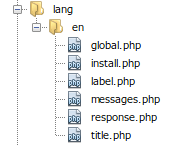

# Translator  

[TOC]

## Introduction  

The platform supports the multilingualism of an application through the language files defined in the space of a component.

> The default path of the translation files defined by the module is `src/modules/<module_name>/resources/lang/<language>/` (e.g. `src/modules/sample_module/resources/lang/en/messages.php`).

## Configuration  

Defining the location of a language file usually takes place in the 'boot' method of the module's service provider by calling:

```php
$this->addLanguageComponent('antares/foo', 'antares/foo', "{$path}/lang");
```

The `$path` variable determines the location of the directory of language files. Remember to keep the correct structure as presented below:


  
It is also possible to use the global directory located in:

```bash
resources/lang
```

or per the user's level:

```bash
resources/lang/administrators
```

Remember that such a solution will render translations no longer available in the 'translations' component and they may be overwritten through publication.

## Usage  

Referring to the translation contained in the configuration file is possible with the use of:

```html
{{ trans('antares/foo::messages.foo_test') }}
```

where `antares/foo` is the name of the module, `messages` is the name of the file and `foo_test` is the translated phrase. More information about how the translator works can be found [here](https://laravel.com/docs/5.2/localization).
