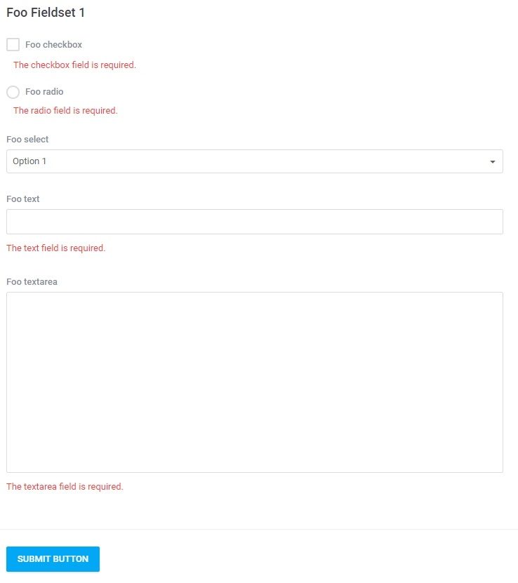
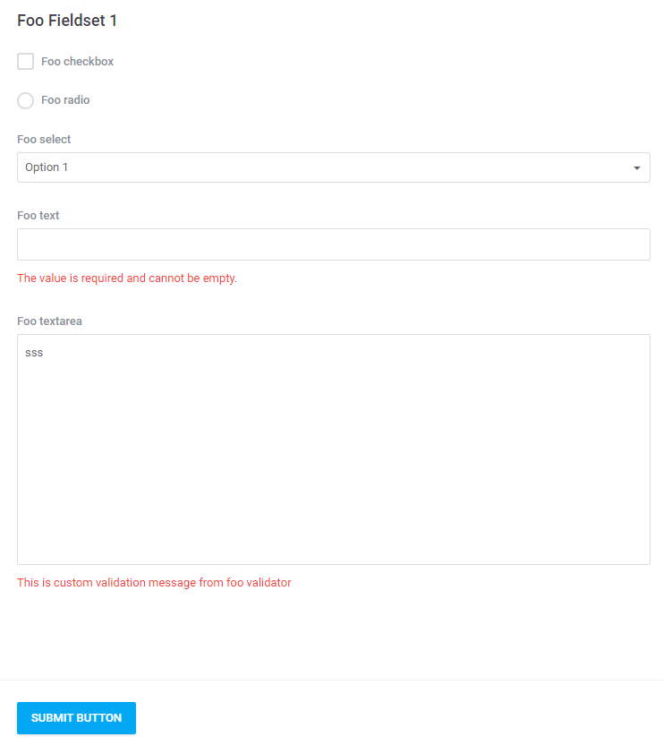

# Validation  

[TOC]

## Introduction  

The platform supports validation of sent forms through the implementation of the functionality on the level of the form itself.

> The default validators path for the module is `src/modules/<sample_module>/src/Validators/` (e.g. `src/modules/sample_module/Validators/UploadValidator.php`).

## Structure

The addition of new validation rules takes place through the configuration of the `rules` parameter of the form which the validation will be executed for. The method accepts a set of validation rules in the form of the table. An example:

```php
/** * Form instance with validation rules
 *
 * @return \Antares\Html\Form\FormBuilder
 */
protected function form()
{
    return app('antares.form')->of('awesome-foo-form', function(FormGrid $form) {
                $form->name('My Awesome Foo Form');
                $form->simple('#', ['method' => 'POST']);
                $form->fieldset('Fieldset one', function (Fieldset $fieldset) {
  
                    $fieldset->legend('Foo Fieldset 1');
  
                    $fieldset->control('input:checkbox', 'checkbox')
                            ->label('Foo checkbox');
  
                    $fieldset->control('input:radio', 'radio')
                            ->label('Foo radio');
  
                    $fieldset->control('select', 'select')
                            ->label('Foo textarea')
                            ->options([0 => 'Option 1', 1 => 'Option 2']);
  
                    $fieldset->control('input:text', 'text')
                            ->label('Foo text');
 
                    $fieldset->control('button', 'button')
                            ->attributes(['type' => 'submit', 'class' => 'btn btn-primary'])
                            ->value('Submit button');
                });
                $form->rules([
                     'text'     => ['required', 'email', 'unique:tbl_users,email'],
                     'textarea' => ['required', 'min:3', 'max:4'],
                     'radio'    => ['required'],
                     'checkbox' => ['required'],
                     'select'   => ['required'],
                ]);
            });
}
```

Verification of these rules takes place once the data are sent and when the `isValid` method is used for the form. An example of the validation inside a processor:

```php
public function create()
{
        $form = $this->form();
        if (app('request')->isMethod('post') && !$form->isValid()) {
            return ['errors' => $form->getMessageBag()];
        }
        return ['form' => $form];
}
```

Operation in a controller:

```php
public function create(FooProcessor $processor)
{
        $data = $processor->create();
        if (isset($data['errors'])) {
            return $this->redirectWithErrors(handles('antares::foo/create'), $data['errors']);
        }
        return view('antares/foo::admin.foo.create', $data);
}
```

It is worth mentioning that if the form is sent by ajax, the validator's response will be transformed in the json format immediately:

```html
{"checkbox":["The checkbox field is required."],"radio":["The radio field is required."],"text":["The text field is required."],"textarea":["The textarea field is required."]}
```

The effect of the validator's operation is presented on the screen below:


  
## Validation's Error Content  

There is a possibility to determine your own contents of form's error after the validation. The `phrases` method accepts in an argument a table that contains its own errors communication:

```php
$form->phrases([
    'required' => 'This is a custom message.'
]);
```

And the effect:


  
## Dedicated Validation  

It is possible to introduce a dedicated method that verifies whether the sent data are correct.
An example of class that applies the `custom_validation` validator on the `textarea` field:

```php
<?php
 
namespace Antares\Foo\Validation;
 
use Illuminate\Support\Facades\Validator as ValidatorFacade;
use Illuminate\Contracts\Validation\Factory;
use Illuminate\Contracts\Events\Dispatcher;
use Antares\Support\Validator;
 
class FooValidator extends Validator
{
     
    /**
     * Validator's rules
     *
     * @var type
     */
    protected $rules = [
        'text'     => ['required', 'custom_validation'],
        'textarea' => ['custom_validation']
    ];
 
    /**
     * Validation's errors translation
     *
     * @var array
     */
    protected $phrases = [
        'required'          => 'The value is required and cannot be empty.',
        'custom_validation' => 'This is custom validation message from foo validator'
    ];
 
   /**
     * Object's construction
     *
     * @param Factory $factory
     * @param Dispatcher $dispatcher
     */
    public function __construct(Factory $factory, Dispatcher $dispatcher)
    {
        parent::__construct($factory, $dispatcher);
        ValidatorFacade::extend('customValidation', '\Antares\Foo\Validation\FooValidator@validateCustomValidation');
    }
    /**
     * Dedicated validation method
     *
     * @param String $field
     * @param mixed $value
     * @param array $parameters
     * @return boolean
     */
    public function validateCustomValidation($field, $value, $parameters)
    {
        return false;
    }
 
}
```

Do not forget to provide the application with the information about what method in what class will be responsible for validation. In the above example it is:

```php
ValidatorFacade::extend('customValidation', '\Antares\Foo\Validation\FooValidator@validateCustomValidation');
```

Such validator has to be transferred to the form's object. Placing to the processor in the constructor:

```php
/**
 * Processor's construction
 *
 * @param FooValidator $validator
 */
public function __construct(FooValidator $validator)
{
    $this->validator = $validator;
}
```

Assigning to the form:

```php
$form->rules($this->validator->getValidationRules())->phrases($this->validator->getValidationPhrases());
```

The effect of sending the form and validation:


  

