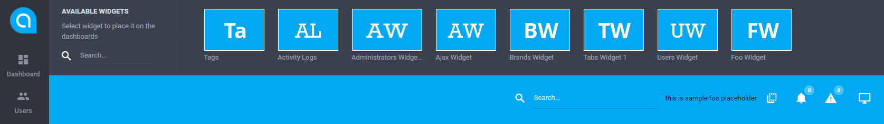
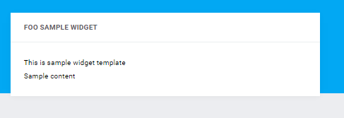
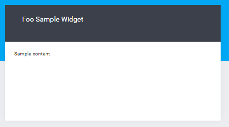
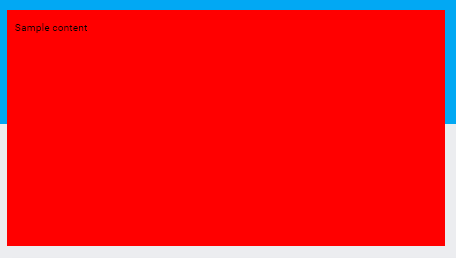
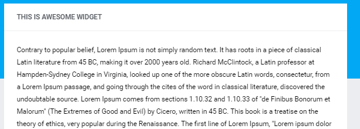
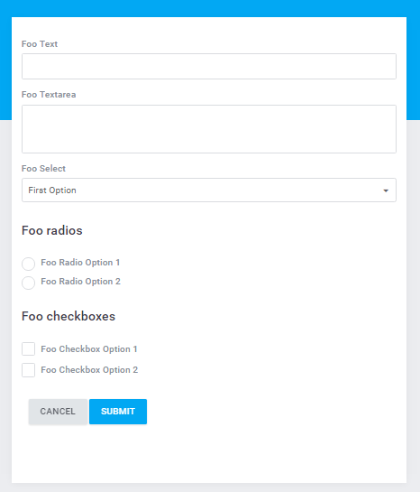
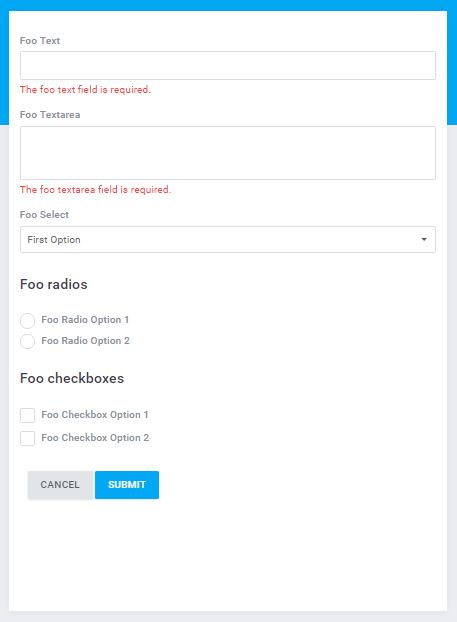
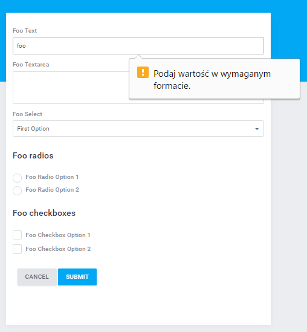
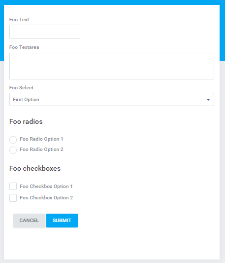

# Widget  

[TOC]

## Introduction  

###  Basic Implementation  

Widgets - objects in the application which (because of their behavior and functionality) are used for data presentation only. They work closely with user's interface. An example of a widget may be a table presenting users' list. Widget's property is the ability of being placed on any application's website. Widgets consist of attributes which determine their behavior in the interface space. An example of an attribute can be 'resizable' which determines whether a widget on a website will be calibrated or not. In the hierarchy of widget's structure the widget is placed the lowest. Widget template is above the widget and it determines the frames of presentation and widget's operation. This means that you can build for instance 10 different widgets with users' tables in the system but each one of them must inherit the widget template structure named 'Datatables'. Each widget may define its own layout which by default is ascribed by widget template. On the top of the widget hierarchy is an abstraction layer which determines common features and behaviors of all widgets in the system.
Minimal structure of the class defining a widget:

```php
<?php
 
namespace Antares\Foo\Widgets;
 
use Antares\Widgets\Adapter\AbstractWidget;
 
class FooWidget extends AbstractWidget
{
 
    /**
     * Determining the widget's name, the attribute is required
     *
     * @var String
     */
    public $name = 'Foo Widget';
 
    /**
     * Displaying (rendering) the widget's content
     *
     * @return string
     */
    public function render()
    {
        return "foo widget content";
    }
}
```

The basic widget's structure consist of the `render` method and the `name` attribute. Both the attribute and the method are required for proper widget's interpretation as a specific type of object in the system. The name attribute should be unique within all widgets. The `render` method is responsible for displaying the widget's content. 

### Placing The Widget On A Website  

The widget described in the case above has to be added 'manually' on a website because it does not define property of automatic presentation. In order to add the widget, firstly, the view - which is responsible for displaying the website where the widget will be presented - must inherit from the 'widgetable' layout, so:

```html

       

```

On the top of the website, the following button  is available which opens the widget selection panel:

  
  
The 'Foo Widget' is avaialable as on the screen above. If you click the 'FW' picture (which stands for two first letters of the widget's name), the widget will be placed on the website as below:

  

It is worth noticing that pressing the  button enables widgets' edition on the website. Apart from adding the widgets it is also possible to change widget's parameters at any moment, so the widget shown above can be removed, its position may be changed or scaled, as presented below:

  
  
Press the button labeled with the  icon in order to remove the widget from the website (which in turn will appear in widget's selection bar) whereas the  button enables widget's container size change.

### Placing The Widget On A Website (The Force Mode)  

The solution described in the previous paragraph enables dynamic widget management on the website. In case when it is necessary to determine the widgets permanently without the possibility of changing their parameters on user's website use the force mode. An example:

```html

   
    <section class="main-content">
        
        
               
            <div class="grid-stack">
                {{ widget_forced('foo_widget',{'x':10,'y':0,'width':20,'height':10})|raw }}  
            </div>
        
    </section>

```

The code above will generate the following website:

  
  
The whole operation happens by means of `widget_forced` twig engine extension. The `widget_forced` function as a first argument takes the name of the widget in the form of underscore (that is Foo Widget => foo_widget), whereas the second argument are widgets' attributes. More information about widgets' attributes may be found [here](../core_modules/widgets.md).

## Views  

The method responsible for displaying widget's content is the `render` method. The method should respond with an object providing the `__toString` magic method or respond independently with a value of the 'String' type. Otherwise, the widget will not be displayed. The code in the example:

```php
public function render()
{
    return "foo widget content";
}
```

will display the content of the 'foo widget content'. Whereas the code:

```php
public function render()
{
    publish('foo', ['js/widget_logic.js']);
    $content = 'Sample content';
    return view('antares/foo::widgets.foo', ['content' => $content]);
}
```

will publish the content defined in the view `antares/foo::widgets.foo`

```html
{{ content|raw }}
```

and add asset's file named 'widget_logic.js' which will be activated each time whenever the widget will be published. The effect:

  
  
## Layouts  

Each widget may use layout for wrapping the content presented by means of the `render` method. Such solution makes the programmer free from necessity of repeating the same activities while generating the widget's content. Determining which layout will be used by the widget is possible through the `template` parameter:

```php
/**
 * Determining which layout will be used by the widget
 *
 * @var String
 */
public $template = 'dark';
```

Usually the 'default' layout is used and its structure is the following:

```bash
default/index.twig
```

```html


    <div class="card card--info card--padding24">
        
            <div class="card__header">
                <div class="card__header-left">
                    <span>
                        {{ name }}
                    </span>
                    {{ event('widgets:render.header-left.'~name)|raw }}
                </div>       
                <div class="card__header-right">
                    {{ event('widgets:render.header-right.'~name)|raw }}
                </div>
            </div>
        
        <div class="card__content">
            {{ content|raw }}
        </div>
    </div>

```

In the case shown above the 'dark' layout has been indicated and its use will display:

  
  
The list of all available layouts is located inside the 'widgets' components, in the catalogue:

```bash
\src\components\widgets\resources\views\templates
```

The files responsible for layouts are the index.twig files.

### Creating Own Layout  

In order to add your own layout go to the catalogue:

```bash
\src\components\widgets\resources\views\templates
```

and create a subcatalogue which has a name adequate to the name of the layout. Create a manifest file (manifest.json) inside the created catalogue, an example:

```bash
\src\components\widgets\resources\views\templates\foo\index.twig
```

```php
{
    "package": "foo",
    "name": "Foo Template",
    "description": "Foo Template Description",
    "author": "Foo",
    "url": "https://antares.com/docs",
    "type": [],
    "autoload": []
}
```

Description of the parameters:

* package - determines short name of the layout,
* name - determines full name of the layout,
* description - description of the layout,
* url - usually the url address to the documentation,
* autoload - php scripts used during loading

Once the manifest file is created, create the layout main file named index.twig. Here is an illustrative structure of such a file:

```bash
\src\components\widgets\resources\views\templates\foo\index.twig
```

```html


    <div style="background-color:red;padding:10px;height:100%;">
        {{ content|raw }}
    </div>

```

As a result it will display:

  
  
In the case above the css inline has been applied for the needs of the code example only. In target solutions inline should not occur.

## Configuration  

### Title  

To make the widget possess upper beam with a title it is necessary to set the attribute named 'titlable':

```php
/**
 * Widget's attributes
 *
 * @var array
 */
protected $attributes = [
    'titlable' => true,
];
```

The attribute will cause widget's title display as in the example below:


  
By default, the title's content will be downloaded from the `name` parameter. However, if the 'title' parameter has been determined, the value of this parameter will be taken into consideration in the first place. More information about widget's attributes can be found [here](../core_modules/widgets.md).

### Description  

The parameter determines widget's description:

```php
/**
 * Widget's description
 *
 * @var String
 */
public $description = 'Foo Ajax Widget Description';
```

### Widget's Availability  

Widgets' configuration enables adapting the widget's structure and functionality to the demand in the system. Widget may take the following parameters:

```php
/**
 * Designation of views where the widget will be published
 *
 * @var array
 */
protected $views = [
    'antares/foo::admin.foo.index'
];
```

The `views` parameter determines on which 'views' the widget will be available. Such solution enables widget's availablity control by a module or a component or a programmer. In the aforementioned example during the 'index.twig' view presentation placed in the location `src\components\foo\resources\views\admin\foo` the widget will appear in the upper widget selection beam. When this parameter is not determined it will be available in all views (the '*' value) by default. The 'disabled' parameter is connected with this one and it is the opposite of the `views` parameter:

```php
/**
 * Designation of views where the widget will not be published
 *
 * @var array
 */
protected $disabled = [
    'antares/foundation::dashboard.index'
];
```

It will cause widget's availability deactivation during 'dashboard' view's rendering. Both parameters - the `views` and the `disabled` - will recognize the values of the 'wildcard' type, an example:

```php
/**
 * Designation of views where the widget will be published
 *
 * @var array
 */
protected $views = [
    'antares/foo::*'
];
```

It will render the widget available only during the presentation of views which belong to the 'foo' component.

## Attributes  

Attributes enables being in control of widget's behavior on a website. The list of attributes:

* x
* y
* enlargeable
* fixed_width
* fixed_height
* min_width
* min_height
* max_width
* max_height
* default_width
* default_height
* resizable
* draggable
* nestable
* titlable
* editable
* removable
* disabled
* manually_disabled
* actions

## Forms  

A widget may define forms belonging to website's presentation. This means that the whole content of which the website is composed may be dictated by widgets. An example of a widget with form's definition:

```php
<?php
 
namespace Antares\Foo\Widgets;
 
use Antares\Widgets\Adapter\AbstractWidget;
use Antares\Html\Form\Grid as FormGrid;
use Antares\Html\Form\Fieldset;
use Antares\Support\Fluent;
 
class FooWidget extends AbstractWidget
{
 
    /**
     * Widget's name designation, the attribute is required
     *
     * @var String
     */
    public $name = 'Foo Widget';
 
    /**
     * Displaying (rendering) the widget's content
     *
     * @return string
     */
    public function render()
    {
        $form = $this->form();
        return view('antares/foo::widgets.foo', ['form' => $form]);
    }
     
    /**
     * Creates form's instance assigned for displaying in the widget
     *
     * @return \Antares\Html\Form\FormBuilder
     */
    protected function form()
    {
        return app('antares.form')->of('foo_form', function(FormGrid $form) {
                    $form->simple('#', [], new Fluent());
                    $form->name('Widget Foo Form');
                    $form->layout('antares/foo::widgets.form');
 
                    $form->fieldset(function (Fieldset $fieldset) {
 
                        $fieldset->control('input:text', 'foo_text')
                                ->label('Foo Text');
 
                        $fieldset->control('textarea', 'foo_textarea')
                                ->attributes(['cols' => 10, 'rows' => 3])
                                ->label('Foo Textarea');
 
                        $fieldset->control('select', 'foo_select')
                                ->label('Foo Select')
                                ->options(['First Option'])
                                ->attributes(['data-selectar' => true]);
                    });
                    $form->fieldset(function (Fieldset $fieldset) {
 
                        $fieldset->legend('Foo radios');
 
                        $fieldset->control('radio', 'foo_radios[]')
                                ->label('Foo Radio Option 1');
                        $fieldset->control('radio', 'foo_radios[]')
                                ->label('Foo Radio Option 2');
                    });
                    $form->fieldset(function (Fieldset $fieldset) {
 
                        $fieldset->legend('Foo checkboxes');
 
                        $fieldset->control('checkbox', 'foo_checkbox[]')
                                ->label('Foo Checkbox Option 1');
                        $fieldset->control('checkbox', 'foo_checkbox[]')
                                ->label('Foo Checkbox Option 2');
                    });
                    $form->fieldset(function (Fieldset $fieldset) {
                        $fieldset->control('button', 'cancel')
                                ->field(function() {
                                    return app('html')->link(handles("antares::/"), trans('antares/foundation::label.cancel'), ['class' => 'btn btn--md btn--default mdl-button mdl-js-button']);
                                });
                        $fieldset->control('button', 'button')
                                ->attributes(['type' => 'submit', 'class' => 'btn btn-primary',])
                                ->value(trans('antares/foundation::label.save_changes'));
                    });
                });
    }
 
}
```

Below - the effect:

  
  
In other words, this is a form placed in a widget. Take note of form's layout syntax which is the file `antares/foo::widgets.form`:

```html


    
        <fieldset name="inputs">
            
                <legend>{{ fieldset.legend }}</legend>
            
            <div class="col-group">
                
                    <div class="form-block">
                        
                    </div>
                
            </div>
        </fieldset>
    


     
        {{ button.getField(row, button, [])|raw }}       
    

```

Form's layout inherits from the default layout and extends the individual sections in order to obtain proper appearance.

### Validation  

A form located inside a widget may be validated. In order to achieve this goal you have to define form's validation rules, so:

```php
$form->simple(handles('antares::foo/foo_save'), [], new Fluent());
  
$form->rules([
    'foo_text'     => ['required'],
    'foo_textarea' => ['required'],
    'foo_select'   => ['required'],
]);
```

In the above-mentioned example form's action url address and the validation rules have been indicated. By means of the `routes` method it is possible to ascribe the answer once the form is sent, so:

```php
/**
* Routing's definition in widget's section
*
* @return \Illuminate\Routing\Route
*/
public static function routes()
{
    return Route::post('/admin/foo/foo_save', ['middleware' => 'web', function() {
                    $form = self::form();
                    if (!$form->isValid()) {
                        return redirect()->back()->withErrors($form->getMessageBag())->withInput();
                    }
                }]);
}
```

The effect:

  
  
### Ajax Validation  

A form in a widget may use ajax validation. This is a desirable solution especially when there is more than one widget on a website. Ajax validation activation occurs by means of the code:

```php
$form->ajaxable();
```

Do not forget about proper form's data operation after the validation.

### HTML5 Validation  

The use of validation determined at the side of the browser is possible when the control's attributes are introduced in the first place, an example:

```php
$fieldset->control('input:text', 'foo_text')
        ->label('Foo Text')
        ->attributes([
            'placeholder' => 'Provide the value beginning from https...',
            'required'    => 'required', 'pattern'     => "https?://.+"
]);
```

The result:

  
  
**It is not possible** to use both the ajax validation and the validation with the use of html5 attributes on one form.

### Controls' Width Control  

By means of well-matched classes which are used to determine the width of the container in which the control is placed it is possible to adapt widget's appearance for the needs of specification, so:

```php
$fieldset->control('input:text', 'foo_text')
        ->label('Foo Text')
        ->attributes([
            'class' => 'w200',
]);
```

or:

```php
$fieldset->control('input:text', 'foo_text')
         ->label('Foo Text')
         ->wrapper(['class' => 'w200']);         
```

It will create:

  
  

