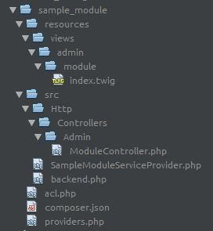
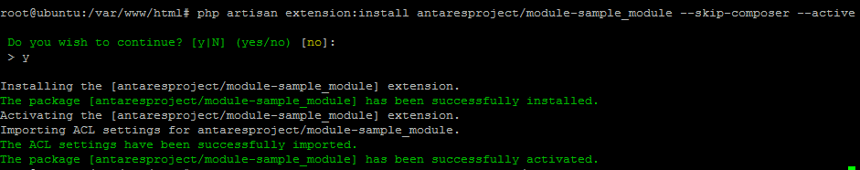
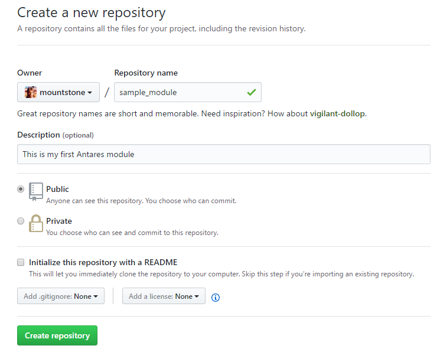
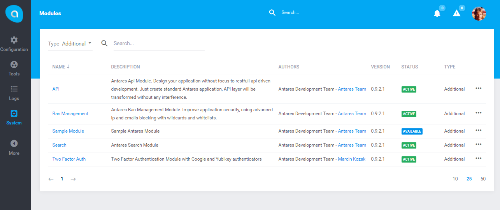
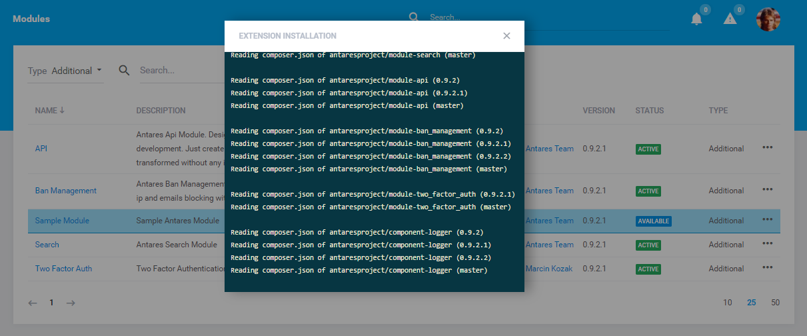
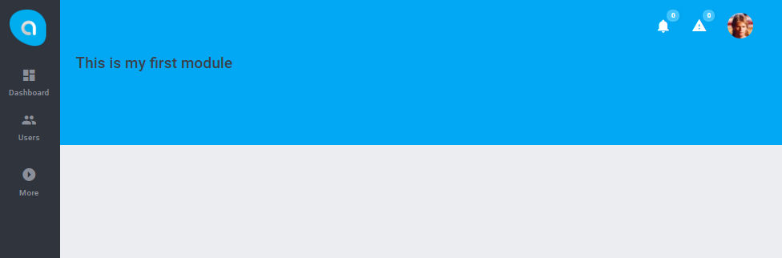

# Sample Module  

[TOC]

An example module may be downloaded from 
the [git location](https://github.com/antaresproject/sample_module.git) or installation appearance may be added using composer:

```bash
composer require antaresproject/module-sample_module:0.9.2.2-dev
```
More information about using composer you can find in official [documenation](https://getcomposer.org/doc/).

In order to create a new module which will be compatible with 
master module's packs, core and frontend, you should:


## Module structure

Before starts read this article, it is recommended to get info about [module base](../modules_development/module_base.md).

### Base structure

Following files are minimal requirements for module to work:

#### Acl

Create file `acl.php` in base path of your module:

```php
<?php

use Antares\Acl\RoleActionList;
use Antares\Model\Role;
use Antares\Acl\Action;

$presentationActions = [
    new Action('sample_module.items.index', 'Items List'),   //'Allows user to preview items list.',
];
$actions             = [
    new Action('sample_module.item.add', 'Item Add'),        //'Allows user to add item.',
    new Action('sample_module.item.update', 'Items Update'), //'Allows user to update item.',
    new Action('sample_module.item.delte', 'Items Delete'),  //'Allows user to delete item.',
];


$permissions = new RoleActionList;
$permissions->add(Role::admin()->name, array_merge($presentationActions, $actions));
$permissions->add(Role::member()->name, $presentationActions);
return $permissions;
```

This file determines which roles (for example admins, users, members, reporters etc.) should have access to action.
Action is the name of resource (endpoint) where logic is implemented.  For example, viewing any items list or updating is an operation with name. This name is called an action.
First argument of class constructor is the name of route which will be used to specify valid urls.

By example above, member has access to view list of items, but not to add, update or delete any of items:
 
```php
$permissions->add(Role::member()->name, $presentationActions);
```
 
 Only admin is able to have full access to all operations:
  
```php
$permissions->add(Role::admin()->name, array_merge($presentationActions,$actions));
``` 

More details about acl you find [here](../modules_development/acl.md).
 
#### Providers
 
Create file `providers.php` in base path of your module:
 
```php
<?php

return [
    Antares\Modules\SampleModule\SampleModuleServiceProvider::class,
]; 
```

As you can see, this file returns class names of [service providers](../modules_development/service_providers.md) used by module. Service provider is the most important file within module. 
It's like a bootstrap where module starts its work.
 
#### Composer
 
Create file `composer.json` in base path of module:
 
```php
{
    "name": "mountstone/module-sample_module",
    "description": "My first sample module",
    "type": "antaresproject-module",
    "version": "0.1",
    "homepage": "http://example.foo",
    "authors": [
        {
            "name": "Antares developer",
            "email": "developer@antaresproject.io"
        }
    ],
    "require-dev": {
        "antaresproject/component-installer-plugin": "*"
    },
    "autoload": {
        "psr-4": {
            "Antares\\Modules\\SampleModule\\": "src/"
        }
    },
    "extra": {
        "friendly-name": "My Module"
    }
}
``` 
Description of keys in `composer.json` file is [here](../modules_development/module_base.md#composerjson-schema).

#### Service provider

Create file `SampleModuleServiceProvider.php` in src subdirectory within module base path:
 
```php
<?php

namespace Antares\Modules\SampleModule;

use Antares\Foundation\Support\Providers\ModuleServiceProvider;

class SampleModuleServiceProvider extends ModuleServiceProvider
{

    /**
     * Controller's namespace
     *
     * @var String
     */
    protected $namespace = 'Antares\Modules\SampleModule\Http\Controllers\Admin';

    /**
     * Route group name
     *
     * @var String
     */
    protected $routeGroup = 'antares/sample_module';

    /**
     * {@inheritdoc}
     */
    protected function bootExtensionComponents()
    {
        $path = __DIR__ . '/../resources';
        $this->addViewComponent('antares/sample_module', 'antares/sample_module', "{$path}/views");
        $this->bootMemory();
    }

    /**
     * Boot extension routing.
     *
     * @return void
     */
    protected function loadRoutes()
    {
        $this->loadBackendRoutesFrom(__DIR__ . "/backend.php");
    }

    /**
     * Booting memory
     * 
     */
    protected function bootMemory()
    {
        $this->app->make('antares.acl')->make('antares/sample_module')->attach($this->app->make('antares.platform.memory'));
    }
}
```
If you want to know more about working service providers, please go to [Service Providers](../modules_development/service_providers.md) section.

#### Routes

Your module should display any content via route. To define route names, create `backend.php` file which determine endpoints for controller's actions:

```php
<?php

use Illuminate\Routing\Router;

$router->group(['prefix' => 'my_module'], function (Router $router) {    
    $router->get('index', 'ModuleController');
});
```
Details about routing in Antares you can find [here](../modules_development/routing.md). 
In the example above your module will be available under the endpoint `/{area}/my_module/index`. 

> `{area}` is the name of access layer where user is assigned (for example admin, user, redactor, etc.).

#### Controller

Controllers are used to process the requests coming from a browser and declare the behavior according to the parameters.
Create to file `ModuleController.php` in the `src\Http\Controllers\Admin\` location in module base path:

```php
<?php

namespace Antares\Modules\SampleModule\Http\Controllers\Admin;

use Antares\Foundation\Http\Controllers\AdminController;

class ModuleController extends AdminController
{

    /**
     * {@inheritdoc}
     */
    public function setupMiddleware()
    {
        $this->middleware('antares.auth');
        $this->middleware("antares.can:antares/sample_module::items-list", ['only' => ['index']]);
    }

    /**
     * Default action od module controller
     * 
     * @return View
     */
    public function index()
    {
        return view('antares/sample_module::admin.module.index');
    }

}
```
Controller class contains method `setupMiddleware()` which determines rules of access to actions.
This controller has only one action `index()` and only one rule `items-list` is assigned to it. Because of fact that
Antares is modular application, first argument of `middleware` should have the name of module in following format: 
`antares.can:antares/<module_name>::<rule_name>`. More details about middleware's in Antares you can find [here](../modules_development/acl.md#verification-at-the-controllers-level). 

#### View

In the previous example method `index()` will show view `antares/sample_module::admin.module.index` which is placed in location:
`resources/views/admin/module/index.twig`. Let's create it:

```twig
   
 
    This is my first module
    
```

As you can see we are using [Twig Engine](https://twig.sensiolabs.org/) to generate views.
The result of our module should have following structure:



Module source should be copied to directory of modules within Antares file structure. The location of directory is in the src directory in Antares base path. 
More information about Antares files you can find [here](../antares_concepts/core_&_files_structure.md).

#### Installing and activating

Go to console and run following command:

```bash
$ php artisan extension:install antaresproject/module-sample_module --skip-composer --active
```
As you can see the name of installed module is the same with name from your `composer.json` file.
In the image below is an example of installation result:



You can also install a module using "component" section with is described [here](../modules_development/module_base.md#user-interface).

## Add module to project

### Using GIT 

#### Create a new project git repository
 
You can use [github](https://github.com), [bitbucket](https://bitbucket.org/) or different git-based version control system.
    

     
#### Clone repository files into local

Using following command:

```bash
$ git clone https://github.com/mountstone/sample_module.git
```  

#### Commit files into repository

Firstly you have to copy module source to directory where repository has been cloned. Then add files before commit:

```bash
$ git add *
```

commit new files:

```bash
$ git commit -am "ADD: initial commit"
```

and push:

```bash
$ git push
```

#### Add repository to composer

If you want to add you module to project it's good practice to extends main `composer.json` file of Antares. The file is located in base path of application.
Typically the source of this file should have following content:

```json
{
    "name": "antaresproject/project",    
    "description": "Create management system for your employees, your customers and for yourself. Experience a completely new way of building standalone and SaaS applications.",
    "homepage": "http://antaresproject.io",
    "keywords": [
        "php",
        "laravel",
        "composer",
        "automation",
        "updater",
        "material-design",
        "rest-api",
        "logger",
        "installer",
        "logger",
        "user-management",
        "twofactorauth",
        "laravel-admin",
        "laravel-application",
        "updaters",
        "two-factor-authentication",
        "access-control",
        "updater",
        "antares",
        "antares-project",
        "boilerplate"
    ],        
    "license": "BSD-3-Clause",
    "type": "project",
    "prefer-stable": true,
    "minimum-stability": "dev",
    "authors": [{
            "name": "Antares Team",
            "email": "contact@antaresproject.io",
            "homepage": "http://antaresproject.io",
            "role": "developer"
        }
    ],    
    "repositories": [
        {
            "type": "git",
            "url": "https://github.com/antaresproject/core.git"
        },       
        {
            "type": "git",
            "url": "https://github.com/antaresproject/component-installer-plugin.git"
        },
        {
            "type": "git",
            "url": "https://github.com/antaresproject/search.git"
        },
        {
            "type": "git",
            "url": "https://github.com/antaresproject/api.git"
        },
        {
            "type": "git",
            "url": "https://github.com/antaresproject/ban_management.git"
        },
        {
            "type": "git",
            "url": "https://github.com/antaresproject/two_factor_auth.git"
        },
        {
            "type": "git",
            "url": "https://github.com/antaresproject/logger.git"
        },
        {
            "type": "git",
            "url": "https://github.com/antaresproject/translations.git"
        },
        {
            "type": "git",
            "url": "https://github.com/antaresproject/tester.git"
        },
        {
            "type": "git",
            "url": "https://github.com/antaresproject/notifications.git"
        },
        {
            "type": "git",
            "url": "https://github.com/antaresproject/customfields.git"
        },
        {
            "type": "git",
            "url": "https://github.com/antaresproject/acl.git"
        },
        {
            "type": "git",
            "url": "https://github.com/antaresproject/automation.git"
        },
        {
            "type": "git",
            "url": "https://github.com/antaresproject/users.git"
        },
        {
            "type": "git",
            "url": "https://github.com/antaresproject/installation.git"
        },
        {
            "type": "git",
            "url": "https://github.com/antaresproject/branding.git"
        }
    ],          
    "require": {
        "antaresproject/core": "0.9.2.x-dev",
        "laravel/framework": "5.4.*",
        "laravie/html": "5.4.*",
        "mnsami/composer-custom-directory-installer": "1.1.*",
        "antaresproject/component-installer-plugin": "0.9.2.1-dev",

        "antaresproject/module-api": "0.9.2.x-dev",
        "antaresproject/module-ban-management": "0.9.2.x-dev",
        "antaresproject/module-two-factor-auth": "dev-master",
        "antaresproject/module-search": "dev-master",        

        "antaresproject/component-logger": "0.9.2.x-dev",
        "antaresproject/component-translations": "dev-master",
        "antaresproject/component-tester": "0.9.2.x-dev",
        "antaresproject/component-notifications": "0.9.2.x-dev",
        "antaresproject/component-customfields": "0.9.2.x-dev",
        "antaresproject/component-acl": "dev-master",
        "antaresproject/component-automation": "0.9.2.x-dev",    

        "antaresproject/component-installer": "dev-master",
        "antaresproject/component-brands": "dev-master",
        "antaresproject/component-users": "dev-master",            

        "barryvdh/laravel-debugbar": "^2.2@dev",
        "regulus/activity-log": "^0.6.7",
        "arcanedev/log-viewer": "^4.3",
        "prettus/laravel-request-logger": "^1.0",
        "davejamesmiller/laravel-breadcrumbs": "dev-master"
    },        
    "autoload": {
        "classmap": [
            "resources/database",
            "src/core/src/modules",
            "src/modules"
        ],
        "psr-4": {
            "App\\": "app/",
            "Installer\\": "app/Installer/src"        
        }
    },
    "extra": {
        "installer-paths": {
            "./src/core": ["antaresproject/core"]
        }
    },    
    "scripts": {
        "post-root-package-install": [
            "php -r \"file_exists('.env') || copy('.env.example', '.env');\""
        ],
        "post-create-project-cmd": [
            "php artisan key:generate"
        ],
        "post-install-cmd": [
            "php artisan clear-compiled"
        ],
        "post-update-cmd": [
            "php artisan clear-compiled"
        ]        
    },
    "config": {
        "preferred-install": "dist",
        "secure-http": false
    }    
}
```
Section "repositories" contains information about where every part of system is located. For example:
 
```json
{
    "type": "git",
    "url": "https://github.com/antaresproject/branding.git"
}
```

Include information that branding is a git repository located at `https://github.com/antaresproject/branding.git`. 
Composer will download source file of "branding" from that, specified location. Section named "require" contains information
which version of repository should be user, for example:

```json
{
    "antaresproject/component-automation": "0.9.2.x-dev"
}
```

Will use version of 0.9.2 (branch) which is placed in github.

Going this route, you have to add following lines into `composer.json` file:

Section "repositories":

```json
{
    "type": "git",
    "url": "https://github.com/antaresproject/sample_module.git"
}
```

Section "require":

```bash
{
    "antaresproject/module-sample_module": "0.9.2.2-dev"
}
```

> Remember that presented example using a [Github](https://github.com) as pattern. 

> You are able to use any other git repository such as https://\<username\>@bitbucket.org/\<username\>/sample_module.git. 
To find out more about composer, go to [Composer Documentation](https://getcomposer.org/doc/).

### Using standalone files
 
You can create module which will be part of your application without using git. Just create module directory in `src/modules`
and copy module source files. Module will be available in "Modules" from "System" main menu:
 

 
Right click on module will show context menu with install option. After click on it, modal dialog will be showed:
  
  

Using git approach gives  
  
  
## Run first module action

As is mentioned previously we have created a file called `backend.php` which contain route definition.
The location of index action for you module include: `/<area>/<prefix>/<name>`   
The area is typically "admin", prefix is "my_module" and the name is "index", so our url is: /admin/my_module/index. 
Let's open it in the browser:



After install module, browser will be refreshed automatically.
That's all. You have created your own first module with acl. 

To get more details about using other Antares functionalities, please read [Modules Development](../modules_development/module_base.md) and [Services](../services/assets.md).