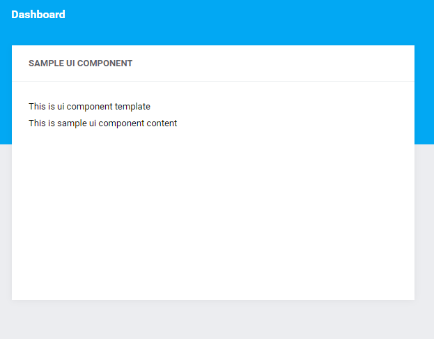

# Sample UI Component  

The code below is an example of a ui component:

```php
<?php

namespace Antares\Modules\SampleModule\UiComponents\Templates;

use Antares\UI\UIComponents\Templates\DefaultTemplate;

class SampleUIComponentTemplate extends DefaultTemplate
{

    /**
     * Path of template view
     *
     * @var String
     */
    protected $template = 'antares/sample_module::ui_components.templates.sample_template';

    /**
     * Ui Component Template attributes
     *
     * @var array
     */
    protected $attributes = [
        'min_width'      => 6,
        'min_height'     => 10,
        'max_width'      => 14,
        'max_height'     => 20,
        'default_width'  => 6,
        'default_height' => 10,
        'enlargeable'    => true,
    ];

    /**
     * {@inherited}
     */
    public function render()
    {
        
    }

}
```

The path to the view's file which will be used by the template is determined in the `$template` attribute:

```twig


    <div class="card card--info card--padding24">
        <div class="card__header">
            <div class="card__header-left">
                <span>
                    {{ title }}
                </span>
            </div>                       
        </div>
        <div class="card__content">
            <p>This is ui component template</p>
            {{ content|raw }}
        </div>
    </div>

```
The `$attributes` determines default parameters of the template. 
More information about the parameters can be found in the [UI Component](../services/ui_component.md) section. 
The ui component may use the template when it inherits from its class:
```php
<?php

namespace Antares\Modules\SampleModule\UiComponents;

use Antares\Modules\SampleModule\UiComponents\Templates\SampleUIComponentTemplate;

class SampleUIComponent extends SampleUIComponentTemplate
{

    /**
     * Name of UI Component
     * 
     * @var String 
     */
    public $name = 'Sample UI Component';

    /**
     * widget attributes
     *
     * @var array
     */
    protected $attributes = [
        'min_width'      => 1,
        'min_height'     => 1,
        'max_width'      => 14,
        'max_height'     => 20,
        'default_width'  => 6,
        'default_height' => 10,
    ];

    /**
     * Where ui component should be available
     *
     * @var array
     */
    protected $views = [
        'antares/foundation::dashboard.index'
    ];

    /**
     * Renders ui component template content
     * 
     * @return String | mixed
     */
    public function render()
    {
        return view('antares/sample_module::ui_components.sample_ui_component')->render();
    }

}
```

The effect is shown below:


